# 钱包 101:浮利欧投资者的多钱包入门

> 原文：<https://medium.com/coinmonks/wallets-101-a-multi-wallet-primer-for-furio-investors-21042d2a7c51?source=collection_archive---------2----------------------->

## 通过一个提供商组合 10 多个钱包是关键

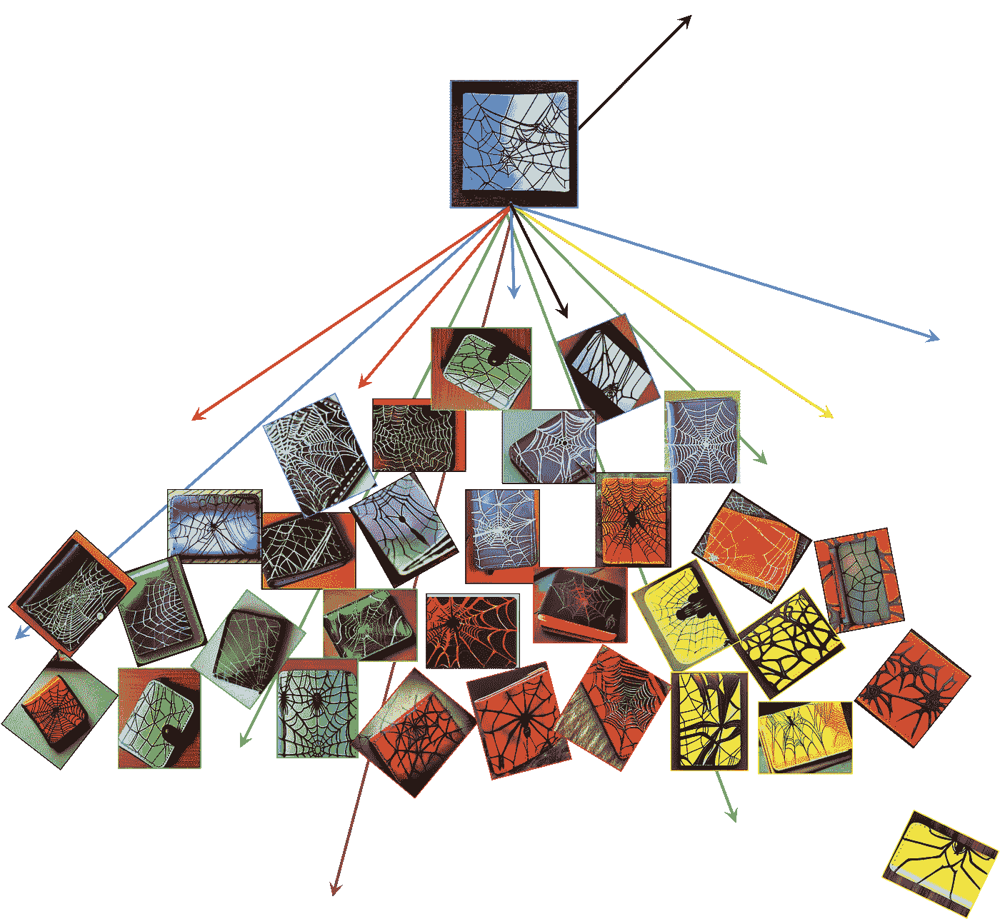

**Wallet Confusion?** It doesn’t have to be this way…

> 如果你已经有几个以上的钱包，一定要跳过这段对话…

早期，我认为 MetaMask 是我需要的所有钱包——那时，多个钱包似乎有点冒险。发现 BNBMiner 游戏——还记得吗？似乎几年前——创造两个钱包更有意义。接下来是严肃的 DeFi 项目——想到了滴滴和大象的钱——突然间**更多的钱包变得必不可少。**

让我们回到最近围绕最新的被动收入新贵之一的活动:**浮利欧—** 特别是投资回报金库，那里的事情变得有趣多了…

## 发生了什么事？

对于大多数 Furio 投资者来说，这已经是旧闻了:随着熊市的持续变化， **Furio 开发团队**最近进行了调整，将毛皮价格从大约 4.5 美元/件降至平均 1 美元/件，同时还有其他重要变化。

这可能看起来不多，但足以重新稳定流动性管理系统(LMS)，&它还促进了项目，引发了一些额外的好处和机会。

最引人注目的变化是，投资者现在不再使用 1 或 2 个钱包快速赚钱以达到最大支出，而是将部分资金重新投资到这个项目 Furpool。太棒了。这对不同投资项目的可持续性和长久性非常有利，它很好地平衡了竞争环境。

> **然而，这也影响了我们投资 Furio 的方式……**

## 原因如下:

最初，打开一个主要的&一个伙伴钱包就足够了:早期投资者这样做了&坐以待毙——同时拉动他们的下线推荐网络——他们每天都在复利，等待达到最大支出。

什么是 **Furio 的最大支出**？看看这篇关于它的快速文章，**然后回来**:

 [## 浮利欧令人满意的“洛根的运行”功能

### 即使在一个完美的世界里，你也不能永远停留…

medium.com](/coinmonks/furios-satisfying-logan-s-run-feature-ca0a4baea1b1) 

Thx。不过，如前所述， [**弗里奥**已经漂亮地转向了](/coinmonks/my-fabulous-fall-furio-adventures-4bfb4663c94d)&现在的投资非常不同…

## 更多的钱包是谨慎的

在 **Furio 的 FurVault** 中，2.5%的每日投资回报率的明显关键是复利: ***随着时间的推移，复利通过每日再投资我的回报而大大增加了我的初始投资*** 。这是这个项目的命脉。

随着 Furio 的工人阶级新价格，两个钱包现在已经过时了。现在，越来越多的钱包创造了越来越多的获得最大支出的途径。

> 这也已经是旧闻了。最近的文章写了不同的计划，通过 [**网状钱包计划**](/@jebalukas/getting-to-max-furios-greatest-financial-advantage-d62e2d83e25f) 用有限的资金 &达到浮利欧的 [**最大支出。**](/coinmonks/with-limited-funds-one-furio-investors-million-dollar-passive-income-roadmap-6387f42006eb)

## 回到钱包。

坦白地说，找 10 或 20 个钱包来创建 10-20 个账户是在浪费大量的时间…幸运的是，比我更有文化的媒体朋友来帮忙了。我欣赏他们超级投资者的热情:他们中的一个有 105 个 Furio 钱包，一个有超过 42 个 Furio 钱包，另一个正在快速赶上(谢谢帕特里夏，马克哈兰& M 福斯特！).

我一直都做错了……可笑的是:我在 BitKeep、MetaMask、币安、Trust、KuCoin、Crypto.com、Coin98 & SafePal 都有一个 BNB 智能链钱包账户。

> **事实证明，通过同一个/单一软件钱包提供商创建多个钱包/账户非常容易**。

我有点普通，所以如果我在挣扎，也许其他人也在犹豫前进。以下简短而有趣的教程描述了如何仅使用 1 或 2 个软件钱包提供商创建至少 20 个以上的钱包帐户，比阅读它所花费的时间更少…

## 明显的问题:

***无数钱包的油费是多少？需要多长时间？有可能一次就把它们合成吗？如何跟踪他们所有人？***

将这种对话扩大到 100 个钱包&你与帕特丽夏处于相同的超级投资水平… **以下是如何做到的**:

## Furio 钱包 101:

您使用哪个提供程序并不重要—大多数/所有(？)有多个钱包应用。我将详细介绍两款钱包——coin 98 和 SafePal。除了通过日常使用欣赏它们的效用，我与这些钱包提供商没有任何联系；我没有提供它们链接。

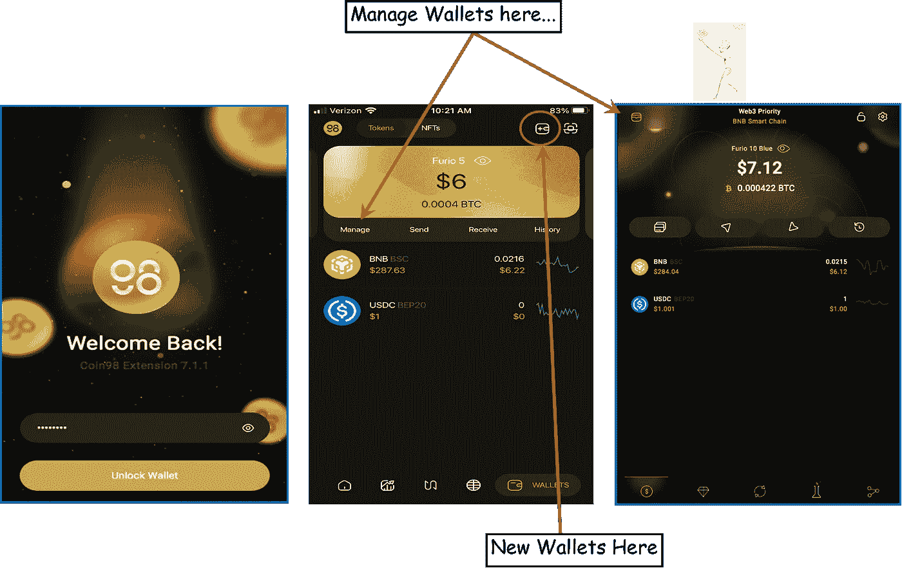

## 硬币 98 钱包

想象我们可以下载一个钱包，输入我的密码并解锁钱包。第二张图片——我的 **Furio 5 钱包**的登陆页面——来自 **iPhone 应用**，接着是我的**电脑应用**的登陆页面(第三张图片)，包含 **Furio 10 蓝色钱包**；它们是略有不同的应用程序。

从**手机应用**我可以‘管理’我的钱包，&从那个页面添加一个新钱包。电脑应用程序上的小钱包图标——第三张图片，左上角——让我进入“管理”页面。接下来…

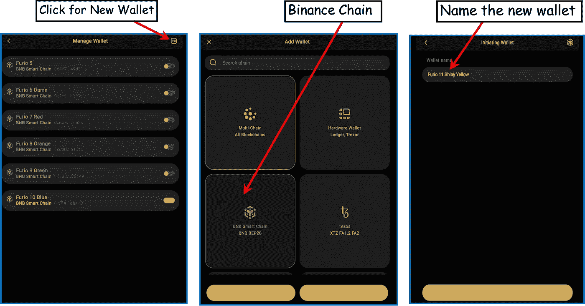

Starting with my Furio 5 Wallet, I’ve since added a bunch more, see below…

## 新钱包:

在任一应用程序的“管理钱包”页面，点击右上方的新钱包图标(在第一张图中)。然后它会问你想要什么样的链条:币安智能链条 BNB BEP20。接下来，给钱包命名。我正在添加我的第 11 个钱包，并将其命名为 **Furio 11 闪亮的黄色**。接下来…

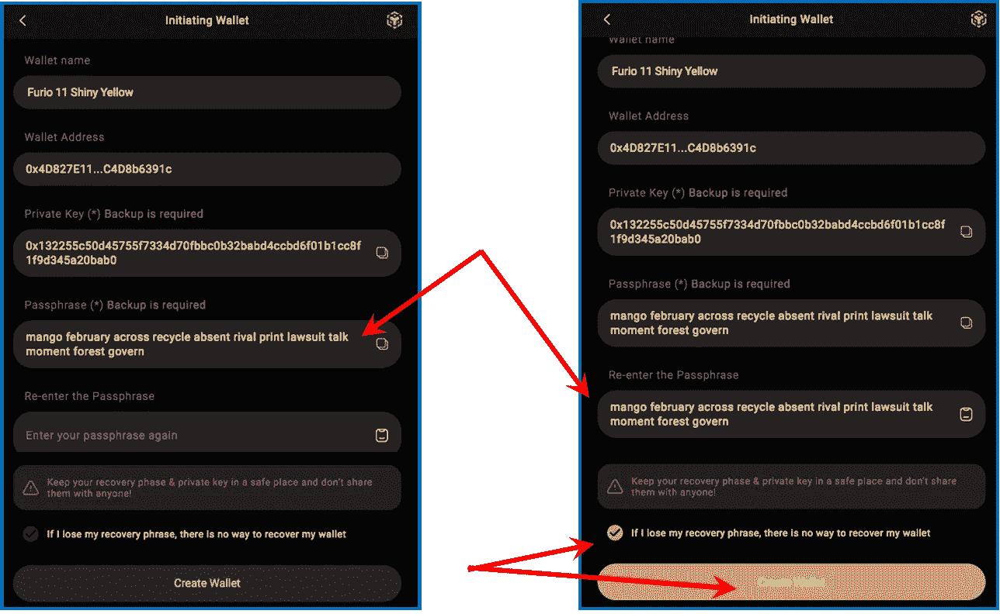

This page contains the Wallet Name, Wallet Address, Private Key & Passphrase…all items to keep track of.

## 启动钱包

上一页非常重要。我给它拍了个截图，然后打印出来，然后删除网上的照片，然后撕掉打印出来的照片&把它混合到由鱼、蔬菜、虾、椰奶、& [四种大米](https://www.youtube.com/watch?v=PfxabSYFs88https://www.youtube.com/watch?v=PfxabSYFs88)做成的稀炖菜里。

**说真的**:这个页面有密码短语/Seedphrase，是那个特定钱包的解锁机制；+其他信息。 ***别丢了*** 。

在页面上，它会要求您单击/复制密码并将其粘贴到下面的空白处。该操作会强制您将密码复制到剪贴板…然后选中表示您理解并创建钱包的复选框。

注意:我还复制了钱包地址&放在电子表格上的钱包名称旁边，以便在必要时将钱包号码与钱包名称相匹配。接下来…

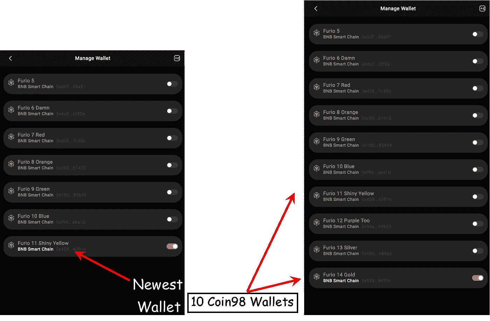

Violá! Pretty easy to create 10, 20, perhaps 100 individual wallets through one provider.

**Furio 11 闪亮的黄色钱包**已经设置好&安全。现在，只需向钱包中添加资金:BNB 的汽油费—查看下面的汽油费详情— &我想开多少 USDC 就开多少。然后复合出它的赫克…

点击上面页面中的任何一个钱包，我就会看到下面的图片，管理钱包页面。这允许我用钱包和地址做各种其他事情。具体来说，如果我用我的其他钱包创建下线，这是我获取地址作为推荐的地方…

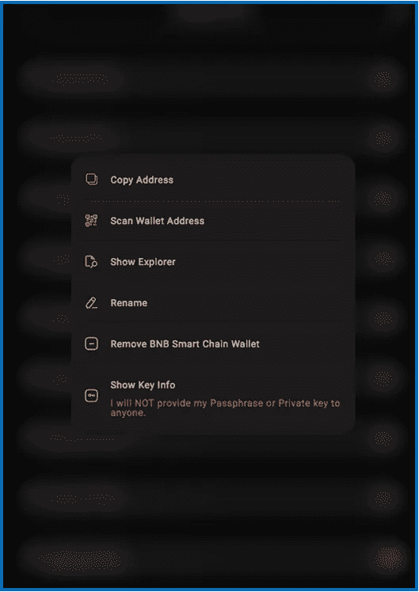

## SafePal 钱包

这太简单了，我在 10 张图片中快速通过这个钱包提供商…

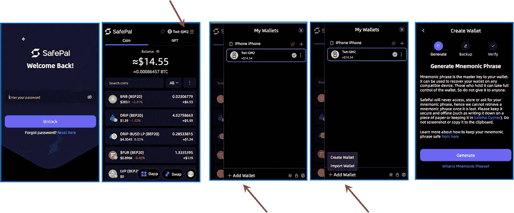

对于 SafePal，可以通过第二张图右上角的链接找到其他钱包。我把那个钱包命名为 Twt-GM2。点击那里滑动屏幕打开&允许我添加钱包。当我从一台电脑切换到另一台电脑时，也会使用 Import Wallet。出于安全原因，通常我都尽量把它放在室内…

上图的最后一个图像通过创建助记短语(与 Seedphrase 或 Passphrase 相同)开始了生成钱包的过程。

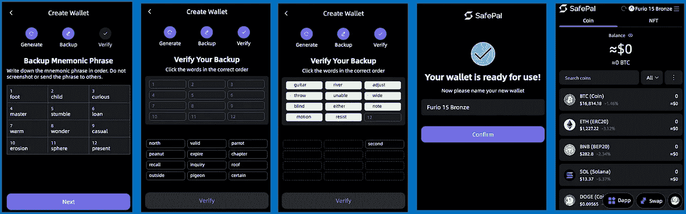

一旦我安全地存储了助记短语，SafePal 希望我显示我已经下载了它，要求我在继续之前再次按顺序产生它。我只需点击第一个&它会自动填充到图表中；继续所有 12 个种子短语单词。

接下来:给钱包命名；在这种情况下，我达到了我的第 15 个 Furio 钱包帐户，恰当地命名为 **Furio 15 Bronze** 。

就是这样。你得到了你的第一个钱包。然后重复以上过程。我不知道任何特定提供商可以支持多少钱包；也许其他人知道&可以留下评论。Thx。

## 如何保持跟踪…

对于我的 Coin98 钱包，目前正在使用的帐户旁边有一个复选标记。例如，我简单地复合了 Furio 6 Damn &当屏幕返回时，我将复选标记移到下一个钱包。

第二天早上，复选标记在钱包列表的底部；那些天，我复合从底部向上移动列表…看上面的两个并排管理钱包图像，为视觉。

下面的 Furio 电子表格记录了我所有 15 个钱包的一些信息，以及增长…其他电子表格记录了每天的回报，并显示了在 Furio 生态系统中优化回报的不同策略…

## 电子表格:

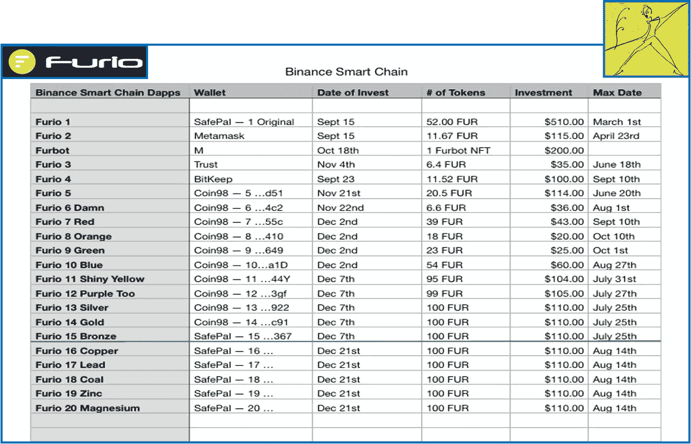

20-Wallet Furio Investments Spreadsheet, Dec ’22\. Below Green line are upcoming, this year…

以上是我从九月中旬开始的 Furio 投资电子表格。我今天有 15 个钱包。我的预期是在 2022 年完成 20 个钱包——在接下来的两周内再完成 5 个。

简单地复利——没有任何推荐或 Furbot 或 FurPool 利润——看起来 7 月和 8 月对我来说将是繁忙的几个月，将我的钱转移到 FurMax，更多地转移到 FurPool & FurFinance 敬请关注…

## 需要多长时间？

每天早上，我用不到 5 分钟的时间来组合我的 10 个硬币 98 钱包。我知道这听起来很快，但是，使用 Coin98 从一个钱包地址到下一个钱包地址只需点击三次，然后点击一次即可复合。

由于我的一些其他钱包是不同的，这花了我更多的时间，但几乎没有。我已经为我的——目前——15 个钱包节省了大约 10 分钟。当我达到 20 英镑的年终目标时，再多加 5 分钟。

在两个不同的钱包提供商之间切换——比如在 Coin98 和 SafePal 之间切换，确实会让我的电脑感到困惑&我通常需要“清除浏览数据”才能继续。这将抹掉缓存& cookies，并清除浏览历史记录，这样电脑就不会被以前的信息搞糊涂了。然后，我也单击顶部地址栏上的 enter，以刷新页面…

## 红狐注:

对我来说， **MetaMask** 已经变得比我用的其他钱包慢多了。永远被困在浪费的时间里，我不建议使用 MetaMask 加载&复合 20 个钱包；甚至我的一 MM 钱包也减缓了我的日常进程。

**然而**，MetaMask 也是我的电脑用来打开我所有其他钱包的主要后台应用之一；有必要在我的电脑上安装…我只是不经常直接使用它。(同时，期待即将到来的 MetaMask 空投👍🏽！)

## 向上扩展…

来自《43 个钱包》的马克:“ ***实际的复利需要 15 到 20 分钟。一旦你习惯了，它真的会变得很快。我每天都会花额外的时间写下每个人当前的大小…*** ”

我也是，有点——我计算在两个星期后，然后一个月，等等，我会有多少美元

## 这是一种气体…这要多少钱？

使用大量钱包时，油费变得很重要。

再从马克:“ ***燃气费确实需要核算。我的平均油费是 0.35 美元/复合，所以我的钱包“家庭”每天 15 美元。***

> 43 个钱包 X 0.35 美元/每日复利 X 30 天就是 450 美元。所以要复合 40+钱包 1 个月，燃气投入是~$450。这是一个有价值的信息点…

毫无疑问:这些 defi 项目需要时间&很明显，需要一些钱。对我来说，潜在的回报远远超过我投入的时间和精力。目前，我很高兴在两周内达到并维持 20 个钱包，这将使我从 2023 年 1 月开始每月的汽油税达到 225 美元。我能做到。

原因如下:

## 浮利欧会付我的油钱…

***我将很快通过 Furio 支付那些汽油费，因为我开始从那些 20+钱包中的 1 个或 2 个中收集。***

很快，当一个指定的钱包超过 1000 美元时，我开始了一个 5 种化合物/2 种收集的系统。这每周创造了超过 50 美元的回报，相当于我每月油费的 75%。将第二个钱包放入 5/2 复合/收集方案中会使金额翻倍，还会带来一些额外的零花钱。😀

## 燃气费钱包

有了 20 多个钱包，很容易就能拿出一些来付油费，当然是专门用来付费的&偶尔周末去墨西哥城旅行，或者其他什么...

利用 5/2 复合/奖励计划，这些钱包中的$FUR 金额每周仍会增加，增长率仅为 1.25%。完美，因为利用 Furio 生态系统的不同方面——包括错开 20 多个钱包的支出— **形成了非常多样化的投资策略。**

***所以，如果我有一点耐心，当我开始奖励自己所有这些辛苦的“被动收入”工作时，汽油费理论上就会消失……***

再次，甜蜜…

谢谢你能走到这一步。

任何人有关于 Furio 钱包创建的好信息，请利用评论部分。我很想知道…

> ****。“有时需要一个全新的项目，它接受旧项目的优点，但又接受一些创新，这些创新要么用新的想法改进协议，要么解决困扰旧项目的问题。”~*** [***隐孢子虫***](/cryptozoa/furio-the-drip-killer-21129e16351b)*

*我希望你能在这篇关于我们生活的疯狂密码世界的评论文章中找到一些有价值的东西。我不是理财顾问，所以请不要考虑这个理财建议；我只是喜欢研究和投资智能加密项目…*

**如果你喜欢这次谈话，*👉 ***跟着*******拍手👏*** *和* ***共用*** 👐*它！***

**我鼓励朋友只玩你不需要的东西。又是 Thx。**

**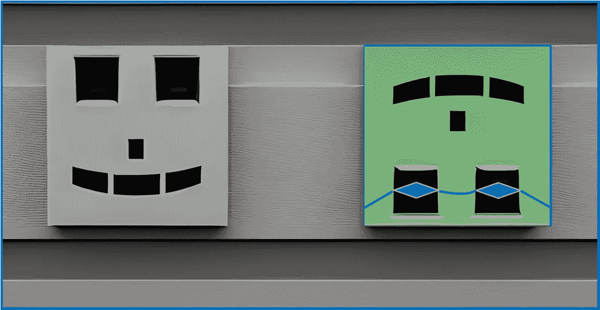**

****Shameless plug…****

****不要脸的塞:****

**再次感谢你和我一起参加这次谈话。我正在记录我参与 [**富里奥投资**](https://app.furio.io/?ref=0x024ee915c2BF9d12F98b750119051A752e18CAa0) 项目的漫长旅程。很高兴有你跟随冒险…**

**下面的图片/链接将带您进入描述 Furio 投资生态系统许多方面的文章。这是一个开始你自己独立研究的好地方。不要错过其中的一篇: [Furio 基础](/@jebalukas/discovering-furios-fundamentals-6724b1728a7c)文章，这是一篇简短的 Furio 初级读本…**

** [## 神话般的秋天浮利欧冒险

### 在一个不断调整的市场中，Furio 聪明而快速地改变着

medium.com](/coinmonks/my-fabulous-fall-furio-adventures-4bfb4663c94d) 

## [投资 Furio](https://app.furio.io/?ref=0x024ee915c2BF9d12F98b750119051A752e18CAa0)

参与者可以从该平台的交换页面购买 100 美元的皮毛.要向 Furvault 存款，您需要通过手动将现有投资者的推荐/钱包地址添加到好友推荐系统来加入。

***注意:如果伙伴/推荐行留空，则推荐奖励将由顶部的开发团队获得。我敢肯定，他们很高兴收到它；不过，我打赌他们得到了很多。然而……***

*通过我的推荐链接投资该项目将提供一点补偿，&是让我知道这些对话是有益的一种极好的方式。*

***很荣幸成为你的好友……***

## 我的 [Furio](https://app.furio.io/?ref=0x024ee915c2BF9d12F98b750119051A752e18CAa0) 好友地址是:

[0x 024 ee 915 C2 BF 9d 12 f 98 b 750119051 a 752 e 18 CAA 0](https://app.furio.io/?ref=0x024ee915c2BF9d12F98b750119051A752e18CAa0)

再次感谢阅读…** 

**另一个朋友在任何东西上画画——信封、收据&任何有表面的东西。我称之为他的账本系列。下面的例子…**

**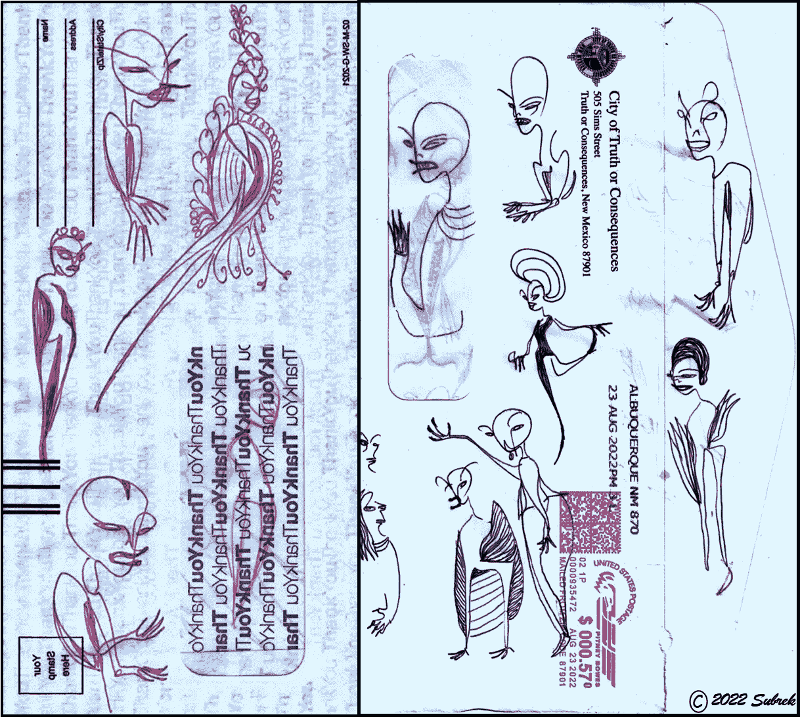**

**Truth or Consequences, New Mexico.**

> **交易新手？尝试[加密交易机器人](/coinmonks/crypto-trading-bot-c2ffce8acb2a)或[复制交易](/coinmonks/top-10-crypto-copy-trading-platforms-for-beginners-d0c37c7d698c)**