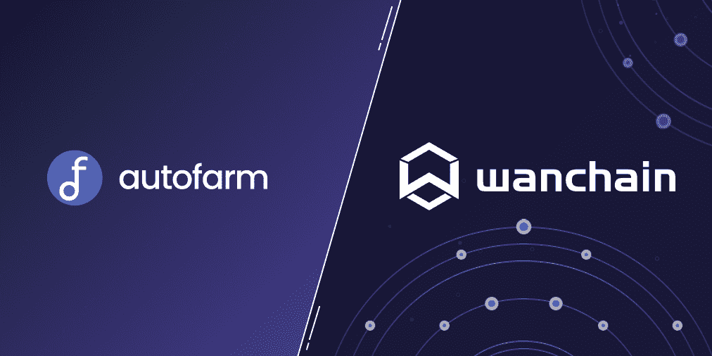

# 万链欢迎 Auto-Farm，全合一 DeFi Dapp

> 原文：<https://medium.com/coinmonks/wanchain-welcomes-auto-farm-the-all-in-one-defi-dapp-3e0fe342535c?source=collection_archive---------13----------------------->

自 2020 年 DeFi 的主流亮相以来，分散式金融可以说已经成为加密革命背后的主要驱动力之一。从最初的 DeFi summer bonanza 开始，DeFi protocols 在 2021 年 11 月的高峰时期在 TVL 积累了超过 1100 亿美元，从其最低基数惊人地增长了 50 倍。DeFi 的迅速崛起可归因于其对由去中心化和区块链驱动的新金融世界的独特看法。

定义好的和丑的

对许多人来说，DeFi 改变了金融的含义。其分散化的方法使人们能够获得曾经只属于传统金融机构的金融服务。有了 DeFi，任何有互联网连接的人都可以参与各种不同的金融活动。不管市场状况如何，这为用户提供了额外收入来源的额外机会。

虽然 DeFi 革命远未结束，但它的一个主要挫折是对许多人来说它仍然难以使用和维护。这是阻止 DeFi 实现其大规模采用目标的主要障碍之一。AutoFarm 希望改变这种状况，并希望效仿 Wanchain！

**AutoFarm** 是一款经过[审核的](https://github.com/autofarmnetwork/autofarm_audits/blob/main/CertiK%20Audit%20Report%20040521.pdf)多链产量农业聚合器，旨在优化用户在 DeFi 空间中与其他 DApps 互动时的农场产量。目前，Autofarm 支持 19 种不同的 EVM 兼容网络。Autofarm 最初是在 BNB 连锁店发起的，没有农场前和售前。自成立以来，它一直致力于优化所有 DeFi 用户的 DeFi 体验，无论他们的体验水平如何。对所有用户来说，以最低的成本生产农业。

**自动武装金库**

金库是产量优化器，专注于以经验最佳间隔为用户提供**自动复利**产量，同时通过久经考验的智能合同代码和同类最佳产量优化策略来分摊天然气成本。为了实现这一点，Autofarm 使用专有的*动态采集*优化器来实现所有保险库的最高 apy。

通过将众多功能打包到协议中，用户不仅能够在产量上获得最高的 APY，还能实现农业体验的自动化。

最终结果是:低成本，最大化的 APYs，以及农业过程的自动化！

> **—新的 Wanchain 支持—**

**广域网**

*   $万—$黄蜂
*   $WAN — $wanUSDT
*   $万—$万思
*   $WAN — $wanBTC
*   $万美元-万美元

**动物园管理员**

*   $万—$动物园

**AutoSwap(下一代 DEX)**

军械库中的下一个是自动交换。AutoSwap 是一个指数聚合器，为你的所有指数交易获取尽可能好的价格。与传统指数不同，AutoSwap 将你的交易分散在多个指数中，以确保最好的 T2 价格和最低的滑点。您的 AutoFarm Swap 交易也变得不可提前运行，并且不受套利影响。

当前多链支持:BSC、CRONOS、POLYGON、AVALANCHE

最终结果:最好的价格，低滑点，前期运行，套利证明！

**AutoFarm 的未来——不仅仅是农场和 dex**

AutoFarm 知道创新不会止步于农业和分散交易，最终的 DeFi 工具是一个生态系统！

下面先睹为快，看看 AutoFarm 的未来。

**AutoFund(即将推出)**
一个复制交易平台，将寻求赚取额外被动收入的交易员与寻求优化收益率的用户联系起来。

**AutoAnalytics(即将推出)**
AutoFarm 目前的 FarmFolio 产品未来的平台是 AutoAnalytics。这将作为 AutoFarm 的首要分析和机器学习平台存在。该功能将在 Autofarm 生态系统中发挥重要作用，因为它旨在分析 DeFi 用户的在线和离线链数据需求。

**AutoTrade(即将推出)**
一种智能自动化服务，用于执行交易策略，如美元成本平均(DCA)和基于规则的高效、无缝且经济高效的执行。

**AutoAlerts(即将推出)**
一种警报服务，利用 AutoAnalytics 的数据功能、AutoSwap 的限价单和 AutoTrade 的智能执行来改善 Autofarm 生态系统中的整体用户体验。

**为什么是 Wanchain？**

Wanchain 是一个成熟的、完全兼容 EVM 的分散式区块链互操作性解决方案，利用区块链最新的分散式、互连性和可伸缩性，用于商业、公共、个人和国家用途。Wanchain 致力于通过互操作性、安全性和透明性推动区块链的采用，以下一代区块链为基础，为超过 17 种不同的第 1 层和第 2 层协议提供跨链链接。

Wanchain 在该领域的遗产不仅仅围绕其庞大的跨链桥网络，事实上，其突出的地位来自于强大而安全的跨链基础设施，这使其成为现有最先进和最安全的跨链平台之一。

**结论**

像 AutoFarm 这样的项目意识到，为了让 DeFi 蓬勃发展，用户需要增强整体用户体验的协议，同时开发支持提高用户效率和适应性的工具。寻求在多链功能水平上创新的项目是最先向区块链技术的未来迈出第一步的项目之一，自然与万链的互联世界愿景保持同步。

> 交易新手？试试[加密交易机器人](/coinmonks/crypto-trading-bot-c2ffce8acb2a)或者[复制交易](/coinmonks/top-10-crypto-copy-trading-platforms-for-beginners-d0c37c7d698c)