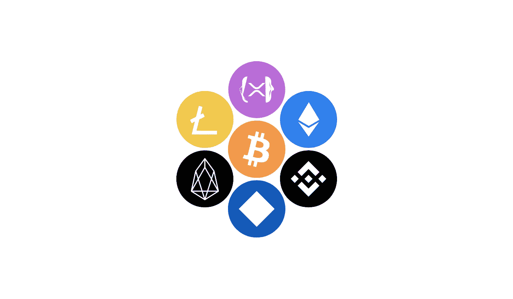
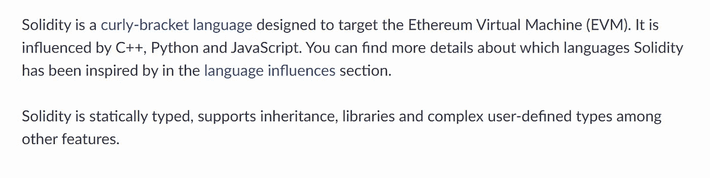
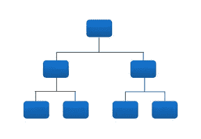

# 想知道为什么大多数区块链人不是主流吗？你还差几段。

> 原文：<https://medium.com/coinmonks/wanna-know-why-most-blockchains-are-not-mainstream-you-are-a-few-paragraphs-close-568533b99a89?source=collection_archive---------5----------------------->

It 毫无疑问，区块链已经成为金融生态系统中的热门词汇之一，由于其带来的好处和可能性，它迅速被普通大众所采用，跨越了安全性、可扩展性和去中心化的各个方面([T3 的组件，区块链三难困境](https://academy.binance.com/en/articles/what-is-the-blockchain-trilemma) )。

它蓬勃发展的一个原因是它正在彻底改变金融。这让我们想到了分散融资的概念。

Image credits: https://fcs.ninja/blockchain

然而，这些杰出的网络是由一个人或一群人发展起来的；他们有足够的声望来塑造和管理他们周围的社区或生态系统。一些最著名的区块链和他们的创造者是[比特币](https://en.wikipedia.org/wiki/Bitcoin)(由中本聪创造)[以太坊](https://en.wikipedia.org/wiki/Ethereum)(由维塔利克·布特林创造)[币安智能链](https://en.wikipedia.org/wiki/Binance)(由赵昌鹏创造)等。

让我们后退一步——如果你对区块链一无所知，请查看[这个资源](https://en.wikipedia.org/wiki/Blockchain)。

> 旁注:这是和我的老朋友[里维斯](https://twitter.com/Reeves_Vik)的一次被动合作。一定要在推特上看看他！

Image credits: [https://giphy.com](https://giphy.com)

与区块链相关的概念数不胜数(几乎是无穷无尽的),肯定会花费你一些宝贵的时间来熟悉，但是——放轻松，我的朋友；Poco a poco。

不管怎样，我们应该深入到这篇文章的争论焦点——为什么大多数区块链人不是主流。

> 请注意，我在这里分享的所有信息都是基于个人观点和研究，我不打算以任何方式批评任何 L-1、L-2 或类似的区块链，也不打算给出任何形式的财务建议。阅读以获得信息；谢谢:)

这些是对现有的和新推出的区块链构成威胁的少数错误(或缺陷),如下:

## 编程语言、框架和库的选择少，开发人员资源的可用性低。

Image credits: Fotis Fotopoulos on [Unsplash](https://unsplash.com/)

对于任何区块链的成功，最重要的优先事项之一应该是支持它的软件开发社区；buidlers 是任何网络成功的关键之一。取得成功的一个方法是正确选择编程语言、框架、库和工具，以适应任何区块链上应用程序的开发。

即使这是一种看起来很有前途的新编程语言，也应该考虑学习曲线及其适应率(从 Python、JavaScript、Ruby、Rust、Solidity 等过渡到所选编程语言的难易程度)。以太坊和其他 EVM 兼容连锁店的一个显著优势是语言的选择(特别是可靠性)。它的设计和语法风格非常类似于 JavaScript、C++和 Python。这使得开发人员很容易过渡到它(显然，这些语言得到了编程社区中许多开发人员的支持)。

Snapshot from [https://docs.soliditylang.org](https://docs.soliditylang.org/)

此外，应提供全面和详细的文档，以满足在区块链上开发 dApps 时使用的工具的学习过程。这可以通过雇佣开发者关系以及为社区开发者提供激励来实现，以在生态系统上提供相关内容。这可以通过推出黑客马拉松、奖金计划、资助和奖励等来实现。

总之，语言、框架、工具的选择和支持学习的资源的可用性对区块链的成功至关重要。

## 营销努力不足或微不足道

Image credits: [https://sadakabtidon.com](https://sadakabtidon.com)

尽管技术和软件的复杂性对任何区块链的成功都至关重要，但营销也扮演着同样重要的角色。换句话说，没有复杂产品的可见性，就不可能有公众参与。许多区块链未能认识到这一事实，并在开发方面投入了如此多的资金，明显忽略了他们应该迈出的营销步伐。应该投入大量资金进行营销，以促进产品的采用。

## 对新项目的批评和(或)低支持和鼓励；FUD 的原因(恐惧、不确定和沮丧)

Image credits: Google Images

FUD 是恐惧、不确定性和沮丧的杜撰术语，也是区块链领域使用最广泛的缩略语之一。

众所周知，生态系统中有许多别有用心的坏人；因此，在做出投资选择时应该进行审查，以避免资金损失，要知道区块链是一个[无许可](https://en.wiktionary.org/wiki/permissionless)和[无信任](https://bootcamp.uxdesign.cc/web3-building-trust-in-trustless-communities-fe1abd6bb1e4)的协议。这给生态系统中寻找下一个投资对象的投资者带来了疑虑和不确定性。

最近，许多区块链已经习惯于在没有对他们的项目进行内在研究或洞察的情况下发出警报或玷污项目所有者的形象。你会遇到像“我们与这个项目没有任何关系”这样的免责声明。骗局，除非证明不是这样”或“不要投资，直到我们批准它”。这使得社区更少参与，并在整个生态系统中吸收更多的张力。

更好的方法是宣传项目，使用更健康的免责声明，如“不是财务建议”或“做你的研究”。此外，除非有相反的证据，否则说一个项目是骗局是不明智的。你最好表达对其状态的不确定性，而不是到处发出危险信号。

这是杀死即将到来的区块链的因素之一。我认为以太坊区块链和币安智能链在处理和调节生态系统项目方面应该效仿。

这对于保持和欢迎生态系统中的项目至关重要。

## 组织不当的生态系统目录

Image credits: [https://usabilityfirst.com](https://usabilityfirst.com)

一个有组织的生态系统目录是任何区块链的基本组成部分之一，因为它向社区提供了多种选择，因为他们有机会探索在这样一个目录中审查和列出的项目。这给了投资者一种寻找或研究项目的感觉。许多区块链往往没有一个结构良好的生态系统目录，这不是一个理想的方法。

## 区块链的基金会或核心团队的透明度(和问责制)较低

Image credits: [https://insidehighered.com](https://insidehighered.com)

核心团队或治理基础缺乏问责，这给了很多区块链人一记响亮的耳光。作为一个分散的网络，最受赞赏的方面是社区及其执政党所采用的问责制和开放性。问责可能受到多种方式的侵犯，无论是与财务、参与还是所采取的步骤有关。

虽然不太猖獗，但一些区块链基金会倾向于在不告知其社区的情况下做出决定。一些可能的情况是，团队分配或其本机令牌的流动性在未经社区同意或验证的情况下被操纵，或者在未经社区通知的情况下投资于 DeFi 或其他解决方案。

这种举动对区块链的成功来说是有风险的，可能会导致社区的低信任度以及之后其原生令牌的贬值。

> 人无完人，但至少从 A 到 z 的区块链内部事务应该有一个良好的开放水平。

我在这篇文章中提到了一些棘手的问题。请注意，它会根据具体情况进行加法或减法更新。

# 摘要和脚注

我绝不是在批评任何区块链。为了开发所有不可思议的网络，付出了如此多的努力；应该对它们进行适当的监管。Buidl 让我们建造吧！

大声喊出来[以太坊](https://ethereum.org/en/)、[理学学士](https://www.bnbchain.org/)、[阿尔格兰德](https://www.algorand.com/)、[阿莱夫零](https://alephzero.org/)、[索拉纳](https://solana.com/)以及更多为你所做的一切！

感谢你停下来阅读这篇文章。如果你喜欢，关注我，看看我的 Twitter 句柄， [@EOttoho](https://twitter.com/EOttoho) ！

值得称赞。和平💚

> 交易新手？尝试[加密交易机器人](/coinmonks/crypto-trading-bot-c2ffce8acb2a)或[复制交易](/coinmonks/top-10-crypto-copy-trading-platforms-for-beginners-d0c37c7d698c)