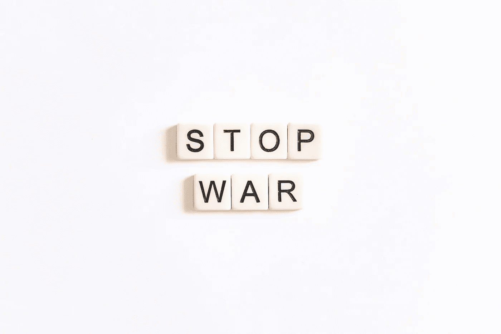

# 除了银行业，战争一无是处

> 原文：<https://medium.com/coinmonks/war-is-good-for-nothing-but-banking-bc37dfcb3102?source=collection_archive---------51----------------------->

我前几天说过，比特币最没意思的是它的价格。对价格的关注是可以理解的。对于那些寻找财富的人来说，这是一种享受。但是那些对财富不感兴趣的人呢？因此，如果有一个任何人都可以支持的话题，那就是比特币结束战争。

是的，这是一种廉价的射击，我知道，因为谁会说他们不想听到结束战争的解决方案？那么，我会补充一点细微差别，所以至少有一点你可能不同意:比特币标准的世界会让战争受到严厉的货币约束。

Photo by [Sincerely Media](https://unsplash.com/es/@sincerelymedia?utm_source=unsplash&utm_medium=referral&utm_content=creditCopyText) on [Unsplash](https://unsplash.com/s/photos/no-war?utm_source=unsplash&utm_medium=referral&utm_content=creditCopyText)

让我们后退一步，看看我们所知道的现代战争。在过去的 100 年里，我们参与战争的指数规模和持续时间与其说是一种技术现象，不如说是一种货币现象。让我解释一下。

在前现代时代，技术可能会让一方比另一方更有优势，但金钱永远是最后的支票。在现代货币(即法定货币)出现之前，战争的货币负担落在了参与战争的主权国家身上。这意味着当钱用完时，战争将很快结束。

然而，在现代，这种货币负担被国有化了——不仅是税收，还有通货膨胀。事实上，凯恩斯本人也写过关于为一战买单的文章，并称赞英国人将货币贬值作为金融解决方案。这意味着，当资金耗尽时，政府会以人民的钱贬值为代价，用债务永远资助战争。这就是为什么现代战争总是打到底。

换句话说，当那些选择参战的人以牺牲他人为代价时，战争对参战者来说就变得非常非常有利可图。没有人比银行更能从战争中获利。法定货币将战争融入了它的本性，并且无视以前总是限制战争的经济现实。

银行从战争中获利巨大。主权国家从银行借钱，然后从银行拥有的企业那里购买战争机器，当战争结束时，银行可以永久地印钱，从胜败双方的公民那里收回债务。

比特币等硬通货标准的世界可以解决这个问题，因为人们会要求用真钱来换取他们在战争中的帮助。他们不会接受债务工具，包括法定货币。因此，主权国家将需要支付硬钱来参与战争；这是不能膨胀的钱，所以成本是真实的。当银行放贷时，它们将需要贷出真钱，并需要对贷出真钱的风险进行定价，从而增加为战争目的借钱的成本。

所以，是的，这并不完全是绝对没有战争的乌托邦，但它至少会让战争基于严酷的经济现实。幸运的是，在这个现实中，战争变得不那么有利可图了。战争就是毁灭，如果参与战争的所有各方都为此付出应有的代价，那么战争就会减少。

你的想法，意见，不同意见都欢迎写在下面！如果你对比特币及其更具知识性的话题感兴趣，请加入我在 https://discord.gg/XvxYuS2WF6 的新比特币社区。一如既往，喜欢或分享将不胜感激。

*作者拉斐尔·米拉富恩特。2022 年 8 月 11 日*

原帖:[https://www . Facebook . com/Rafael . mirafuente/posts/pfbid 0 yqqbjehr 2 ssuog 6j 3 qmmtaq 5b 8 CXC pnh 5 bjjyatjjkrkhz 9 smihztb 4 fjejzhu 7 l](https://www.facebook.com/rafael.mirafuente/posts/pfbid0yqqBJehR2ssUoG6j3qmMTaQ5B8CxCpNh5bjjYAtjJkRKHZ9smihZtbg4FjEJjhU7l)