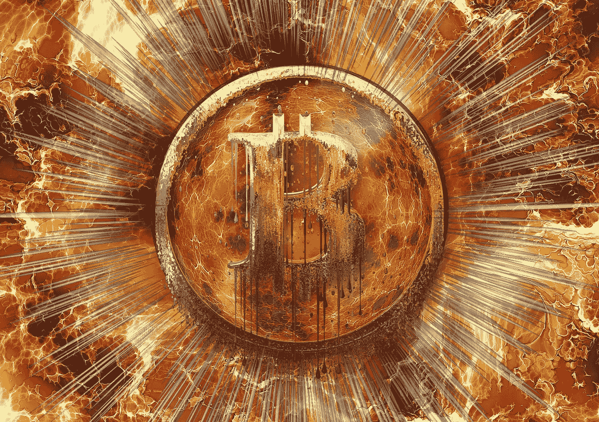

# 警告！比特币即将崩盘至 10000 美元！

> 原文：<https://medium.com/coinmonks/warning-bitcoin-is-about-to-collapse-to-10-000-9c2f8cdda100?source=collection_archive---------6----------------------->

## 最终崩溃迫在眉睫！

Cover Image : by geralt on [Pixabay](https://pixabay.com/illustrations/big-bang-explosion-armageddon-pop-422747/) modified with [Pixabay](https://pixabay.com/illustrations/fireball-fire-armageddon-explosion-1229866/). Logo by Vallota on [Pixabay](https://pixabay.com/illustrations/cryptocurrency-digital-money-3146112/)

比特币(BTC)吸收了 FTX 交易所毁灭性破产的第一波冲击，没有像许多人预期的那样大幅下跌。出现了温和的抛售，但或许更大的抛售正在逼近。

FTX 仍可能是主要事件，这是“坏消息”,将为最终价格下跌创造条件，然后…