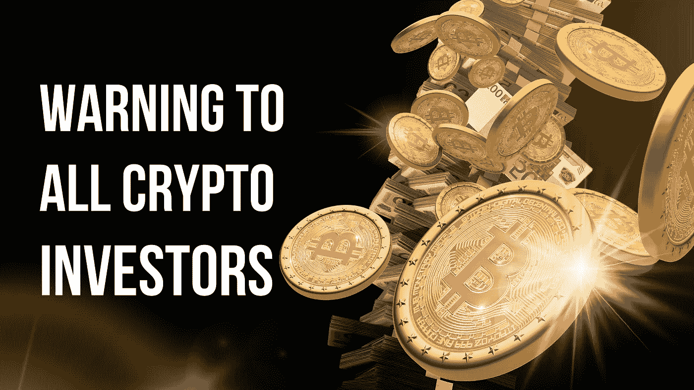

# 警告所有加密投资者！

> 原文：<https://medium.com/coinmonks/warning-to-all-crypto-investors-a7da499a59d?source=collection_archive---------12----------------------->

## 到目前为止，我们都知道 2022 年对投资者来说是一段艰难的时期。纳斯达克指数下跌了 33%，债券市场和加密等风险资产受到的冲击最大。截至第三季度末，S&P 下跌了 25%。

