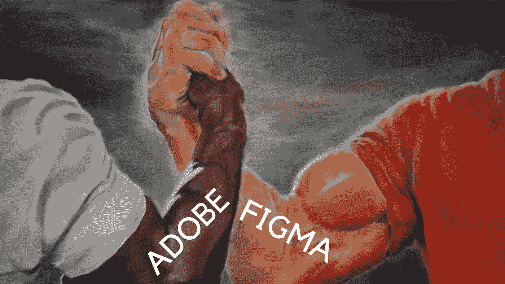
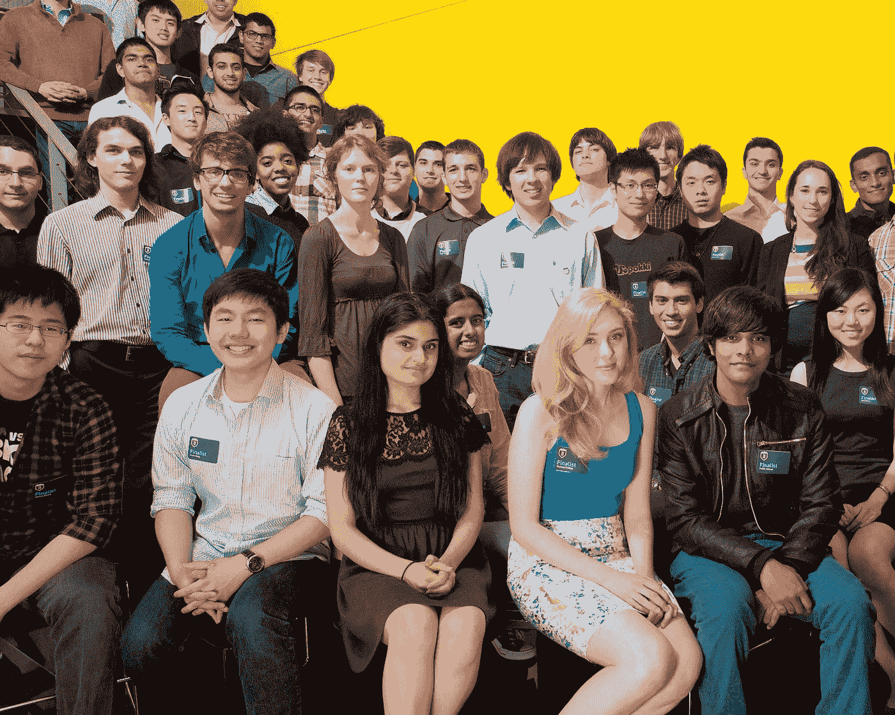

# 奥多比绝望了，还是只是千里眼？

> 原文：<https://medium.com/coinmonks/was-adobe-desperate-or-just-clairvoyant-9c098cc7c57e?source=collection_archive---------18----------------------->

Adobe paid $20B for Figma.

很长一段时间，我所有的新闻都是关于女王的，然后是费德勒的退役，然后是菲格玛。

对于那些不知道 Figma 是什么的人来说，它是 Adobe 的未来。

这是设计软件界的金·卡戴珊，只不过它真的有用，粉丝们绝对喜欢它。

所以 Adobe 买了。

多少钱？

啊啊，这才是真正有趣的地方。

典型的 Saas 的收入可能是 6-12 倍。

Adobe 刚刚以 50X 的价格收购了 Figma。

200 亿美元。

想一想，我们现在都处在一个泥泞、潮湿和令人讨厌的羽绒市场。

50 倍？

哇！他们一定非常非常想要。

他们多付了吗？

也许吧，但为了防止 Figma 不可避免地超越他们并吃掉他们的午餐，Adobe 不得不尽早收购他们的竞争对手。

The genius of Figma was its brilliant user experience and collaborative function.

Figma 会成为它过去的阴影吗？

Adobe 会像所有大公司一样收购、粉碎和掩盖它吗？

可能，大公司喜欢这样对待他们新收购的公司。

Figma 的忠实者会有什么反应？

一些人已经在大声呼救。

在所有报道的新闻和背景故事中，最酷的可能是 Figma 的创始人是一个叫 Thiel 的家伙。

"这笔交易将使菲尔德成为泰尔奖学金最富有的获得者，因为他在 Figma 的股份达到 2B+美元。"

彼得·泰尔是 PayPal 最初的黑手党成员之一，他在出售 PayPal 并创建 Palantir 后赚了钱。

加上他一系列利润丰厚的投资和巨额投资基金，他的身价约为 40 亿美元。

他是 FaceBook 的第一个外部投资者(想象一下他从 FaceBook 的成功中赚了多少)，也是一个犀利的辩手。

他创立了泰尔奖学金，实质上是给学生 10 万美元，让他们做自己想做的事情，前提是他们从大学辍学，全职研究这个想法。

Thiel Fellows are also known as 20 under 20\. Young genius who are given resources and mentorship to blossom.

这是激进的、可怕的、近乎愚蠢的。

但就像黑魔法一样，它成功了。

有哪些小天才从联谊会出来，震撼了世界？

维塔利科·布特林，哦，没什么大不了的，他刚刚创立了以太坊，价值约 15 亿美元。

印度最年轻的亿万富翁，OYO 房间的创始人里泰什·阿加瓦尔。

世界上最年轻的白手起家的亿万富翁，Luminar Technologies 的创始人奥斯汀·拉塞尔(Austin Russell)。

柏杨·史莱特，海洋清理组织的创始人，正在清理海洋。

永远不要低估年轻人的潜力。

有了正确的成分、适当的资源和正确方向的足够推动，奇迹之外的事情可能就会发生。

Vitalik Buterin, the co-founder of Ethereum, at age 28, is worth around $1.5 Billion.

哦，Adobe 的下一个菜单是什么？

也许坎瓦？

它们目前的估值约为 400 亿美元，我猜这对 Adobe(市值 1350 亿美元)来说是个不小的数目。

这对创业公司来说意味着，随着所有这些重大收购的发生，市场已经准备好迎接更多有进取心的、颠覆性的技术进入。

考虑拆分 Adobe 的产品，看看如何有选择地在一个利基市场提升用户体验，让你的产品适应市场，并在那里开花结果。

这就是菲格玛、坎瓦和其他许多人的做法。

-

Adobe 是否为 Figma 多付了钱？

-

#创业#商业# startupx #成长#成功#社交媒体#文化#创业#战略# canva # figma # adobe #收购#设计师#竞争#彼得希尔#蒂尔费洛#维塔利布特林#伯颜#奥斯汀罗素#Riteshagarwal

> 交易新手？试试[加密交易机器人](/coinmonks/crypto-trading-bot-c2ffce8acb2a)或者[复制交易](/coinmonks/top-10-crypto-copy-trading-platforms-for-beginners-d0c37c7d698c)