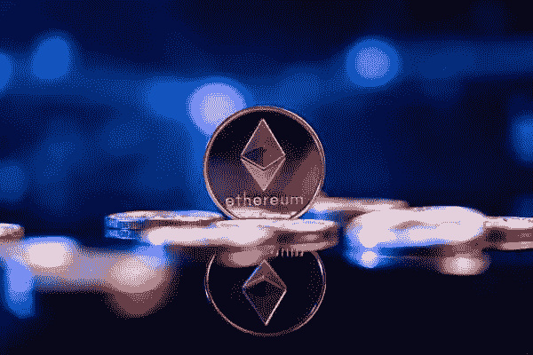
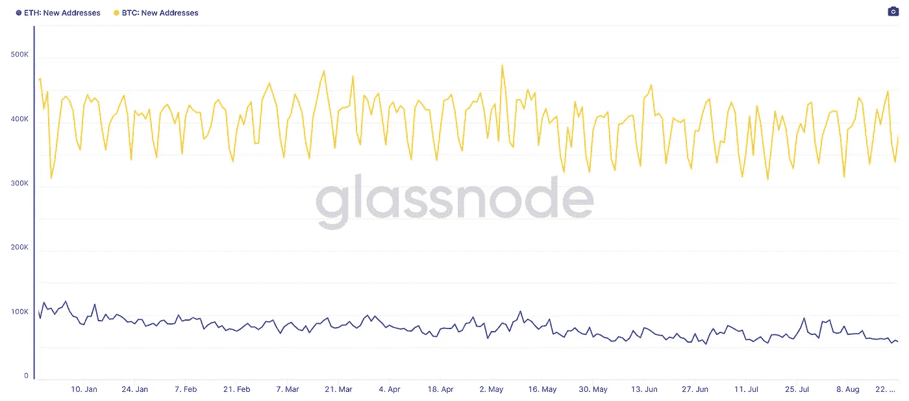
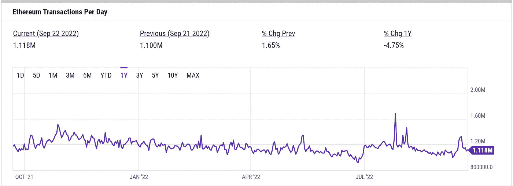
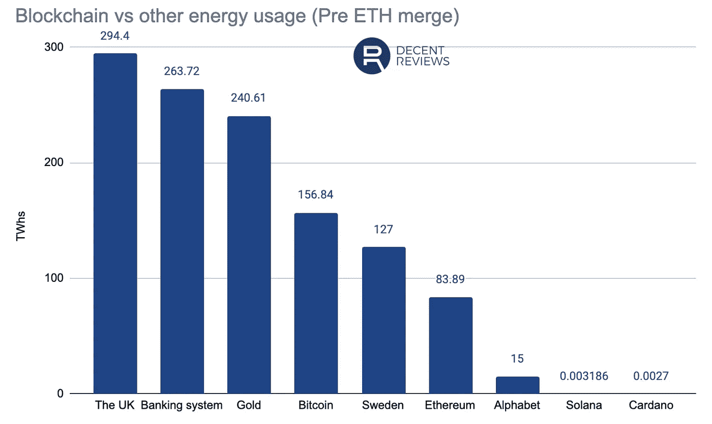
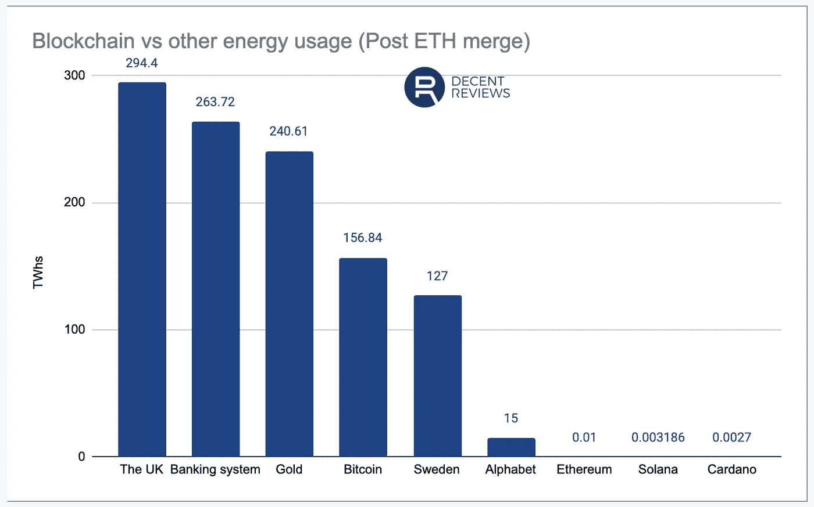

# 以太坊的合并真的成功了吗？

> 原文：<https://medium.com/coinmonks/was-ethereums-merge-really-successful-df6d425512dc?source=collection_archive---------24----------------------->

上周，[世界第二大加密货币](https://www.fxempire.com/crypto/eth)创造了历史，成为第一种有效取代其共识机制的主要加密货币，尽管这对以太坊开发者来说确实是一个里程碑式的成就，但围绕转向股权证明的宣传很快就消散了。

# 以太坊没能带来新用户

为了让现代世界中的任何东西成长甚至生存，它必须保持新的支持者、信徒和用户的持续流动。虽然现在下定论还为时过早，并且警告说我们正处于一个加密的冬天，但以太坊的成功合并未能为其生态系统带来任何新用户。

如上图所示，合并未能给区块链带来新用户。

合并如何影响事务吞吐量？

正如您可以从 Coin Metrics 提供的链上数据中看到的，合并后，以太坊处理的平均交易数量几乎保持不变，这使得 PoS 的可伸缩性成为目前的一个激烈争论。

# 交易成本呢？

但也许新用户进入以太坊生态系统的最大障碍是极高的交易成本。许多投资者认为合并最终会大幅降低汽油费。燃气费是在以太坊的区块链上进行任何交易所需的费用。

上面的图表显示以太坊的煤气费在过去的一年里大幅下降。然而，天然气费用的下降与该项目的利息损失相关，这可能与其基础资产价格的损失有关。

# 以太坊 2.0 降低能耗

以太坊 2.0 合并后的一个真正的成功是备受期待的能耗降低。据估计，能源使用量已经下降了 95%-99%。

虽然还不确定这是否会以生态系统的安全、审查阻力和其他可能的未知后果为代价，但这种减少是合并的基石，虽然其积极影响可能在一段时间内不会看到，但它肯定会加强以太坊的长期成功，因为全球只会加强其能源保护法规。随着世界变得更加环保，这也可能会在未来吸引更多的人参与进来。

这是合并的最重要的方面，即使所有其他的希望都是徒劳的，能源方面将证明越来越重要，并在未来几十年受益，我们甚至还没有开始看到这一点的影响。所以如果仅仅因为这个原因合并就成功了。

任何对我们致力于比特币交易的免费服务感兴趣的人，只需点击这个[链接](https://www.thegoldforecast.com/bitcoin)。

*最初发表于*[*【https://www.fxempire.com】*](https://www.fxempire.com/forecasts/article/was-ethereums-merge-really-successful-1138156)*。*

> 交易新手？尝试[加密交易机器人](/coinmonks/crypto-trading-bot-c2ffce8acb2a)或[复制交易](/coinmonks/top-10-crypto-copy-trading-platforms-for-beginners-d0c37c7d698c)