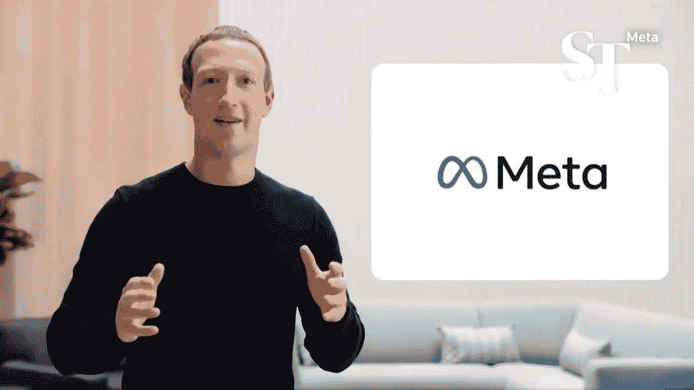

# 扎克伯格押注元宇宙是错误的吗？

> 原文：<https://medium.com/coinmonks/was-zuckerberg-wrong-in-betting-on-the-metaverse-f29745c2c53d?source=collection_archive---------15----------------------->

Zuckerberg taking a monumental bet on an emerging tech few understands is quite a bold move.

脸书在 2021 年更名为 Meta。

Meta 在元宇宙上花了 100 亿美元。

他们估计，到 2024 年，元宇宙将是一个 8000 亿美元的市场。

更多的估计认为 2031 年将达到 3 万亿美元。

仔细想想，用 1000 万到 200 万美元的赌注来赢得 3T 的奖金是显而易见的。

“在 2020 年 10 月之前，元宇宙这个词在 SEC 的文件中只出现过 5 次。2021 年，这个词被提到了 260 次。”

Meta 是元宇宙标准论坛的一部分，该论坛包括 Adobe、Epic Games、宜家、高通、索尼、XR 协会和 SDOs、Khronos Group、万维网联盟和开放地理空间联盟。

我们明白了。

每个人都对元宇宙感到兴奋。

还是只有大公司？

还是只是 Meta？

该公司前身为脸书。

Trying a new idea and changing your entire half trillion dollar company to a new concept is quite different.

市值超过 4 . 4 亿美元的 Meta 公司首席执行官马克·扎克伯格坚信元宇宙。

“扎克伯格和其他 Meta 领导者认为，虚拟和增强现实耳机将成为主要的下一代计算平台，并愿意在可能需要几年时间的技术和尚未准备好发布的原型上投入巨资，以及大量的技术专家，以便与苹果、谷歌、微软和其他关注该行业的公司竞争。”

Meta 在 2021 年赚了 1179 亿美元，但他们准备拨出很大一部分来支持他们的元宇宙愿景。

据报道，Meta 的现实实验室部门拥有超过 17，000 名员工。

他们正在研究各种 AR/VR 和触觉技术，类似于我们在热门电影“Ready Player One”中看到的技术。

扎克伯格坚信未来属于元宇宙，并正在全力以赴实现这一愿景。

因为元宇宙还处于起步阶段，所以可以相当准确地说，扎克伯格本质上是在赤手空拳地展现一个全新的行业。

这可能惹恼了一些人。

员工们想知道为什么要走这条路。

股东们感到困惑的是，为什么 Meta 在元宇宙的研发上投入了大量资金，而收入却受到了影响。

专家们指责扎克伯格把脸书变成了他的个人游乐场。

扎克伯格的直觉是不是太危险了？

The metaverse is still at its infancy, but large will it grow to?

在脸书决定直接进入元宇宙之前，它有 36 亿用户。

我同意元宇宙是一个很棒的概念，会吸引我们的注意力和想象力。

对于任何能够首先插上国旗的人来说，这绝对是一个巨大的潜在市场。

谁知道呢，也许扎克伯格脑子里有一个更大的计划，只有当他的计划被完全执行时，这个计划才有意义。

但是，对于一家市值 5000 亿美元的上市公司的首席执行官来说，这么快就冒这么大的风险，是不是有点太偶然了？

你是法官。

-

扎克伯格押注元宇宙是错误的吗？

-

#创业#商业#创业#成长#成功#社交媒体#文化#网络 3 #战略#马克扎克伯格# facebook # meta #元宇宙#亿万富翁#现实实验室#扎克伯格# eth # btc #密码#黑客#钱包