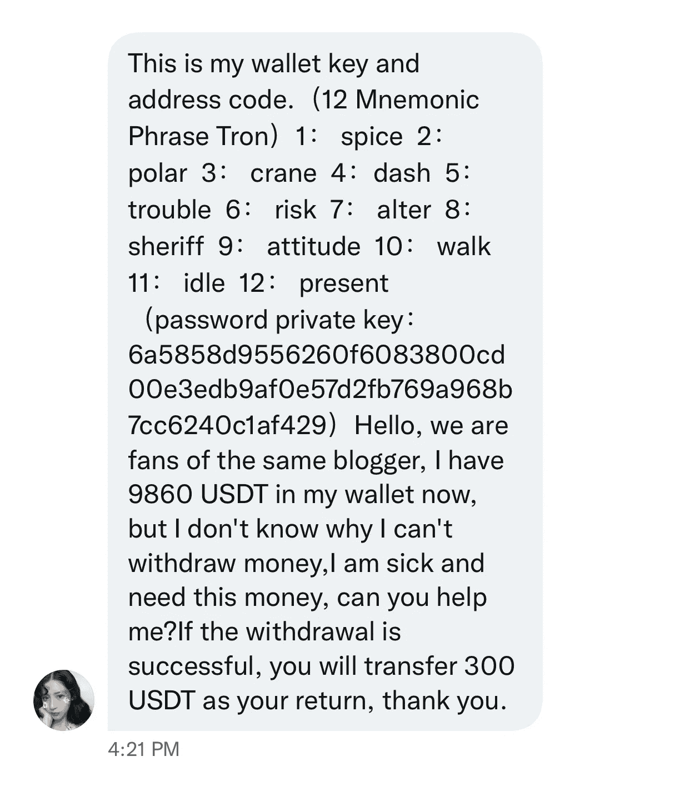

# 小心这个新的加密骗局

> 原文：<https://medium.com/coinmonks/watch-out-for-this-new-crypto-scam-686218d3688a?source=collection_archive---------15----------------------->

好得难以置信…

在 Twitter/脸书/LinkedIn 上收到一条类似这样的消息？

会不会是……免费的钱？

**不！**

但是他们放弃了他们的私人钥匙…而且不是“不是你的钥匙，不是你的钱包”吗？

我明白了，我的 NFT 包包也下降了，但这不是收回那辆早已远去的菲亚特的方法。

我将尝试用简单的术语来解释这一点，即使是非本地的加密专家也能理解。

基本上，他们会给你这个钱包，私人钥匙和所有的东西，然后他们会一直等到你进去

你会检查它，看到资金，想哇哦哦，我发财了！但是等等，尽管在 USDC 有 1 万美元，(免费的钱！)没有足够的汽油费来寄给我自己。

没问题，我会给我自己的钱包寄一点 ETH 去加油，然后拿着我的免费的$$$和新钥匙离开。

但是，当你把$$$转到这个钱包时，一个聪明的交易机器人会把所有的资金偷回来！包括你的 ETH！不不不

再见，财富。

本来可以买这么多新 NFT 的。*叹息*。

[这篇文章](https://ethereum.org/en/developers/docs/mev/)分解了 MEV 的过程，又名最大可提取价值，又名这些智能机器人如何在你说出“被骗”这个词之前窃取资金

这可以用于更道德的赚钱，如通过套利，如上文所述:“搜索者在区块链数据上运行复杂的算法，以检测有利可图的 MEV 机会，并让机器人自动向网络提交这些有利可图的交易。”

不过竞争相当激烈:“因此，对于一些竞争激烈的 MEV 机会，如 DEX 套利，搜索者可能需要向矿商/验证商支付 90%甚至更多的 MEV 总收入，因为有太多的人想进行同样有利可图的套利交易。”

1.)而是
2。)我猜
3。)整蛊
4。)人
5。)用
6。)诱惑力
7。)的快钱
8。)和一个免费的
9。)私钥
10。)比较容易
11。)给骗子
12。)在那里

当有疑问时，不要点击 randos 在 Twitter 上分享的任何链接，不要成为快钱诱惑的受害者。真正的短期收益只能来自翻转动物和其他随机生物的图片(不要引用我的话，NFA，DYOR，以及其他任何术语)。)

注意安全！保护你的钱！！！#wagmi