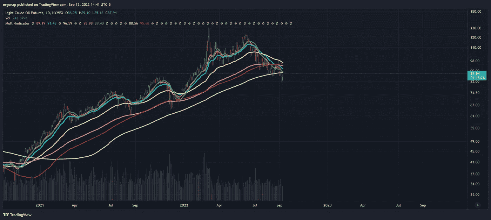
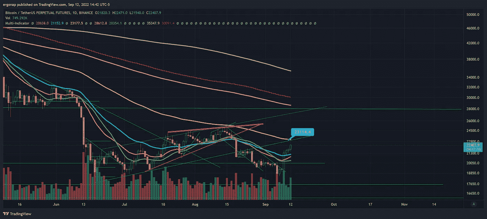

# 我们正在实时见证俄罗斯的崩溃

> 原文：<https://medium.com/coinmonks/we-are-real-time-witnessing-russian-collapse-6f27b864afff?source=collection_archive---------20----------------------->

## 加密货币市场/比特币市场分析 9/12

因此，我在我的[季度宏观](/coinmonks/now-comes-the-real-market-moves-catalysts-are-set-how-to-safely-navigate-whats-to-come-4c0821f8db1f)中警告说，我认为俄罗斯将在未来十年左右崩溃。我是说，整个国家。

这第一条推特的意思是:连俄罗斯人在溃败后都不想再发球了。

Reading between the lines here is Russians saying “no thanks”. lol.

另请参见下面路由器:

This was a huge turning point.

这还不是全部。还记得俄罗斯是如何利用加密来避免制裁和出售石油的吗？关于那个。

**印度拒绝用卢布**购买俄罗斯石油。(/end)。

这不是对俄罗斯有信心的表现。不仅如此，我预计油价很快会有一个巨大的调整。老实说，我们可能会在未来一两年内看到 50 美元的油价。这是金砖四国的死亡。美国将军会。

This is an overdue *bullish* correction. [https://www.tradingview.com/x/07OSYPTt/](https://www.tradingview.com/x/07OSYPTt/)

遗憾的是，这里(可能)下跌 50%对美国来说是一个福音，对俄罗斯来说是一个死亡，然而……这将是一个价格会再次上涨的确认。所以…也许几年下来，然后回到疯狂的价格。

比特币一直在向上挤压，要么多头离场，要么散户做空等待平仓。鉴于这种情况，明天 CPI 报告出来后我们就知道了。23K 确实是再看哪里。

[https://www.tradingview.com/x/nB36h4J1/](https://www.tradingview.com/x/nB36h4J1/)

因此，除非你觉得承担损失很有趣，否则在扣除 CPI 之前，我不会寻找任何职位。

> 交易新手？试试[密码交易机器人](/coinmonks/crypto-trading-bot-c2ffce8acb2a)或[复制交易](/coinmonks/top-10-crypto-copy-trading-platforms-for-beginners-d0c37c7d698c)