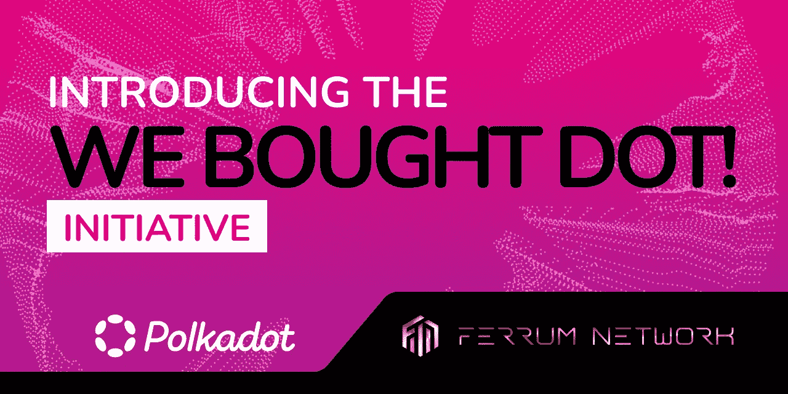

# “我们买了 DOT！”倡议已解释

> 原文：<https://medium.com/coinmonks/we-bought-dot-initiative-explained-e66f1d753c35?source=collection_archive---------18----------------------->

## 铁姆公司围绕其获得波尔卡多副链的承诺发表声明，并开始积累 dot。

亲爱的铁社区:

铁姆公司最近宣布，作为我们新计划的一部分，我们进行了大规模的 DOT 收购，“我们收购了 DOT。”这标志着铁进化的重要一步，因为我们承诺完全拥抱获得草间弥生和波尔卡多副链的旅程。

在本文中，我们将简单介绍一下什么是*伞链*以及波尔卡多和草间弥生*伞链拍卖*和*众筹贷款*如何运作，然后再深入探讨这一举措背后的原因。

# 了解 DotSama 生态系统

在我们能够有效地传达这项倡议背后的战略之前，了解 Polkadot-Kusama ( *DotSama* )生态系统是如何运作的非常重要。Polkadot 创始人 Gavin Wood 在创建这种“区块链的区块链”[第 0 层](https://research.tokenmetrics.com/layer-0-blockchain-protocols/)协议时，对[“与区块链最大化主义打赌”](https://cointelegraph.com/news/gavin-wood-polkadot-is-a-bet-against-blockchain-maximalism)采取了相当创新的方法。

其中一些创新与*副链*的固定方式有关。副链是通过一个名为*副链拍卖*的活动获得的，这通常是通过一个名为*众筹贷款*的过程获得资金的。

## 副链、拍卖和众筹贷款…

**Parachain** —首先， [*parachain*](https://wiki.polkadot.network/docs/learn-parachains) 是集成在波尔卡多特或草间弥生网络中的项目专用区块链。Polkadot 支持有限数量的副链，目前估计约为 100 个。

**副链拍卖** —由于副链的可用性有限，必须有一种机制来确保只有最有希望的项目才能获得*副链名额*。 [*副链拍卖*](https://wiki.polkadot.network/docs/learn-auction) 是在波尔卡多或草间弥生中继链上举行的拍卖，以确定哪个区块链将连接到副链插槽。

众筹贷款(crowd loan)—副链插槽可能会很贵。这需要一种方法为预收入项目提供资金。一个 [*众筹贷款*](https://wiki.polkadot.network/docs/learn-crowdloans) 允许一个团队众筹 DOT(用于波尔卡多特老虎机)或 KSM(用于草间弥生老虎机)来启动其副链拍卖。众筹贷款允许人们通过同意锁定自己的 DOT (KSM)直到租期结束来做出贡献。

要更深入地了解所有这些项目，请点击[这里](https://wiki.polkadot.network/docs/learn-parachains)。

## 草间弥生 vs 波尔卡多特

草间弥生和波尔卡多特之间有一个重要的区别。[波尔卡多特将这些差异描述为:](https://wiki.polkadot.network/docs/learn-kusama-vs-polkadot) *草间弥生*野性快；非常适合大胆的试验和早期部署。Polkadot 更加保守，优先考虑稳定性和可靠性。

草间弥生可以被视为一个货币化的 testnet 环境，在该环境中，产品、功能、激励和治理模式等可以在被推向 Polkadot 中存在的更适合生产的环境之前进行测试。这种关系在草间弥生的月亮河和波尔卡多特的月光等项目中得到了体现。加瑠罗/阿卡拉或施登/阿斯塔是其他例子。

# 铁姆公司的副链计划

铁开始锁定，不是一个，而是两个副链槽。一个在草间弥生中继链上，一个在波尔卡多特上。铁 X 网络将作为草间弥生副链存在，而铁网络无限层主网将作为波尔卡多特副链存在。

## 前所未有的方法

从使用[铁十字链令牌桥](/ferrumnetwork/a-lesson-in-security-ferrum-cross-chain-token-bridge-cd0fb78f6277)重新设计跨网络安全转移资产的方式，到通过 [Crucible](/coinmonks/crucible-ferrum-networks-revolutionary-defi-2-0-e22dd3f7cf6b) 部署前所未见的赌注和通缩奖励机制，铁一直在尝试并实现前所未有的。

我们在 DotSama 生态系统中保护副链的方法没有什么不同。在 DotSama 生态系统中启动的大多数项目从一开始就是基于*的项目。铁作为一个所谓的“遗留项目”，呈现出一定程度的挑战和优势。*

## *FRMx vs FRM*

*当试图理解这些具体的挑战和优势时，最好从 FRM 和 FRMx 背后的经济学目前的结构入手。在编写本报告时，约有 13%的 FRMx 代币在流通，而超过 50%的 FRM 代币在流通。通常，在进行众筹贷款时，项目会为这种活动预留 10-20%的代币供应量。虽然这可能与草间弥生的铁 X 网络的 FRMx 的大量非流通代币有关，但由于波尔卡多特的铁网络的非流通 FRM 供应较少，这一任务有点困难。*

***铁 X 网**—ku sama 上的铁 X 网有可能用 FRMx 的大量未流通代币做众筹贷款。铁姆公司计划开展 KSM 众筹贷款，将足够比例的 FRMx 分配给众筹贷款参与者。*

***铁网**——鉴于非流通 FRM 的供应量较低，波尔卡多特上的铁网众筹贷款提出了一定的挑战。国库中的代币越少，可用于交换流动性、多 wap 或生态系统增长计划(如捐赠基金、黑客马拉松和其他开发者支持计划)的过渡流动性的代币就越少。*

*幸运的是，铁姆已经想到了一个方法来迎合作为一个既定项目的优势。在一个大多数早期项目都是预营收的行业中，铁作为一个创收项目，弥补了可用代币的不足。因此，铁姆公司计划借出一大笔 DOT 来保护他们自己。这使得 FRM 中分配给众筹贷款的比例降低，从而减少排放，并为增长战略保留国债。当更新的 FRM 和 FRMx tokenomics 发布时，请继续关注这些倡议的更多信息！*

## *我们买了 DOT！*

*这就引出了“我们买下了 DOT”倡议！我们已经承诺在接下来的几个月里将我们收入的很大一部分用于积累大量的 DOT。我们买了近 3000 个点点购买交易，很快就进入状态💰👇【https://bit.ly/BiMonthlyDOTBuybackJuly2022】几天前又将继续进行 DOT 的例行采购。*

*点购买交易💰👇
[https://bit.ly/BiMonthlyDOTBuybackJuly2022](https://bit.ly/BiMonthlyDOTBuybackJuly2022)*

****注*** :如果你在问自己“为什么铁不也积累 KSM？”答案是由于 FRMx 和与 FRM 之间的巨大供应差异。草间弥生副链更容易通过众包获得。波尔卡多副链需要一个辅助方法。*

## *最后*

*我们不仅希望这一举措能让我们更接近保护 parachain 插槽的目标，还希望它能让我们更接近 DotSama 生态系统的整体！我们非常期待在 DotSama 生态系统中开始我们的旅程。*

*通过查看我们的合作与增长执行副总裁 Nick Odio 在 [Decoded Buenos Aires](https://www.youtube.com/playlist?list=PLOyWqupZ-WGvcE0HKKnORiFqWNv5onxCf) 参加 Kusamarian 的采访，了解我们为什么选择加入 Polkadot 反对区块链最大主义的赌注。*

## *关于铁网*

*铁是开创互操作性 2.0 时代的先锋。由 Quantum Portal 提供支持，铁网络的 mainnet 节点和相关基础设施将为行业中的每个链带来价值、数据和功能互操作性。利用铁网络，任何人都可以在一个网络上构建和部署解决方案，并立即启用多链功能，而没有为其 dApps 和项目管理多链基础设施带来的负担或技术债务。*

*本着打破大规模采用障碍的使命，铁通过减少摩擦，使初创公司和已建立的网络更加紧密，从而为行业提供动力。*

## *关于波尔卡多*

*[Polkadot](https://polkadot.network/) 是一个分片的多链网络，允许多个不同的区块链并行运行(作为副链)，连接到它的中继链。Polkadot 的基础设施使来自区块链的交易能够并行处理，还允许 parachains 通过跨链消息在彼此之间进行通信和交换资产，并通过桥与外部区块链进行通信和交换资产。*

# *铁网络重要环节*

*[网站](https://ferrum.network/) | [电报](http://telegram.ferrum.network/) | [推特](http://twitter.ferrum.network/) | [YouTube](https://www.youtube.com/channel/UCN658dMRTaH4C4dP32VHi6Q) | [不和](https://discord.gg/HEfKq57asd)*

> *交易新手？尝试[加密交易机器人](/coinmonks/crypto-trading-bot-c2ffce8acb2a)或[复制交易](/coinmonks/top-10-crypto-copy-trading-platforms-for-beginners-d0c37c7d698c)*