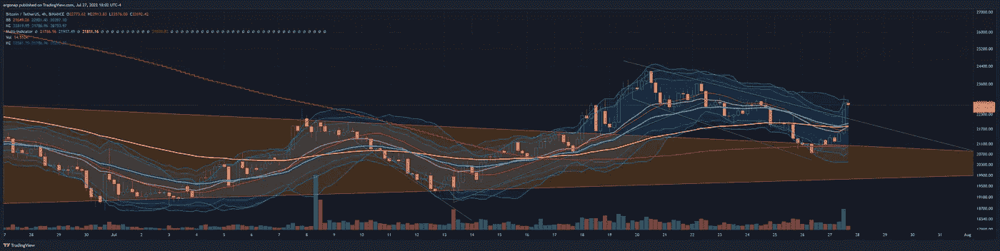
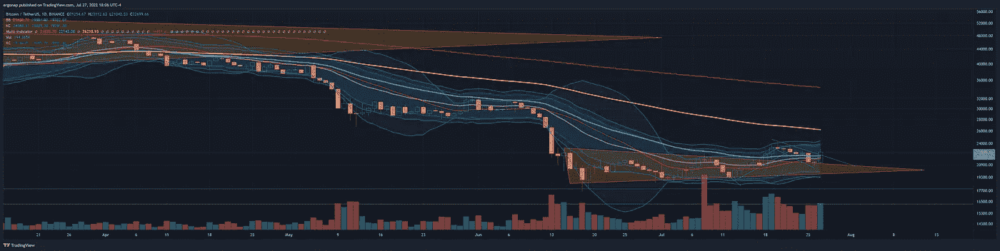
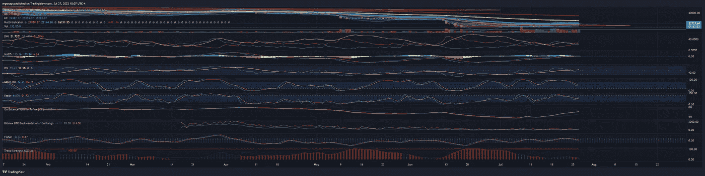
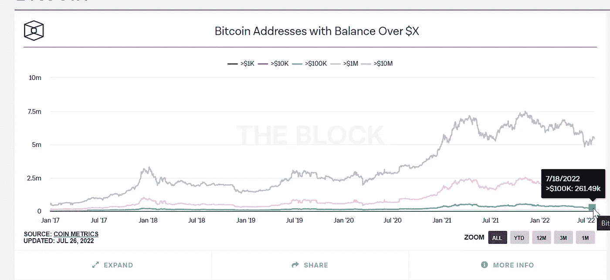

# 我们中断了频道！📈🤔

> 原文：<https://medium.com/coinmonks/we-broke-up-the-channel-8c675b1235cd?source=collection_archive---------35----------------------->

## 加密货币/比特币市场分析 7/27

今天有点重要。我们有可能发生黑天鹅事件，但相反我们打破了熊市，海峡，现在事情可能会好起来。还是那句话，时间还早，在这个市场要非常小心。FOMC 宣布加薪 75 个百分点，与上月相同。因此，虽然是的，我们可能会从这里上升——这看起来得到了合理的证实——记住有黑马正在逼近。例如，[联邦贸易委员会正在起诉 Meta](https://cointelegraph.com/news/ftc-files-lawsuit-against-meta-over-attempted-monopolization-of-metaverse) 。总的来说，成交量显示了对走势的支持。所以从日线图来看，我们**可能**正在测试 26k 美元。或者我们可以在期货到期日设置一个地狱，因为期货到期日也是星期五。据报道，[资金净流入大幅上升](https://beincrypto.com/coinshares-biggest-inflows-into-bitcoin-btc-since-november-2021/)——但我将检验我们在这方面真正看到了什么。

I think we’ll retest 22.3 and then up we go, but we’ll see. [https://www.tradingview.com/x/aJTrhMSW/](https://www.tradingview.com/x/aJTrhMSW/)

To. Be. Determined. [https://www.tradingview.com/x/9pCdJ6v8/](https://www.tradingview.com/x/9pCdJ6v8/)

其他技术指标从日线来看显示出一些不确定性，这一点不太确定。MACD 表明了行动的结束，而 DMI 表明我们现在还相对犹豫不决。所以这周剩下的时间就是期货到期。

This is not necessarily all clear, but we will see how the pullback goes. [https://www.tradingview.com/x/u2DHP76U/](https://www.tradingview.com/x/u2DHP76U/)

链上数据显示，没有人真正加入大玩家的行列。一般来说，这与泵是矛盾的。

big players are notoriously idle, and only the small players are jumping in.

> 交易新手？尝试[加密交易机器人](/coinmonks/crypto-trading-bot-c2ffce8acb2a)或[复制交易](/coinmonks/top-10-crypto-copy-trading-platforms-for-beginners-d0c37c7d698c)