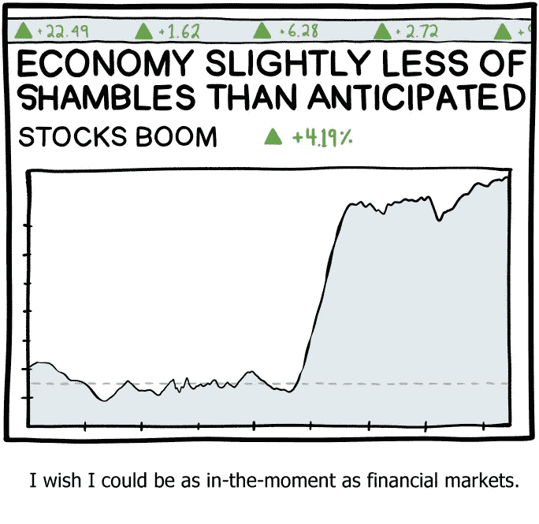
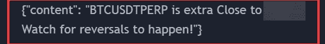
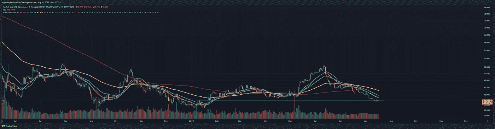

# 我们落后，但我们向上🤔❔

> 原文：<https://medium.com/coinmonks/we-lag-but-up-we-go-f746ee13d581?source=collection_archive---------47----------------------->

加密货币/比特币市场分析 8/16

好吧，这个市场是愚蠢的。我没有太多要说的，但最终结果是，我已经从 100%看跌变成了 60%左右。许多事情正在发生变化，而且即将发生更大的变化。在这一切的尽头是一个直接通向戈布林镇的垃圾场，但是现在，我们往上走。弃尸前大约两周。

SMBC 对实际发生的事情做了最好的解释。

BTC 是因为缺乏更好的措辞，而不是在这里被拒绝。这并不意味着人们没有抛弃 BTC——他们已经抛弃了。甚至在这篇文章之前 2 小时。但是…我想我们要走了。这是令人震惊的，考虑到连续几天普遍控制市场的彻底悲观情绪。

literally it makes no sense, but whatever. go with the flow. [https://www.tradingview.com/x/MVL9Ps5G/](https://www.tradingview.com/x/MVL9Ps5G/)

这是我的警觉对我尖叫的常识。这是我一手安排的。但是事情仍在发展，BTC 的统治地位仍在下降！

当 BTC。d 上涨，我们都有麻烦，需要退出市场。我会对 42%到 43%的 BTC 优势发出警告。在那之前，坐滑梯吧。

when this turns, a lot of people are going to lose their shirts. [https://www.tradingview.com/x/DIl62VIl/](https://www.tradingview.com/x/DIl62VIl/)

BTC 已与间谍脱离关系。Spy 今天有一些惊人的记录，我们突破了它们。这导致了:

This is not a valid question, especially for a trader. The valid question is: Why did you not prepare for it to break through or reject at them?

此外，提醒一下——人们仍在通过场外交易抛售比特币，这一直支撑着看涨情绪——这是今天的情况，昨天也有大量的比特币。如果我们一次看到很多这样的情况(即使一天只有几个也是一个问题)，这是一个退出信号。

> 密码量子警报，[2022 年 8 月 16 日上午 5:03]
> 🐳1，993.92 # BTC(48，039，531 美元)
> 流入#币安的资金总额
> 
> 密码量子警报，[2022 年 8 月 16 日下午 12:48]
> 🐳1，182.92 # BTC(28，235，700 美元)
> 流入#Bitfinex 的资金总额
> 
> 密码量子警报，[2022 年 8 月 16 日晚上 9 点 54 分]
> 🐳1，321.13 # BTC(＄31，696，873)
> 流入#币安的资金总额

> 交易新手？尝试[加密交易机器人](/coinmonks/crypto-trading-bot-c2ffce8acb2a)或[复制交易](/coinmonks/top-10-crypto-copy-trading-platforms-for-beginners-d0c37c7d698c)