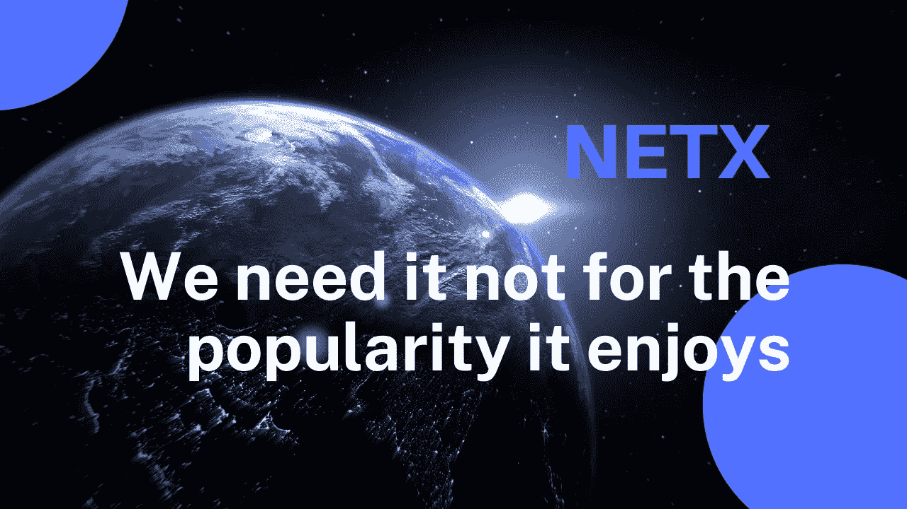

# 我们需要它不是因为它受欢迎

> 原文：<https://medium.com/coinmonks/we-need-it-not-for-the-popularity-it-enjoys-8ef2fc7a235e?source=collection_archive---------14----------------------->

Ethanim 系列第四部分

TL；速度三角形定位法(dead reckoning)

*   生命在人们对权力和自由的渴望中找到了它的意义。
*   选择分权不是因为区块链，而是因为失控。
*   不管有没有区块链的帮助，元宇宙注定要分权。



前三篇文章涉及了从元宇宙如何展开到 NetX 如何解读元宇宙的话题。很明显，元宇宙的未来取决于 Web 3.0。一个 Web 3.0 的元宇宙已经被世界认可甚至可能已经成为主流。

这篇文章阐述了为什么当虚拟世界融入现实世界时，个人和团体都走向分散化的存在。所以，NetX 元宇宙转向去中心化仅仅是因为 Web 3.0 的起飞？

```
**Life finds its meaning in people’s aspirations for power and freedom.**
```

先驱者总是指引着人类文明前进的道路。他们用他们的财产和权利中的中央集权推动了世界的快速发展。文明不断变化。它在对抗竞争中进化，在对抗压迫中成长。权力下放的出现预示着文明向自由和平等权利的迈进。

虚拟世界成为人们发泄欲望的理想之地，弥补了物理中心化世界对自由和利益的缺失。每年，新发布的 3A 大片游戏都以尖端的虚拟世界技术振奋人们的精神。随着自由王国吸引更多的人，虚幻的自我发现自己沉迷于这个虚幻的世界。然而，这个乌托邦有许多不足之处。

无论设置有多全面，游戏最终都会部署在服务器上。用户落入游戏开发者手中的风筝，因为他们设置固定的情节，在更新期间关闭，限制言论等。收入是在开发商遵循集中化规则的同时产生的。这个部分自由的世界作为一个相对包容的解决方案出现，在某种程度上削弱了邪恶之手。Web 3.0 在人类文明的召唤下自然到来，消除了这种集权的权威。

```
**Decentralization is chosen not because of blockchain but because of out-of-control.**
```

目前，区块链是实现权力下放的最佳方式。以前的文章简要介绍了为什么 Web 3.0 是元宇宙最适合的存在形式。区块链和 Web 3.0 不仅因为它们的去中心化属性，更重要的是因为它们在有机体生长的初始阶段支持公平和多样化的生存条件，作为失控的先驱。

随着失控的统治，集中的群体将逐渐走向去中心化，以换取更多的自由和权利，委托给已经习惯了的用户。在趋势 Web 3.0 中，权力委托以令牌和 NFT 的形式涉及所有权、使用权和投票权。这种解决方案缩短了在快速前进的生物群体模型中达到失控的时间。

随着进化的展开，一个没有控制的未来消除了集中的权利和团体，否认了它们的长期存在。这解释了为什么我们将分散的属性编程为集中机构的资产、权利和产品。我们想在这里描绘一个包容的、失控的元宇宙，拥有最多样化的生态。

```
**Metaverse is decentralized but not necessarily blockchain.**
```

随着人们对更自由的虚拟世界的渴望，人们对 Web 3.0 元宇宙寄予了厚望。这种分散的权力委托将是我们在设计和开发 NetX 时的首选。去中心化的区块链和 Web 3.0 响应了人类文明和愿望的召唤，而不是受到区块链和加密市场的繁荣和增长的刺激。在渴望自由的地方，网络元宇宙自然会失控。

这种进化驱动的去中心化找到了一种更简单的无控制方式。区块链符合文明的轨迹。然而，实现分权和失控的渠道不一定非得是区块链。我们认为，各种形式的存在将不受控制地出现。我们已经提到，分权应该吸收集权的长处。一个完全去中心化的元宇宙不仅能让用户重获自由，还能通过惩罚和激励等措施压制邪恶的灵魂。很难判断区块链是否满足需求。即使它失败了，优化的形式也注定会在这个分散的元宇宙出现。

我们的元宇宙呼吁去中心化，不是因为区块链获得了声望，而是因为元宇宙网络自然失控。分散的生命形式是不可避免的。区块链只是选择的工具。

# 📚必读

[Ethanim 系列-1](/coinmonks/metaverse-an-open-and-destined-future-b652734fbdf2) | [Ethanim 系列-2](/coinmonks/the-present-metaverse-doesnt-denote-decentralization-51cf038f6651) | [Ethanim 系列-3](/coinmonks/some-thoughts-on-metaverse-values-cd08a52f4e43)

***NetX，面向可信可靠的智能自治系统的数字生活的链原生互联网(***[***Trias***](https://www.trias.one/)***)***

[***铁人三项***](https://www.triathon.space/#/)***|***[***Ethanim***](https://www.ethanim.network/)***|***[***Tusima***](https://www.tusima.network/#/)***| Behemotum | Octavius | leviam | Divina***

> 交易新手？尝试[加密交易机器人](/coinmonks/crypto-trading-bot-c2ffce8acb2a)或[复制交易](/coinmonks/top-10-crypto-copy-trading-platforms-for-beginners-d0c37c7d698c)