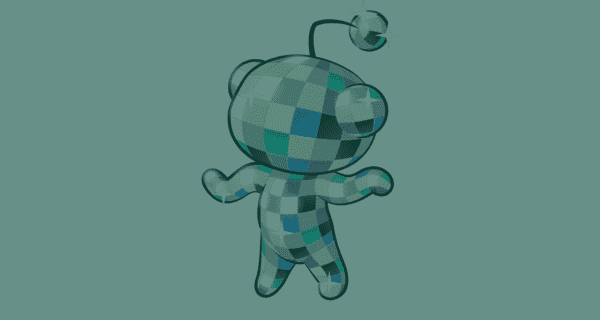

# 📛我们嗅到了 NFTs 的味道:Reddit 是下一个出售可收藏头像的网站

> 原文：<https://medium.com/coinmonks/we-smell-nfts-reddit-is-the-next-to-sell-collectible-avatars-45f7bfaad2f0?source=collection_archive---------22----------------------->

你可以称它为“可收藏的头像”，但它仍然是一个基于区块链的图像，以我们称之为 NFT 的独家许可出售，不是吗？我们会让你自己决定。

它看起来像 NFT，卖起来像 NFT，但 Reddit 声称其新推出的限量版数码产品只是…“可收藏的头像？”

**告诉我更多信息**

你可以在 Reddit 头像生成器中以固定价格购买 Reddit 在区块链的个人资料图片。

你不需要有一个加密钱包来购买艺术家制作的数字卡通人物。你的信用卡或借记卡应该足够了。

可收藏的头像存储在 Reddit 自己的区块链钱包 Vault 中进行管理，Reddit 目前在这里存储他们的社区积分。

它们可以在二级市场交易，如 OpenSea 或 SuperRare。

由与 Reddit 合作的独立艺术家制作，这些收藏品将在评论部分产生“类似发光的效果”，增加一种视觉效果，类似于 Twitter 用来识别 NFT 头像的六边形。

更重要的是，你可以混合和匹配你的头像的外观与 merch 在头像建设者！

这些头像由多边形区块链支持，所有者将被授权在 Reddit 上使用它们。

由于没有拍卖，所有的 NFT 都有固定的价格，可以通过美元等货币购买。

这些 NFT 头像的标价分别为 9.99 美元、24.99 美元、49.99 美元、74.99 美元或 99.99 美元。

艺术家将在他们的头像每次被购买时获得报酬，并有权获得任何二次销售的版税。

90 种不同的设计将在这个早期销售阶段发布。

> 交易新手？试试[密码交易机器人](/coinmonks/crypto-trading-bot-c2ffce8acb2a)或者[复制交易](/coinmonks/top-10-crypto-copy-trading-platforms-for-beginners-d0c37c7d698c)

**这不是 Reddit 第一次与 NFTs 进行竞技。**

去年，Reddit 发布了基于其吉祥物 Snoo 的限量版 NFTs，名为 CryptoSnoos，这是一件来自不同时空的不同维度坐标的艺术品。

**太久了？这里有一句俏皮话:** Reddit 推出了艺术家制作的“可收藏的头像”，这些基于区块链的数字卡通在它的平台上以独家授权出售。

喜欢这件作品吗？请务必在 www.brandxhood.com[**查看 OG 简讯，这些新闻是其中的一部分。**](http://www.brandxhood.com.)**每天早上 7 点，直接将更详细的新闻更新、随意的灵感、温和的生产力提醒等信息发送到您的收件箱。**

> ***加入 Coinmonks* [*电报频道*](https://t.me/coincodecap) *和* [*Youtube 频道*](https://www.youtube.com/c/coinmonks/videos) *了解加密交易和投资***

# **另外，阅读**

*   **[有哪些交易信号？](https://coincodecap.com/trading-signal) | [Bitstamp vs 比特币基地](https://coincodecap.com/bitstamp-coinbase) | [买索拉纳](https://coincodecap.com/buy-solana)**
*   **[密码交易机器人](/coinmonks/crypto-trading-bot-c2ffce8acb2a) | [维护审查](https://coincodecap.com/uphold-review)**
*   **[如何给 MetaMask 钱包添加 Arbitrum？](https://coincodecap.com/how-to-add-arbitrum-to-metamask-wallet)**
*   **[KuCoin vs 北海巨妖 vs BitYard](https://coincodecap.com/kucoin-vs-kraken-vs-bityard)**
*   **[加密交易的最佳 VPN](https://coincodecap.com/best-vpns-for-crypto-trading)**
*   **[ProfitFarmers 回顾](https://coincodecap.com/profitfarmers-review) | [如何使用 Cornix Trading Bot](https://coincodecap.com/cornix-trading-bot)**