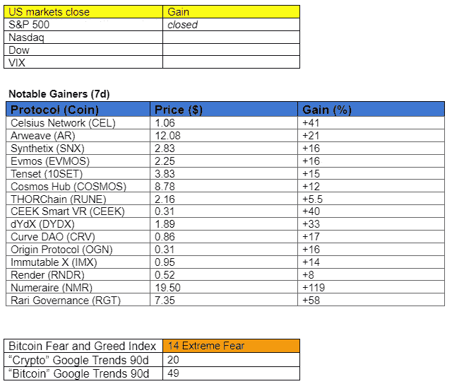

# 我们，金融革命者。

> 原文：<https://medium.com/coinmonks/we-the-financial-revolutionaries-1c83e1890e2a?source=collection_archive---------24----------------------->

问题#034

早上好，家人，

如果你在美国，我们希望你享受 7 月 4 日的周末！

你意识到你是个革命者了吗？是啊！从某种意义上来说，你正在帮助改革金融的未来。

在假日周末，我坐下来听了一个名为[“加密革命”](https://www.youtube.com/watch?v=0psJ5JjjNrw)的播客，其中历史学家乔希·罗森塔尔比较了加密事件和世界历史之间的相似之处。

关于金融历史和事件之间的相似性，播客非常有趣。虽然人类在过去的努力发展缓慢，但加密让许多相同的金融波动以数字速度发展。在现实世界中花了几个世纪才发生的事情，现在却在网上几个月就上演了。

乔希·罗森塔尔注意到了一些相似之处。

*   13 世纪，意大利佛罗伦萨的复式记账法[使金融民主化，并导致了文艺复兴。佛罗里达人可以获得的流动性刺激了经济，从而支持了艺术和科学的兴起。在 2021 年的加密牛市中，类似的事件没有发生；大量的资本引发了一场数字艺术革命，将非功能性数字技术纳入其中。](https://en.wikipedia.org/wiki/Double-entry_bookkeeping)
*   美国独立战争是一场远离君主集权制度的分权治理的实验。美国建立了自下而上的方法来代表人民。类似地，加密的基础，本质上，是使金融民主化:将金融从集中决策中移除。
*   当美国独立战争开始时，美国存在三种主要的政治影响。联邦主义者、反联邦主义者和无政府主义者。无政府主义者不想要中央政府。把他们想象成比特币制造者。联邦党人想要一个中央集权的政府来维护新的价值观和理想——一个类似以太坊的系统。反联邦主义者正在寻求基于国家的治理，这是对宇宙的一个公平的比较。

虽然在我们面前仍然有巨大的变化，我们将见证人类的理想和互动被处理链。一场革命正在以数字化的速度实时发生，我们都将成为其中的一部分！

**空头比特币产品创纪录流入**

根据每周 Coinshare [repor](https://blog.coinshares.com/volume-87-digital-asset-fund-flows-weekly-report-ef9a4c955c32) t，上周，共有 6400 万美元流入数字资产投资产品。不幸的是，大多数人都是做空比特币的产品(5100 万美元)。以太坊连续第二周出现总计 500 万美元的资金流入。

> 交易新手？试试[加密交易机器人](/coinmonks/crypto-trading-bot-c2ffce8acb2a)或者[复制交易](/coinmonks/top-10-crypto-copy-trading-platforms-for-beginners-d0c37c7d698c)

# 市场更新🌍

比特币和以太坊这两个加密市场驱动因素继续徘徊在 20k 和 1k 的主要支撑位附近。然而，考虑到最近股票和加密之间的相关性，这两人的命运似乎暂时与微观经济因素密切相关。在这方面，最好跟踪重要的经济新闻，以获得未来方向的想法。

过去一周，Evmos、Arweave 和 Synthetix (SNX)等几个具有可靠用例的加密资产逆比特币的相关性而动，出现了显著的上涨，尽管这可能是暂时的。尽管如此，投资者似乎更关注那些坚持独特用例的项目，而不是投机性高的项目。这一趋势将是必不可少的，因为它可能指向一个更严格的数字资产估值方法。

**埃夫莫斯/USDT**

EVMOS，EVM 兼容的宇宙链，自最近首次亮相以来，价格一直保持上升趋势。自 6 月 7 日以来，EVMOS 令牌已经上涨了 39%，考虑到大多数加密市场的状况，这是一个显著的成就。凭借 4.57 亿美元的适度市值，EVMOS 可能有更大的发展空间。

*高分辨率* [*图表*](https://www.tradingview.com/x/gy0KAeWg/)

***通过订阅***[***Substack***](https://tradergabi.substack.com/subscribe?)***成为第一个收到这份免费每日简讯的人。***

如果你喜欢这份报告，并且认为它值 20 分(0.01 美分)，请点击下面的按钮来支持我的写作。(最多 50 次！)谢谢！

# 新闻观察📰

**彼得·希夫银行倒闭**。经济学家彼得·希夫(Peter Schiff)是加密货币的著名公开批评者，他的波多黎各银行因未能维持最低净资本要求而面临当地监管机构的关闭。结果，监管机构冻结了客户资产。啊，真是讽刺！

**摄氏还债。** Celsius 已经向 MakerDao (MKR)偿还了 1 . 2 亿美元的 stablecoin 债务，并降低了协议的清算风险。因此，其新的 BTC 清算价格为 4966 美元。

英国军队社交媒体账户被黑。昨天，加密诈骗者占据了英国军队的推特、脸书和 YouTube 近四个小时，伺机推销 NFT 诈骗。

**新闻花絮:**

*   黑客[因涉嫌窃取 10 亿中国公民的数据向](https://www.theblock.co/post/155701/hacker-asks-for-10-bitcoin-for-allegedly-stolen-data-of-a-billion-chinese-citizens?utm_source=rss&utm_medium=rss)索要 10 比特币。
*   ENS 域 000.eth [卖](https://twitter.com/WuBlockchain/status/1543782872641077248?s=20&t=QARqwAmmAwNjTIQUPZ8u2Q)300 ETH。
*   埃隆·马斯克的特斯拉因持有比特币而面临 4 . 4 亿美元的资产减记。
*   vault exchange[在“金融挑战”中暂停](https://www.vauld.com/blog/corporate-statement/)客户提款

**在协议级⛓**

**Cardano 的 Vasil Testnet 合并成功。** Cardano 的 testnet 合并已经[完成，](https://twitter.com/InputOutputHK/status/1543692218799718401?s=20&t=OF_jpb-C1p-UdXaKkqW-fA)剩下的就是分叉 mainnet，开发者预测这将在接下来的四周内发生。升级允许更快地创建数据块，从而提高可扩展性。

**NFT &元宇宙更新🐵**

*   保时捷向[揭开](https://www.nft.porsche.com/) NFT 宇宙的面纱。
*   Sorare [签约](https://decrypt.co/104266/sorare-ethereum-soccer-nfts-surge-psg-kylian-mbappe)足球明星 Kylian Mbappe 为形象大使。
*   OpenSea 的联合创始人离开了公司，但仍留在董事会。

**作家笔下的花**

美国独立战争期间美国公民创造的最初想法是从有利于少数人的治理体系向包容全体公民的治理体系迈进了一步。虽然该系统继续受到大量现代挑战的测试/改变/解释，但其核心是一个大胆的改进实验。

有了加密技术，我们就站在了金融革命的前沿。挑战、斗争和各种治理提案将最终塑造其未来。我们是参与者。没有人知道未来会走向何方，但最终目标是改善当前通常效率低下的金融体系。

***在***[***Substack***](https://tradergabi.substack.com/subscribe?)***订阅，抢先获得这份免费的每日简讯。***

如果你喜欢这份报告，并且认为它值 20 分(0.01 美分)，请点击下面的按钮来支持我的写作。(最多 50 次！)谢谢！

# 加布里

*关注我的*[*Twitter*](https://twitter.com/web3_gabri)*和*[*Medium*](/@TraderGabi)*或在*[*Substack*](https://tradergabi.substack.com/subscribe?)订阅此免费每日简讯

*出版商、作家和图表作者表达的所有观点都不应被解释为财务建议，也不一定反映加密玩笑的观点。出版商、作家和图表制作者可能持有所讨论的代币和资产的头寸。鼓励读者自己做研究。*