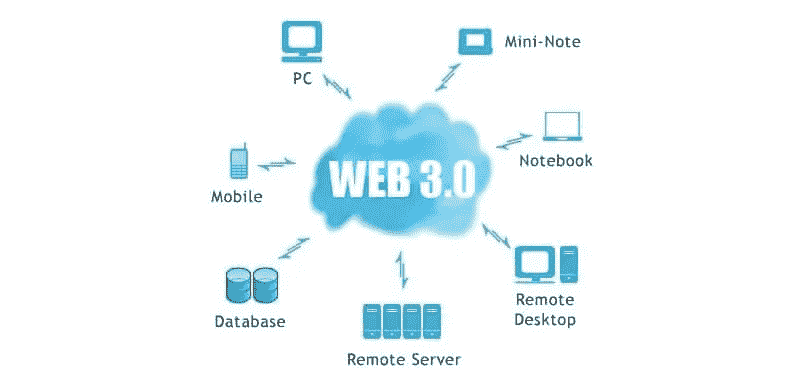

# Web 1 对 Web 2 对 Web 3

> 原文：<https://medium.com/coinmonks/web-1-vs-web-2-vs-web-3-8073be3edbda?source=collection_archive---------31----------------------->

1990 年，万维网诞生。Web 1 是第一个版本，非常基础。你打开一个浏览器，输入一个网址，然后按回车键。网站加载到屏幕上后，您可以开始浏览网站。

Web 1, Web 2, Web 3

没有人负责 Web 1。只要有互联网连接，您就可以阅读、浏览和购买网页上的任何内容。HTTP 是 Web 1 遵循的标准、通用和开放的协议。

然而用户体验受到了限制。我们会去网站了解更多，但我们永远不会自己创造任何东西。这种特权是为一群受限的人保留的:程序员。在互联网的早期(Web 1)，我们大多数人只是他人提供的内容的消费者。

web 的这种迭代一直持续到 2004 年。接着是脸书，它迎来了社交媒体革命，有时被称为 Web2。除了浏览，脸书、推特和 Youtube 让任何人都有可能产生内容。不需要任何编码技能。人们可以使用该平台发布帖子、上传照片、分享和欣赏视频，以及与他人联系。在 Web 2 上，你既是消费者也是创造者。

我们生活在 Web 2 时代。虽然它在许多方面改善了我们的生活，但也引发了许多问题。它不再是一个自由开放的互联网，而是完全被少数公司控制。随着 Web 2 平台的所有者——扎克伯格和他的合伙人——成为主要赢家，财务差距进一步恶化。另一方面，我们其余的人是没有报酬的参与者。

Web 3.0

当我们发布、分享和评论时，我们要么赚不到钱，要么得到我们所提供价值的极小一部分。然而，我们，用户，是这些平台的命脉。没有我们他们什么都不是。在 Web 2 下，我们无法控制自己的数据，包括数据存储在哪里以及与谁共享。平台所有者获取我们的个人信息并出售给各种公司，通常在我们不知情或未同意的情况下。我们到底能从这笔美妙的交易中得到什么？除了个性化的广告和推荐，没有什么实质性的东西。

因为没有所有权，所以有失去隐私和匿名的可能。当使用 Web 2 网站时，生活在压迫制度下的用户处于相当大的危险之中。为了压制不受欢迎的想法和观点，政府可以追踪个人并关闭整个网站。

还有审查制度的问题要考虑。我们已经看到 Web 2 平台仅仅因为用户的观点与平台的“政治”不一致就暂停账户、删除帖子、禁止用户访问。一些企业家和工程师正在致力于被称为 Web 3.0 的下一代网络，以解决这些和其他问题。
Web 3 是一个去中心化的系统。这意味着网络是由世界上数百万台计算机驱动的，而不是由少数公司拥有的数据中心驱动的。支撑比特币和其他加密货币的技术区块链激发了这种去中心化的网络。

dapp(分散式应用)是基于 Web 3 协议的应用，不能被实体、企业或政府关闭。任何有电脑的人都可以为网络的运行做出贡献。

Web 3 让用户和创客都可以挣钱，都可以谋生。这是可以想象的，因为加密货币令牌推动了 d'apps 和其他 Web 3 应用。每当您使用、改进或参与游戏时，都会赢得代币。您玩得越多，赢得的代币就越多。你获得的代币会随着时间的推移而增值。你可以选择保留你的利润或者将它们兑换成法定货币。

在当今的商业环境下，我们大多数人都无法投资初创公司和早期企业，因为我们没有足够的资金，或者因为我们生活在不正确的国家——想想突尼斯、巴基斯坦等等。这个差距被 Web 3 打破了。权力下放允许各行各业的人在发展的任何阶段投资于各种倡议。每个人都有“利益”，因为 Web 3 是基于共享所有权的概念。当 Web 3 平台扩展和繁荣时，每个人都会受益，而不仅仅是少数人。你是一个用户，一个创造者，最重要的是，你是 Web 3 的所有者。

> 交易新手？试试[加密交易机器人](/coinmonks/crypto-trading-bot-c2ffce8acb2a)或者[复制交易](/coinmonks/top-10-crypto-copy-trading-platforms-for-beginners-d0c37c7d698c)