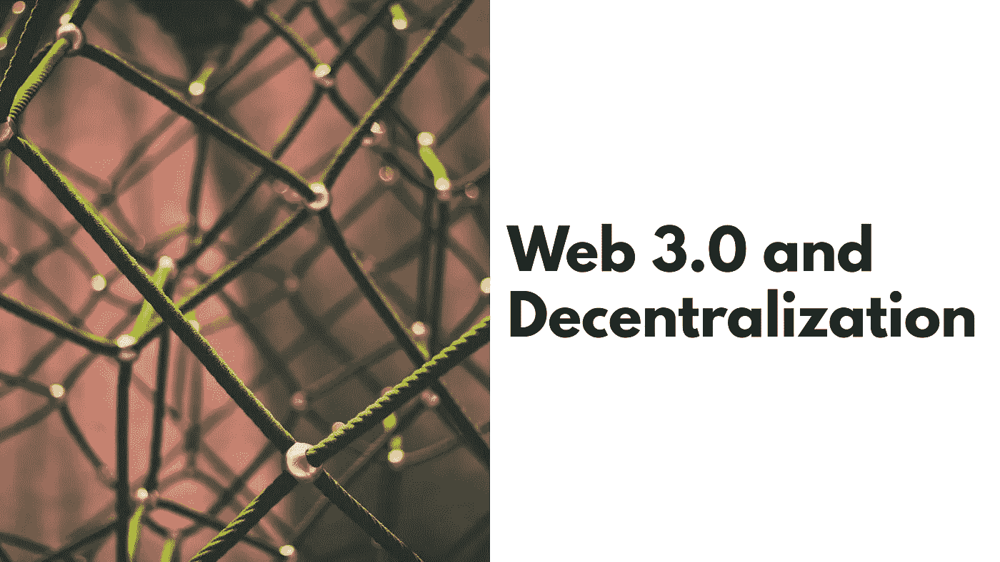
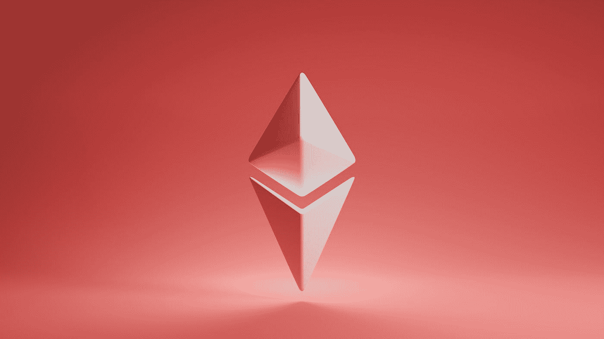
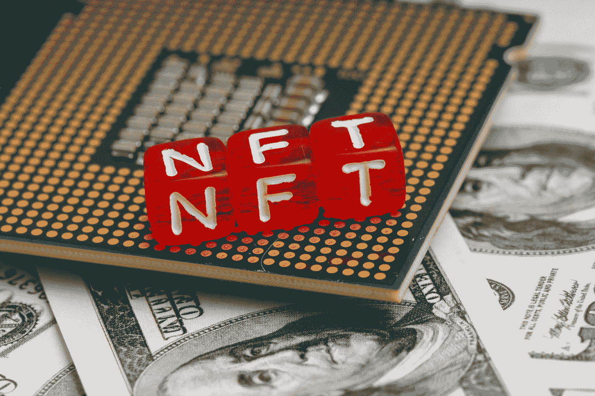

# Web 3.0 和去中心化

> 原文：<https://medium.com/coinmonks/web-3-0-and-decentralization-a4788e3b1b2b?source=collection_archive---------28----------------------->

你有没有想过区块链是如何工作的？或者说什么是基础层面的代币或加密货币？或者为什么 NFT 是不可替代的？

在这篇文章中，我们将探索什么是真正的 Web 3.0，并了解一些去中心化和区块链的基础知识。我们还将了解什么是智能合约和代币，最后，我们还将了解这些加密货币是如何实现的，以及是什么真正使 NFTs 可信。

# 介绍

为了理解 Web 的这些概念，我们首先需要知道什么是 Web 2.0，以及它有什么不同。Web 2.0 是基于社交媒体概念的万维网，用户可以创建内容，在线发布内容，并与其他用户生成的内容进行互动。但接下来的问题是，他们不拥有这些内容或由此产生的收入。提供内容共享平台的公司拥有该内容所产生收入的最大所有权。这导致了数据和流量影响的集中化。

## 集中

假设我开始了自己的社交媒体应用程序。我创建了一个很棒的用户界面，以及一个强大而安全的后端界面。因此，如果你们中的任何人加入我的社交媒体应用程序，并开始在上面发布内容，这些内容将存储在我设置的数据库中，只有我有权访问。这意味着我对您的数据拥有最大的控制权，因此我也拥有由此产生的收益和收入。不仅如此，我还可以为你的数据做任何决定。例如，我可以决定不再将您的数据存储在关系数据库中，并将其迁移到 NoSQL 数据库，而您作为用户将无法限制这一决定。这就是所谓的中央集权。

> **集中化**或**集中化**(参见[拼写差异](https://en.wikipedia.org/wiki/American_and_British_English_spelling_differences#iseize))是一个组织的活动，特别是那些关于规划和决策、制定战略和政策的活动，集中在特定地理位置组内的过程。这将重要的决策和计划权力转移到了组织的中心。~ [维基百科](https://en.wikipedia.org/wiki/Centralisation)

我们也可以这样说，当一个节点或一组节点控制着系统中的治理时，系统就是集中式的。节点只是网络上的系统。与上面的社交媒体应用程序示例一样，使用该应用程序的所有用户系统以及主服务器都是网络上的节点。

> 交易新手？试试[加密交易机器人](/coinmonks/crypto-trading-bot-c2ffce8acb2a)或者[复制交易](/coinmonks/top-10-crypto-copy-trading-platforms-for-beginners-d0c37c7d698c)

## 分散

分散化是指没有一个节点或一组特定的节点对所有其他节点进行集中控制或管理。这并不一定意味着没有节点对网络有任何控制，而是意味着所有节点对网络有同等的控制和访问权，并且在一个节点上做出的改变会影响整个系统。例如，如果我们上面的社交媒体应用程序是分散的，那么完整的数据将存储在每个用户的系统上，每当一个用户对该数据进行更改时，可能通过上传 pic，所有节点上都将发生相同的更改。由于这种确保网络去中心化的**方法**，也被称为**共识**，去中心化的系统需要大量的计算能力和资源。

Photo by [Shubham Dhage](https://unsplash.com/@theshubhamdhage?utm_source=medium&utm_medium=referral) on [Unsplash](https://unsplash.com?utm_source=medium&utm_medium=referral)

# Web 3.0

Web 3.0 不同于 Web 2.0，Web 2.0 通常有一个集中的系统，它有一个分散的分布式系统。这意味着在 Web 3.0 中，系统上的所有节点都拥有同等的控制权和访问权。Web 3.0 的一个关键特性是它使用区块链机制实现了智能合约和令牌。让我们理解我刚才使用的术语是什么意思。

## 区块链

简单来说，区块链是一种分布式数据库，这意味着数据不是存储在集中式服务器上，而是存储为分布式系统。我们不会在这篇文章中讨论分布式系统，但是我将来一定会就这个主题写一篇文章。区块链中的数据存储在称为块的组中。一旦一个块的容量被填满，它们就被链接到前面的块上，形成一个由这些块组成的链，称为区块链。

这种区块链机制的意义在于其中的数据是不可变的，这使得存储在其中的记录是真实的。

## 区块链网络

现在，为了对该区块链进行同等的控制和访问，需要在所有节点上都有一份该区块链的副本，这些节点一起构成了区块链网络。要确保的主要事情是所有区块链有相同的数据，没有人操纵添加虚假数据到链中。为了确保这一点，开发的算法被称为区块链共识，他们使这些网络几乎不可能腐败。

## 智能合同

智能合同可以理解为存储在任何区块链网络上的程序，只要合同中的条款得到满足，这些程序就会自动执行。例如，我可以创建一个智能契约，帮助我存储一个变量并获取这个变量。我可以在我选择的任何区块链上部署它，根据我选择的链，我将不得不为更改这个区块链支付汽油费。一旦我这样做了，契约将在链上注册，任何人都可以访问它来更新或读取这个变量。

## 代币

代币是在现有区块链网络上开发的资产，在链上具有有限的总供应量。这些经常被混淆为与加密货币相同，但即使它们有许多相似之处，它们也有所不同，因为加密货币原产于区块链，这意味着每种加密货币都有自己的区块链网络。同时，在现有的区块链网络上创建令牌。例如，我可以声明一个名为“DToken”的令牌，并将其供应限制为 50 个令牌，然后在我选择的区块链网络上发布它。然后，区块链上的一项记录就被创建了，记录上写着我拥有 50 张“代币”。现在，最初，代币没有货币价值，但为了这个例子，让我们说，我设法在市场上为我的代币创造了一个需求，它的价值为每枚代币 6 美元，所以现在我可以用这个代币交易不同的商品，比如我可以购买两杯 3 美元的咖啡，并用我的代币支付，假设这个人想以这个价格交易我的代币。加密货币的工作方式非常相似。

Web 3.0 是革命性的 Web，因为它融合了令牌和区块链网络的概念。这有助于为 web 上的任何数据添加所有权特征。这些网络的共识也有助于确保这些数据的真实性，在很大程度上促进了去中心化。这有助于开发许多新概念，如 NFTs 和 DeFi(分散融资)。

Photo by [Andrey Metelev](https://unsplash.com/@metelevan?utm_source=medium&utm_medium=referral) on [Unsplash](https://unsplash.com?utm_source=medium&utm_medium=referral)

# 不可替换令牌

NFT 是遵循 ERC 721 标准的令牌。与其他令牌不同，NFT 是不可替换的，这意味着每个 NFT 都是唯一的，不能被复制或变异。就像任何其他代币一样，我们可以创建 NFT 形式的数字资产，并用它们交换其他代币或加密货币。

让我们看看这是如何工作的，以及 NFT 与其他代币和加密货币有何不同。

因此，我创建了一个数字资产，比如一个大小为 1 kb 的小图像。现在，如果我将该资产发布为令牌，并将供应限制为 5 个令牌，则每个令牌都将与另一个令牌相同，这意味着每个令牌都将与另一个令牌等价。另一方面，如果我将这个资产铸造为一个 NFT，并且铸造了 5 个 NFT，那么它们中的每一个都将有一个惟一的令牌 id，可以用来跟踪它的所有权细节。如果我将来交易了一只 NFT，任何能接触到区块链数据的人都能追踪到这只 NFT 的原主人。这就是这些不可替代的原因。

# 结论

Web 3.0 和去中心化一天比一天流行。像 Meta、Google 和 Apple 这样的大巨头正在参与元宇宙的开发，这是 Web 3.0 的超级应用。这有可能导致一个完全数字化的世界，所有的交易和资产都将存储在区块链网络上。它可以将全球整个金融系统数字化，而且已经在朝着这个方向快速前进。

我希望你喜欢这篇文章，在我的官方博客网站上订阅我的时事通讯: [Thinkfeed](https://thinkfeed.divyesshm.com) 。