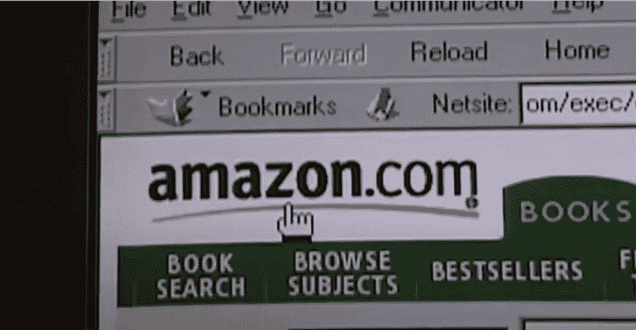
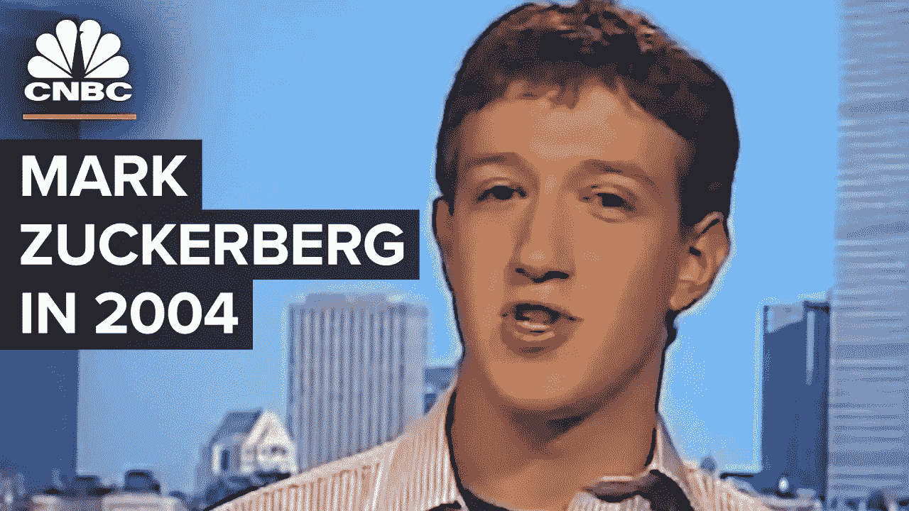
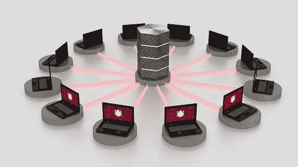
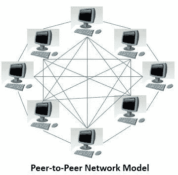

# 虚拟的 Web 3.0

> 原文：<https://medium.com/coinmonks/web-3-0-for-dummies-732613206cde?source=collection_archive---------34----------------------->

Web 3.0 是区块链领域的新生事物。这是所有人都在谈论的加密新术语。我们都听说过是*大革命*将改变互联网的工作方式。

*突然间，NFT 也成了对话的一部分。*

因此，术语“ *Web 3* ”对大多数人来说有点模糊，经常被误解。为了理解 Web 3.0，我在互联网上进行了广泛的研究，在本文中，我们将从基础开始探索 Web 3.0。

## 这一切是如何开始的

要全面掌握 *Web 3* ，我们得回到历史中去，了解 *Web 1.0* 和 *Web 2.0* 。

同样，你在这里，想知道“*到底什么是 Web 3.0”*，这与 20 世纪 90 年代初发生的情况相同。有些事情正在发生。一些大事。那是无法彻底解释的。

那是互联网。

当时许多人都不知道，历史正在被创造，互联网的第一个版本 *(Web 1.0)* 正在酝酿之中。

> 交易新手？试试[加密交易机器人](/coinmonks/crypto-trading-bot-c2ffce8acb2a)或者[复制交易](/coinmonks/top-10-crypto-copy-trading-platforms-for-beginners-d0c37c7d698c)

年轻的杰夫·贝索斯将在这场革命中扮演重要角色。亚马逊正处于起步阶段，它将购物体验重新定义为“电子商务”。

Web 1.0 的特点是只读静态网页，唯一的目的是消费信息。如果你还记得互联网以恼人的开机声开始的日子，那么你肯定知道互联网的 Web 1.0 阶段的外观和感觉。我喜欢把它看作互联网的第一个原型。

快进到 2000 年代，社交网络时代。这是 MySpace 和当时鲜为人知的脸书的时代。这就是互联网的 *Web 2.0* 版本。

Web 2.0 的主要特征是交互性。与 Web 1.0 不同，在 Web 2.0 中，用户是国王。

一个完美的场景是用户注册一个社交网络，生成他们自己的内容，并邀请他们的朋友。这是黄金法则，MySpace 曾经是社交网络的先驱。

虽然 Myspace 在被新闻集团收购后处于巅峰，但年轻的扎克伯格热衷于改善脸书的架构和用户体验。

然后，MySpace 将努力通过广告赚钱，从而降低其对用户的吸引力。此外，关于未成年人在 MySpace 上接触成人内容的故事开始传播，就像这个科技巨头跪下了一样。

脸书时代到来了。它像野火一样蔓延。凭借脸书与外部开发者合作的文化，它拥有更好的框架和用户体验。这是唯一的去处。这是新的 Myspace，但是更大更好。

但是这一切好得令人难以置信。对吗？

是的，没错。发生了一些事情。脸书正在收集你所有的个人数据。更多的数据意味着更多的个性化广告，因此也意味着更多的钱。

这实质上意味着，你免费使用脸书，实际上是把你的用户隐私扔出了窗外。是的，你就是产品。

*哦，不仅仅是脸书。*

谷歌、必应、Twitter、Linked In 和所有其他搜索引擎平台早已采用了这一模式。*现在仍然是。*

虽然普通的 cookies 有其特殊之处，但是搜索引擎上的第三方 cookies 能够创建你的详细个人资料。这使得广告商可以根据你的数据来锁定你。

我们都太熟悉这样的时刻，当你在谷歌上搜索某样东西，突然你被同样的广告轰炸。伙计，你又被盯上了。

因此出现了新的问题。对用户隐私以及如何在互联网上保护用户的关注。正是沿着这些思路，Web 3.0 诞生了。

## Web 3.0

我敢打赌，随着元宇宙的推出，Web 3.0 引起了你的注意。但是 Web 3.0 背后有一个更大的概念，元宇宙只是其中的一部分。

Web 3.0 是一个概念，被认为是为在使用区块链技术的分散网络上运行而设计的。在这项技术中，用户可以完全控制如何使用他们的数据。

*我所说的分散式网络是什么意思？*

目前，我们仍然在一个集中的网络上运行，其中一台服务器是主要的信息来源。

*换个角度来看:*

我们都记得 2021 年 10 月 4 日脸书、Instagram 和 Whatsapp 宕机 6 到 7 个小时的那一天。所有这些平台都在一台服务器上运行，因为数据是从一台中央服务器上传输的，所以整个网络都关闭了。

然而，在分散式网络中，数据是在对等网络中传输的。这实质上意味着，如果某个特定对等网络出现故障，它不会主要影响整个网络。

*在这种对等网络技术中，用户是权威，以下因素将发挥作用:*

1.  用户控制的数据
2.  用户货币化控制
3.  默认隐私
4.  安全数字身份

可以这样想，今天，如果一个广告客户想在脸书做广告，他们会去脸书。在 Web 3 中，人们认为广告商将与用户直接接触，没有中介。

重要的是要注意，Web 3.0 目前只是一个想法(概念)，它正在慢慢成形，很快就会有足够多的新的 Web 3 公司涌现出来。

勇敢的浏览器可能是 Web 3 用户隐私领域的先锋。免费的 Brave 浏览器声称可以阻止令人毛骨悚然的广告，并确保没有个人数据离开你的设备。

*然而，你仍然可以选择是否要看勇敢的私人广告。如果你同意，你将获得 BAT(基本注意力令牌)奖励，如果不同意，你可以继续免费使用浏览器。*

*有了你的 BAT，你可以在 web 3 去中心化应用中兑换和兑现现金价值礼品卡，给内容创作者和网站所有者小费，交换或存储，购买 NFT，以及进行应用内购买。*

*通过用户升级到高级版本，内容创作者和网站所有者都能够获得收入。*

***NFTs 呢？它们在 Web 3 中是如何出现的？***

忘记猫 gifs &滑稽猿。NFTs 背后的技术应该是您的主要关注点。简而言之，NFTs 使用区块链技术来验证特定的令牌是否属于特定的人。

把它想象成一张数字收据。只要你有数字收据，没有人可以要求令牌，因为你在公共记录上被验证为合法所有者(区块链)。

因此，NFTs 在 Web 3 中引入了以区块链技术为基础的认证和验证方面。

## 结论

Web 3.0 还没有被固定在一个特定的定义上。我们仍处于早期阶段，没有人真正知道 Web 3 之旅将会走向何方。这是新的黎明。很生涩，很暧昧。

这是下一次互联网大革命吗？谁知道呢。*但是扣好了，作为 Web 3 的乘坐，绝对会颠簸！*

在推特上关注我:[https://twitter.com/cryptolord254](https://twitter.com/cryptolord254)*(与关注者斗争)*

查看我以前的币安文章:

[币安 NFT 刚刚铲平了它的 NFT 游戏](/coinmonks/binance-nft-just-leveled-up-its-nft-trading-experience-bb84364d4f5) > >

[为什么你应该交易 BUSD 保证金期货](/@maggiendegwa47/why-you-should-trade-busd-margined-futures-dc709f01bc37) > >

你应该用币安贷款吗？ > >

[为什么币安的融资融券交易应该优先于你](/@maggiendegwa47/why-binance-margin-trading-should-be-a-priority-to-you-36a09cd1bd0e) > >

当你可以和币安进行双重投资时，为什么要去 HODL？ > >

> *加入 Coinmonks* [*电报频道*](https://t.me/coincodecap) *和* [*Youtube 频道*](https://www.youtube.com/c/coinmonks/videos) *了解加密交易和投资*

# 另外，阅读

*   [Bookmap 评论](https://coincodecap.com/bookmap-review-2021-best-trading-software) | [美国 5 大最佳加密交易所](https://coincodecap.com/crypto-exchange-usa)
*   [加密交易机器人](/coinmonks/crypto-trading-bot-c2ffce8acb2a) | [造币评论](https://coincodecap.com/coingate-review)
*   最佳加密[硬件钱包](/coinmonks/hardware-wallets-dfa1211730c6) | [Bitbns 评论](/coinmonks/bitbns-review-38256a07e161)
*   [新加坡十大最佳加密交易所](https://coincodecap.com/crypto-exchange-in-singapore) | [购买 AXS](https://coincodecap.com/buy-axs-token)
*   [红狗赌场评论](https://coincodecap.com/red-dog-casino-review) | [Swyftx 评论](https://coincodecap.com/swyftx-review)