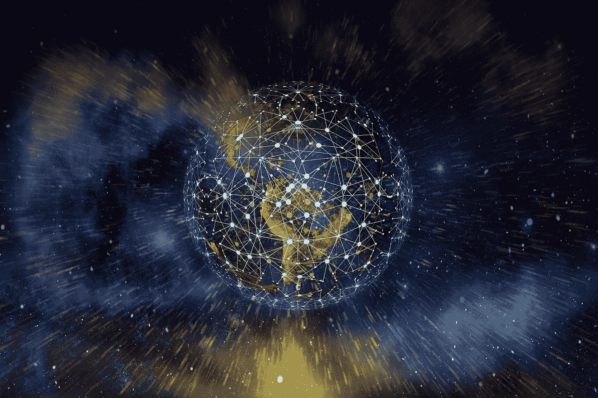

# web 3.0——技术的未来

> 原文：<https://medium.com/coinmonks/web-3-0-future-of-technology-c29b424a4332?source=collection_archive---------55----------------------->

Web 3.0 近年来获得了很多关注，尤其是在公司和软件开发人员中。它被描述为互联网的新进展，它与区块链技术的联系使得 Web 3.0 对观众更有吸引力。

在本文中，我们将尝试解读 Web 3.0 的含义及其对当今技术的影响，让读者一瞥这个行业的未来，并可能成为这个快速发展的领域的一部分。

# 网络的演变

Web 1.0 是一个术语，用来描述 Web 行业的早期版本，或者通常所说的第一次“迭代”。早期的互联网主要由使用超链接的静态网页组成，没有我们今天习惯看到的视觉和图形。早期的网页是使用简单的 HTML 代码构建的，创建静态和简单的内容，直到被称为 CSS 的级联样式表取而代之。它允许网页培养自己更复杂的外观和感觉。一个有趣的事实是，广告在 Web 1.0 中被禁止了，这可能会让许多年轻的网络用户感到惊讶。

> 交易新手？在[最佳加密交易](/coinmonks/crypto-exchange-dd2f9d6f3769)上尝试[加密交易机器人](/coinmonks/crypto-trading-bot-c2ffce8acb2a)或[复制交易](/coinmonks/top-10-crypto-copy-trading-platforms-for-beginners-d0c37c7d698c)

慢慢地，互联网发展到所谓的 Web 2.0，动态 URL 的使用取而代之，揭示了 Web 的潜力，允许在数据库的使用上显示不断变化的内容，用自动获得的组件填充其内容。这导致了云时代的到来，让用户能够直接通过互联网访问软件和资源。Web 2.0 用户可以获得的另一项基本服务是电子商务。对我们来说，现在生活在这样一个世界里似乎几乎是不可能的，在这个世界里，你不能躺在床上浏览数百家商店，然后第二天就把所有东西送到你的门口。然而，在 Web 1.0 时代，一个商店的网站仅仅代表一个可用产品和服务的目录或者一个简单的订购单。

没有社交媒体，今天的世界可能更难以想象。尽管它出现的时间不长，但它已经在很多方面改变了我们的日常生活，即使是最挑剔的技术恐惧者也不会忽视它。无论你是用它来谋生、创造内容、浏览自己喜欢的内容，还是只是和朋友聊天，都无法否认社交媒体为每个人提供了大量的机会。然而，尽管 Web 2.0 为小公司提供了发展的机会，让它们接触到更多的受众，但控制信息流和用户数据的仍然是大公司。

# Web 3.0

那么，Web 3.0 在这个故事中处于什么位置呢？

区块链技术的进步使我们能够通过加密和使用计算机网络存储数据来分散数据，而不是将数据存储在大公司的服务器中。这种体系结构允许创建额外的安全层，因为数据不能被任意更改，只能由所有者修改。这是通过检查数据是否与网络上存储的副本相匹配来完成的，如果不匹配，则数据无效。这种结构使其成为无权限的，这意味着第三方执行交易不需要权限。这确保了交易的安全性，并使其可信和透明，使越来越多的公司和企业能够探索区块链产业的可能性。这使得它成为当今发展最快的技术之一，也是网络领域未来最有希望的机会之一。

文章由来自[同位素](https://isotopic.io/)的珍妮·李斯撰写

[**同位素**](https://isotopic.io) **是区块链支持的软件分发服务，托管整合了 NFTs 和加密货币的游戏和应用。**

> 加入 Coinmonks [电报频道](https://t.me/coincodecap)和 [Youtube 频道](https://www.youtube.com/c/coinmonks/videos)了解加密交易和投资

# 另外，阅读

*   [什么是保证金交易](https://coincodecap.com/margin-trading) | [美元成本平均法](https://coincodecap.com/dca)
*   [维护卡审核](https://coincodecap.com/uphold-card-review) | [信任钱包 vs MetaMask](https://coincodecap.com/trust-wallet-vs-metamask)
*   [Exness 点评](https://coincodecap.com/exness-review)|[moon xbt Vs bit get Vs Bingbon](https://coincodecap.com/bingbon-vs-bitget-vs-moonxbt)
*   [如何开始通过加密贷款赚取被动收入](https://coincodecap.com/passive-income-crypto-lending)
*   [BigONE 交易所评论](/coinmonks/bigone-exchange-review-64705d85a1d4) | [电网交易机器人](https://coincodecap.com/grid-trading)