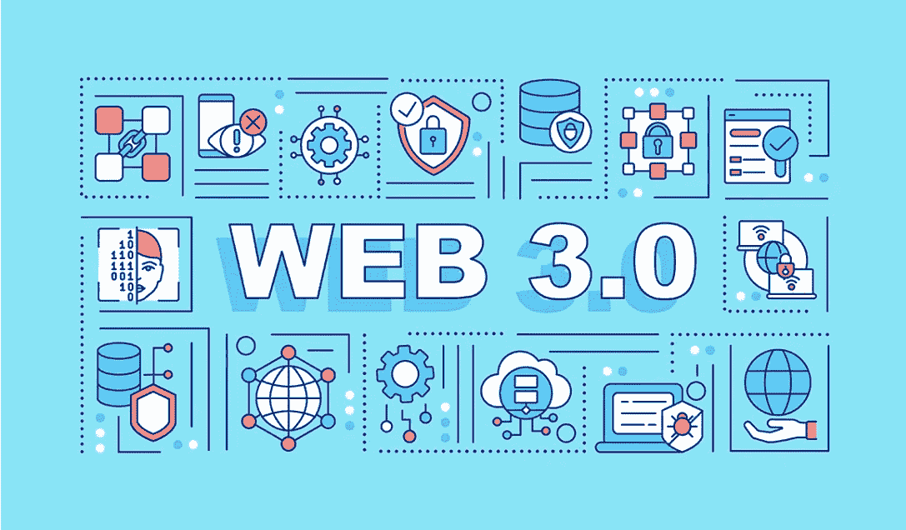

# 安全领域的 Web 3.0

> 原文：<https://medium.com/coinmonks/web-3-0-in-security-38a8d23c591e?source=collection_archive---------2----------------------->

我正在探索与网络安全相关的不同方面，我喜欢这样做，在探索之后，我现在对网络安全有了更好的理解。所以现在我想我也可以探索一下区块链安全，因为这一次它正成为潮流，每个人都想这样做。所以我想，当我学到这些东西的时候，我也应该与你们分享，与你们所有人分享我的学习。所以我们从这里开始写博客。

# Web 1.0 vs Web 2.0 vs Web 3.0

Web1 创建于 20 世纪 90 年代，作为公司创建静态页面和网站的平台。Web2 可以被视为对用户现在可以添加和创建内容的平台的升级。Web3，简单来说，就是被视为你们所说的互联网的第三次迭代或化身。

然而，Web3 是一个不同的故事。Web 3.0 是人类和机器都可以访问的 Web。简单来说，Web 1 是你的百科全书，Web 2 是维基百科，Web 3.0 是 AI 和人类可以访问的下一个大数据库。

Web 3.0 在许多方面都独一无二。这个版本的互联网承诺更加去中心化，让企业和用户对他们的数据有更多的控制权。

它将不再被谷歌和脸书巨头垄断。有人可能会说 Web 2.0 非常注重广告和营销，而 Web 3 旨在缓解这种情况。

# 什么是 Web3

Web3 是互联网的下一次发展。它是一个分散的、开源的平台，允许安全的、对等的交互，而不需要中介。这个新版本的网络将由区块链技术驱动，并将完全去中心化(运行在允许加密货币增长和采用的相同技术上)。

对于那些不熟悉的人来说，区块链是在计算机网络上的端点之间共享的分布式数据库或分类帐。它允许在不需要第三方的情况下以保证记录数据安全的方式存储电子数据。在加密货币领域，这意味着我们可以记录和验证交易，而不需要像银行或国家政府这样的第三方。

# 是什么让 web3 独一无二？

在过去和现在的世界中，AI 只能从 web1 和 web2 页面中获取数据，并按原样将信息呈现/传递给你。然而，有了 Web3，人工智能和机器学习将能够从网络上检索数据，并以详细的方式理解和呈现信息。

例如，从 Siri 和 Alexa 询问信息，当前会得到类似“根据维基百科”的响应，用户会收到从维基百科条目中提取的文本到语音的回答。

有了 Web3，Siri 和 Alexa 将能够梳理多种来源的信息，并给你一个详细的答案，特别是对用户提出的独特问题。

这只是 Web3 如何扩大人工智能和机器学习用途的一个潜在例子。

Web1 的创始人蒂姆·伯纳斯·李(Tim Berners Lee)基本上认为，Web3 是一个具有内在意义的网络，是一个关注数据如何被消费的网络。

Web3 是一个允许任何人添加数据和内容的平台，而不会受到集中把关者的监控。Web3 旨在提供一个平台，在这个平台上，数据和内容有意义，可以被用户和机器解释。

# 当前状态下的 Web3

过去，Web 1.0 和 Web 2.0 在架构模型的基础上转变了各自的安全模型，从而带来了更多的经济效益。Web1 见证了 Netscape 通过安全套接字层(SSL)在用户浏览器和服务器之间提供安全通信。

像 Google、Microsoft 和 Amazon 这样的 Web2 中介，以及许多认证机构，是 SSL 的继任者传输层安全性(TLS)背后的驱动力。

类似于 Web2 的演变也将发生在 Web3 上，尽管对 web3 应用程序和 web3 安全公司的投资更多。这是因为分散的网络需要分散的安全应用和 web3 应用或 dApps。

这些 web3 应用程序和 web3 应用程序需要在不依赖于 web2 中流行的数据库层和传统应用程序逻辑的情况下构建。

与 web2 的结构不同，web3 应用程序和 web3 应用程序将与一个模型一起工作，该模型具有区块链、网络节点以及用于管理逻辑和状态的智能合约的使用。

由于 web3 的即将到来，web3 公司和 web3 网络安全公司获得了大量资金。

由于 web3 将成为与加密货币和数字钱包密切相关的新平台，web3 公司已经获得了价值超过 10 亿美元的融资。

一些 web3 公司，如 Ledger 和 Fireblocks，将构建安全 web3 应用程序，预计在不久的将来会越来越受欢迎。

总部位于法国的安全基础设施公司 Ledger 去年获得了 3 . 8 亿美元的资金。同样，Fireblocks 也获得了 3.1 亿美元的加密安全资金。

就保护而言，web3 与 web2 和 web1 之间的主要区别在于，交易一旦执行，就不能在 web3 中撤销，因此需要保护和安全/监控。

# Web3 的优势

尽管存在安全问题，但 Web3 比传统的 Web2.0 平台有很多优势。

Web3 的一些潜在优势包括:

*   **提高安全性:**由于没有中央控制点，web3 有可能更好地抵御黑客和其他安全威胁。通过赋予实体对其数据和设备的更多控制权，它允许开发比现有技术安全得多的新技术(例如区块链技术)。
*   **降低成本:**通过消除对中介的需求，web3 可以帮助用户和企业降低成本。当企业垄断了包括数据和技术在内的任何行业时，它们可以向用户收取使用费。通过使信息易于获取或使技术开源，人们获取信息的成本变得更低。
*   **增加隐私:** Web3 平台通常在构建时考虑到隐私，这意味着用户可以确保他们的数据是安全的。大多数平台在默认情况下对所有通信使用加密，并且不与其他用户共享信息，这样就不太可能将信息意外泄露给任何其他方。此外，由于没有人直接控制交互，有人将您的信息出售给相关方的可能性非常低。
*   **更大的控制权:**由于用户之间以及他们想要的数据之间直接互动，他们比通过中介有更大的控制权。

# Web3 的风险

*   **缺乏责任感:**随着 Web3 的出现，出现了一些需要考虑的风险。首先是失控的风险。在 Web3 中，没有控制网络的中央机构。这意味着如果出了问题，没有人来解决。目前，合规条例要求控制信息的实体保护该数据，确保其完整性，并实施某些控制措施来确保用户隐私。在分散的市场中，没有人负责确保这些预防措施和控制措施到位。
*   **Web3 缺乏对数据的集中控制和访问:**由于数据分散在不同的部门和位置，缺乏集中的数据也很难做出明智的决策。虽然分散数据为个人用户带来了许多好处，但对于企业来说，如果没有高质量的信息，很难做出高质量的业务决策。拥有可以作为单一事实来源的集中数据是企业收集竞争对手、客户等信息的一个好方法。没有这些信息，分析会变得更加困难。
*   **Web3 和区块链安全漏洞:**web 3 和区块链技术的去中心化特性带来了独特的安全挑战。因为没有中央机构控制这些网络，所以很难跟踪和管理安全漏洞。此外，这些技术通常用于存储敏感数据，这使它们成为黑客的目标。

尽管存在这些挑战，组织仍可以采取一些措施来提高安全性。

首先，他们可以制定一个全面的安全策略，将这些技术的独特性考虑在内。作为一家企业，您需要了解提供服务所需的设备类型，然后根据您的需求制定保护这些设备的策略。在网络安全领域，这通常通过威胁建模来完成，威胁建模是识别与您的组织相关的风险及其相应缓解措施的正式过程。

其次，他们可以与其他组织合作，共享信息和资源。通过与其他在 Web3 领域有专业知识的企业合作，你可以获得关于你的组织如何有效利用这项技术的提示和指导。最后，他们可以投资研发以保持领先地位。由于这是一个新的领域，希望成为该领域先行者的公司在竞争对手之前投资 R&D 开发新的解决方案是非常重要的。

# Web3 对网络安全的影响

Web3(去中心化的网络)的兴起为网络安全带来了新的机遇。由于数据和信息存储在分布式账本上，Web3 应用程序比传统的 Web 应用程序更安全，更能抵御攻击。

然而，Web3 也为网络安全带来了新的挑战。例如，[智能合同](https://www.ibm.com/topics/smart-contracts)——在区块链上运行的程序——可能包含可被黑客利用的安全漏洞。由于许多 Web3 应用程序的假名性质，很难追踪和起诉网络罪犯。

## 分散数据

在集中式系统中，数据存储在中央位置。这个中心位置通常由单个实体控制，例如政府或公司。在分散式系统中，数据分布在计算机网络中。这允许许多不同的实体控制数据。

分散数据有许多不同的应用。网络安全领域的一个例子是深度网络。对于那些不熟悉的人来说，深度网络是互联网中不被像谷歌这样的普通搜索引擎索引的部分。深度网络[构成了互联网](https://traversals.com/blog/surface-web/#:~:text=Key%20Takeaways,data%20source%20for%20OSINT%20investigations.)上大约 95%的数据，它是黑客的信息宝库。这是人们购买恶意软件工具包、招募其他黑客和进行各种非法在线交易的地方。随着互联网变得越来越分散，监管越来越少，我们可以预计网络犯罪分子会获得更多此类信息。

## 黑客可以瞄准更多的终端

在过去几年中，我们在互联网上拥有的设备数量持续稳步增长。它正以每年大约 18%的速度增长，在全球已经拥有超过 150 亿台设备。这意味着攻击者拥有比以往更多的潜在目标。展望未来，安全团队需要更加努力地监控他们的环境并强化他们的系统。这不仅仅指笔记本电脑或手机之类的东西，而是指所有智能设备，如智能汽车、蓝牙设备和医疗植入物(如起搏器)都可以从互联网上访问，并可能成为黑客的目标。

## 潜在更好的平台安全性

像区块链这样的技术的一个好处是它们本质上是安全的。它们非常安全，以至于一些世界上最富有的人愿意向比特币和以太坊这样的产品投入数百万美元。到目前为止，我们还没有看到任何情况下，区块链本身被黑客攻击产生欺诈性的加密货币硬币，这可能是一个积极的迹象。

## 信息或数据的所有权

近年来，数据所有权的趋势一直在增长，越来越多的人主张他们控制自己数据的权利。

正如目前所构建的，我们使用的许多平台，如社交媒体，实际上是我们信息的所有者。他们可以使用我们的个人信息，并经常将其出售给那些对了解我们的更多信息有既得利益的公司。在数据分散的环境中，没有一个实体能够收集和出售我们的个人信息。这些信息将被安全地存储在我们可以控制的计算机设备上，并且只与我们想分享这些信息的人分享。

## 取消中央控制点

Web3 的一个重大转变是，它让我们远离了控制数据的中心点。这种转变已经开始，并且是由技术进步推动的，比如区块链和分布式账本技术。

这为用户提供了前所未有的数据自由和自主权。一个很大的优势是，它将使互联网对审查更具弹性，没有一个实体控制信息，人们将能够未经过滤地向世界各地的其他人分享他们的想法和思想。

# web3 的网络安全挑战

分散式 web 平台存在漏洞和安全漏洞的可能性增加了。Blackhat 黑客将找到创新的方法来访问金融信息并一次性清空数字钱包。

Web3 提供了很大的增长潜力，但是如果 web 3.0 的设计和定义很差，就会有很多网络安全风险需要考虑。

## ***信息质量可疑***

Web1 依赖于知名出版商提供的准确信息。由于用户提供的错误信息激增，Web2 的数据质量大幅下降。Web3 可能会导致更多有问题的数据，因为它依赖于人工智能和机器学习。

就目前的人工智能和机器学习而言，很难说人工智能是否能够区分事实和虚构，并知道哪些信息来源是可信的。

## ***操纵数据***

在人工智能和机器学习方面，故意篡改数据是一个重大的网络安全问题。除了不确定的信息质量之外，用户生成的内容可能会产生糟糕的数据结果。

人工智能和 web3 应用程序可以变成大规模的虚假信息来源，这可能是一个数字噩梦。

这方面的一个案例研究是，在 Twitter 用户向微软的实验性人工智能聊天机器人 Tay 提供了厌恶女性和种族主义的信息后，它变成了一个种族主义应用程序。

Tay 被设计成一个聊天机器人，它根据 Twitter 上与用户的随意对话变得更加智能。不到 24 小时，结果相当震撼。这表明用户反馈的信息会导致各种各样的后果。

## 数据可用性

讨论 web3 时需要考虑的一个大难题是数据可用性。在网页不可用或链接断开的情况下，人工智能会做什么？

解决方案是让这些 AI 和 web3 应用程序从整个互联网创建数据备份，以便随时访问？这可能会增加对 IT 团队几乎无法控制的系统可用性的依赖。

## 数据保密性

数据泄露是经常发生的事情，它们经常危及机密信息。除此之外，此类内容可能会意外发布和/或张贴在互联网上不安全的区域或位置。

web3 中更危险的是，由于不断扫描，人工智能和机器学习 web3 应用程序可以遇到这些数据，并可以将其吸收到他们的数据库/知识库中。

为什么这很危险？这是因为人工智能消耗私人数据，任何人都可能无意中发现并使用这些数据。因此，网络安全和 web3 公司将需要提高他们的游戏和加强安全，以确保没有他们的数据被传播到互联网上。

## Web3 和区块链安全漏洞

数据泄露和安全漏洞比以往任何时候都更加猖獗。身份盗窃资源中心报告称，2021 年[代表着数据泄露和网络安全威胁的空前高峰](https://www.idtheftcenter.org/post/identity-theft-resource-center-2021-annual-data-breach-report-sets-new-record-for-number-of-compromises/)。

也就是说，web3 并非没有安全缺陷，由于它的分散性，它可以证明有更多的威胁潜伏在角落里。

与传统的 IT 和云部署相反，web3 架构具有潜在的财务激励，黑客可以通过 web3 漏洞获得这种激励。

以前，在 web2 中，网络罪犯大多可以访问网站和服务，很少有机会获得经济收益。

随着 web3 与区块链的集成，区块链的安全漏洞也在增加，因为大量的数字钱包和货币可以在单点访问。

最近的 web3 区块链安全漏洞案例研究是虫洞桥。虫洞桥是一种互操作性协议，允许分散式应用程序(dApps)和用户在多个区块链之间移动资产。

由于 web3 和区块链的安全漏洞，一名网络罪犯得以带着 12 万以太币逃脱，这相当于价值 3.6 亿美元。这一切都是通过利用索拉纳区块链的一座桥完成的。

# 应对 Web3 网络安全挑战

Web 2.0 中安全概念的很大一部分是关于反应的。必须添加机制来验证事务是否应该首先在 web3 中发生，因为事务一旦完成就不能修改。

换句话说，在防止攻击方面，安全性必须非常出色。

**至少有四项举措可能有助于建立一个积极主动的 web3 安全策略:**

## 漏洞利用的真实数据来源

对于所有已知的 web3 缺陷和漏洞，必须有一个单一的真相来源。

需要一个分散版本的 Web3。目前，在 SWC 注册表、Rekt、智能合同攻击向量和 DeFi 威胁矩阵等地方可能会发现不完整的数据。

Bug bounty 程序，如 Immunefi 的，旨在暴露新的漏洞。

## 制定安全决策的规范

在 web3 中，关键安全设计选择和特定事件的决策方法目前尚不清楚。

分散化意味着没有人拥有这些问题，这会给用户带来严重的后果。

最近的 [Log4j 漏洞](https://cyvatar.ai/log4shell-detecting-log4j-vulnerability-cve-2021-44228/)为将安全托付给分散社区提供了警示。

对于 DAOs(分散自治组织)、安全专家、Alchemy 和 Infura 等提供商以及其他人如何解决紧急安全风险，必须有更清晰的认识。

## 签名和认证

大多数 dApps，包括最著名的，目前都没有对它们的 API 响应进行认证或签名。

这意味着每当用户的钱包从这些应用程序中检索数据时，在确保响应来自正确的应用程序以及数据没有被篡改方面存在差距。

在一个应用不遵循基本安全最佳实践的世界里，用户必须确立自己的安全姿态和可信度，这几乎是不可能的任务。

至少，需要更好的方法来提醒消费者注意危险。

## 更好的用户控制密钥管理

在 web3 范式中，用户的交易能力是基于密钥的。众所周知，密钥很难处理；整个业务已经基于密钥管理而形成，并将继续围绕密钥管理而构建。

管理私钥的难度和风险是导致消费者选择托管钱包而不是非托管钱包的主要因素。

前两个计划侧重于人员和流程，而第三个和第四个计划需要技术变革。

最令人兴奋的发展之一是 web3 安全创新现在公开进行，我们永远不应该低估创新解决方案的潜力。

# 如何保护 Web3 中的个人数据

随着连接性的提高，我们需要提高数据的安全性。随着如此多的信息在网上共享和存储，确保我们的数据免受黑客和其他网络犯罪分子的攻击比以往任何时候都更加重要。

有几种方法可以保护我们在 Web3 中的数据。一种是加密我们的数据，只有授权用户才能访问。加密已经以 HTTPs 的形式在互联网上使用，但重要的是您要采取额外的预防措施，以确保尽可能使用加密。例如，使用 VPN 来确保您的数据始终加密，以及启用静态/存储加密是您应该做的两件事，以确保您的数据免受窃听。当你使用公共 wifi、图书馆 wifi 或网吧等不安全的网络时，这一点尤为重要。

另一个建议是限制你分享数据的地方的数量。与您共享信息的人或公司越多，您的个人数据被泄露的可能性就越大。您希望通过向第三方实体提供尽可能少的信息来限制暴露的机会。在你决定与一家公司分享你的个人信息之前，你也应该尽职调查这家公司，确保他们是合法的。

最后，我们可以使用身份验证和授权协议来控制谁可以访问我们的数据。通过使用强密码和双因素身份验证来保护我们的帐户，降低了我们的帐户被泄露的可能性，从而降低了我们的信息被泄露的可能性。

# 结论

随着我们步入 Web3 时代，意识到随之而来的新的网络安全威胁非常重要。过去，大多数攻击都集中在窃取数据或破坏系统上。然而，随着分散式应用程序和智能合约的兴起，攻击者现在可以针对这些应用程序并中断它们的操作。这可能导致用户和企业的经济损失。

欢迎任何类型的评论。谢谢您的时间:)。

# 黑客快乐！！！

如果您喜欢阅读这篇文章，请鼓掌并跟随:

***推特:***【https://twitter.com/i_amsphinx】T4

***领英:***[https://www.linkedin.com/in/pathakabhi24/](https://www.linkedin.com/in/pathakabhi24/)

***GitHub:***https://github.com/pathakabhi24

> 交易新手？试试[加密交易机器人](/coinmonks/crypto-trading-bot-c2ffce8acb2a)或者[复制交易](/coinmonks/top-10-crypto-copy-trading-platforms-for-beginners-d0c37c7d698c)