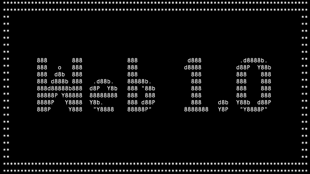
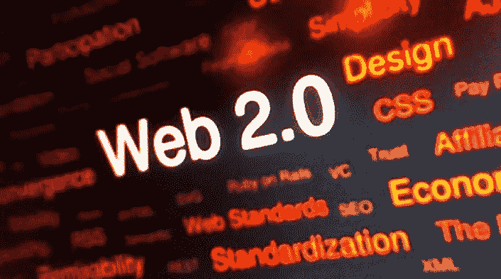
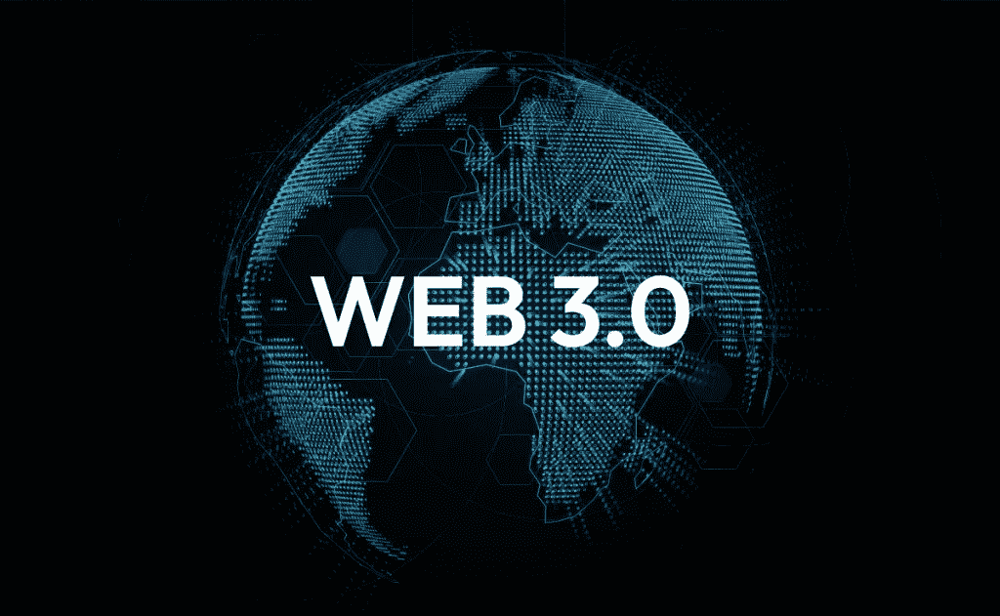

# web 3.0——互联网的未来

> 原文：<https://medium.com/coinmonks/web-3-0-the-future-of-the-internet-337e8dc4699e?source=collection_archive---------16----------------------->

Source : Phys.org

自 20 世纪 80 年代初诞生以来，互联网已经走过了漫长的道路。在早期，互联网实际上是被政府用作一种通信来源。但是现在，在 2022 年，任何一个拥有智能手机或电脑的人都可以上网。即使没有技术知识的人也可以轻松使用互联网。90 年代的情况并非如此。

# **如果现在的互联网足够好，为什么还要 Web 3.0？**

Source : Listly

你可能想知道 web 3.0 到底是什么？但在此之前，我们目前使用的互联网版本基本上是 web 2.0。那什么是 web 1.0？。我们是什么时候升级到 web 2.0 的？……我们头脑中产生的问题会很大。才知道为什么 web 3.0？，我们需要了解 web 1.0 和 2.0 的历史。

# **Web 1.0**

Source : Devloteq

web 的第一个版本出现在 1990 年到 2004 年的时间线上。在这个版本中，互联网的用户数量非常有限。主要原因很容易猜测。在那个时代，计算机既复杂又昂贵，因此人们只有在工作或一些基本用途需要时才会购买这些设备。

互联网这个词基本上是一个数字信息中心。用户没有与互联网中的网页进行交互的选项。感觉很孤独。只有用户和网页。

用户在互联网上只有阅读选项。没有评论，喜欢等这种东西。

这是对 web 1.0 的简短描述

# **Web 2.0**

Source : apc.org

互联网的这一演变始于 21 世纪初，目前我们正与之共存。web 2.0 的发展被证明是世界历史上的一个转折点。这听起来可能很滑稽，但如果我们回顾自 2004 年以来的互联网历史，这可能是合理的。

web 1.0 的衰落始于技术的进步，但互联网仍然陈旧而简单。人们意识到他们可以利用互联网做更多的事情。因此，当在网站上写博客的功能开始时，网络的演变就开始了。互联网变得越来越简单，并通过博客的选择聚集了全球的许多用户。

网络的另一个革命是人们可以创建自己的内容，也可以收到对他们作品的评论。YouTube 就是一个很好的例子。自从 YouTube 开始运作，人们开始不仅为了基本目的使用互联网，也为了娱乐。这导致了社交媒体的概念，人们可以在任何地方不受限制地联系和交谈。

到了 2010 年，个性化体验和在线广告开始普及。这使得互联网成为人们甚至政府的收入来源。像谷歌、脸书、微软等全球性组织通过互联网赚了数百万美元。

截至 2022 年，网络世界是不可替代的，因为它已经融入了世界人民的日常生活。现在的互联网树有很多分支，像社交媒体、在线广告、在线购物、内容创作、博客等等。这是对 web 2.0 历史的简短回顾

# Web 3.0

Source : demandtalk.com

耶！，最后是我们等待体验的东西，Web 3.0！

这个版本的互联网被专家认为是互联网的未来。这种 web 3.0 实际上存在于当前的互联网世界中，但并不在一个显著的水平上。

web 3.0 是互联网的分散版本，不像 web 1.0 和 2.0 是完全基于中心的。术语“分散的”可以定义为“没有对社区或团体的单点控制，但是该团体的所有参与者都对其具有控制。这个定义可以与互联网联系起来，即“在互联网上没有中央控制，人们的数据不是由单个实体而是由他们自己组织的”。这个定义听起来可能令人困惑。为了明确这一点，让我们举个例子。

考虑像谷歌这样的科技巨头，它提供搜索引擎、电子邮件服务等服务。在这种情况下，我们非常清楚，如果我们使用谷歌的服务，那么它实际上会在我们不知情或不知情的情况下收集我们的数据。所以在这种情况下，我们在互联网中的数据实际上是由谷歌在这种场景下控制的。这描述了 web 2.0 的整体工作思想

到了 web 3.0，将不会有像谷歌那样的中央权威机构来控制我们在互联网上的数据。只有互联网的用户才能完全控制他们的数据。没有人能够控制其他用户在互联网上的数据存在。这都是关于 web 3.0 的

# Web 3.0 实际上并不新鲜。

这听起来可能很有趣。Web 3.0 对于互联网世界来说其实并不是什么新鲜事物。web 3.0 的第一个模型出现在 2008 年。那实际上是在 web 2.0 的早期阶段。长话短说，web 2.0 和 3.0 几乎在同一时间出现在互联网上。web 3.0 的第一个模型实际上是 2008 年出现的区块链技术。区块链的主要资产是加密货币，这是一种高度依赖加密技术的数字货币形式。

区块链在当时没有普及的原因之一是它的局限性和狭窄的功能范围。比特币区块链网络的主要目标是分散资金。所以除了比特币交易，它不提供其他功能。这就是为什么 web 3.0 在过去对互联网世界来说是不可见的

# **为什么目前全世界都在谈论 Web 3.0？**

这是因为人们越来越关注互联网上的隐私和安全。你可能想知道在过去的十年中互联网存在安全问题。但目前，人们严重依赖互联网。比如在 YouTube 平台，很多人从他们的内容中赚钱。不仅仅是 YouTube，互联网还有很多面包赢的平台。此外，网上交易在最近几年得到了广泛的应用。

这样我们就知道了一个事实，当前的互联网流通着数百万的金钱，金钱是人类在现代社会生存的必要条件。所以在虚拟世界失去它，一次是傻的，一次是痛苦的。

因此，这是互联网尽可能处于最安全的一面的关键时刻。这就是为什么 web 3.0 被认为是互联网最安全的一面。人们在互联网上完全拥有自己的数据，没有任何第三方控制他们的数据。如果互联网是纯粹的 web 3.0，互联网世界的科技巨头将变得毫无意义。

# 未来不确定

web 3.0 出现的原因是合理和明确的，但是 web 3.0 的未来仍然是不可预测的。这种升级还有很长的路要走。谁知道，未来的互联网可能会像从 web 1.0 到 2.0 的演变一样，以意想不到的方式演变。

# 结论

以上场景是从我的角度出发的，不一定 100%准确。我写了我对什么是 web 3.0 以及为什么是 web 3.0 的想法。我不是这个领域的专家，但我喜欢在这个科技世界探索更多，并通过文章分享。

如果这篇文章有任何建议或修改，请告诉我。欢迎您的所有意见。

让我们为互联网祈祷吧

> 交易新手？试试[加密交易机器人](/coinmonks/crypto-trading-bot-c2ffce8acb2a)或者[复制交易](/coinmonks/top-10-crypto-copy-trading-platforms-for-beginners-d0c37c7d698c)