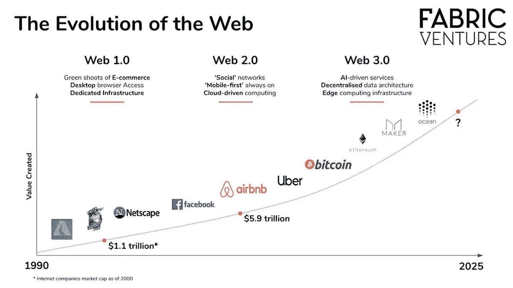

# Web 3.0-整个行业对教育的需求

> 原文：<https://medium.com/coinmonks/web-3-0-the-need-for-education-throughout-the-sector-822da807ec67?source=collection_archive---------38----------------------->

## 区块链和 Web 3.0 的成功在很大程度上取决于网络效应，这需要教育来满足当前的可访问性。

Web 3.0 是互联网的自然发展——它包含了数据和它所赋予用户的力量。这是一场赋权和社会革命…