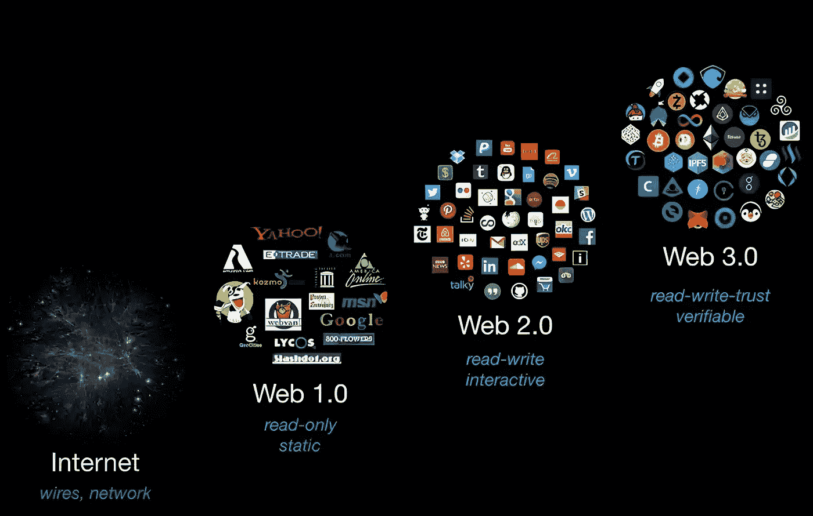

# Web 3.0:下一代在线连接

> 原文：<https://medium.com/coinmonks/web-3-0-the-next-generation-of-online-connections-81f798870df5?source=collection_archive---------20----------------------->

你听说过即将改变世界的全新创新 web 3.0 吗？它建立在复杂的区块链技术原理上。它还具有用人工智能深度学习实现的复杂功能，但 Web 2.0 与 Web 3.0 的特征是什么？

即使不会一直这样，web 2.0 也是当今互联网的现状。Web 3.0 和 2.0 在几个关键方面有很大的不同。Web 3.0 更关注授权给个人用户，而 Web 2.0 更关注社区增长。但是 web 3.0 远不止这一个目标。

当我第一次听说 web 3.0 时，我思考着为什么它是一件大事。这真的有那么重要吗？是的，原因如下。据 Peraltadesign.com 称，到 2025 年，我们创造和消耗的数据将是 2010 年的 160 倍。如果这不是重大事件，我不知道什么才是。它在边缘计算如何推进我们存储数据的方式方面发挥了如此重要的作用。

下一代最突出和最引人注目的因素之一是区块链。区块链技术建立了一个分散的数据库，可以保存和跟踪所有交易，包括涉及加密货币等数字货币的交易，而不依赖于第三方。使用这种基于分类账的系统可以确保交易的安全、合法和可靠。有人预测 Web 3.0 技术将在日常生活中广泛应用，比如在税收和货币征收中！你真的能相信吗？

我们的日常事务，我们使用的技术，以及我们如何利用它都将被 Web 3.0 改变。我听说它对我们如何开发和使用代码，对各种当代问题的有效数字解决方案有着巨大的承诺。然而，许多人还没有学会如何编码，或者即使你已经学会了，你也可能有兴趣学习更多的基础知识、幽默的迷因和更有效编码的巧妙技巧。

> 交易新手？试试[加密交易机器人](/coinmonks/crypto-trading-bot-c2ffce8acb2a)或者[复制交易](/coinmonks/top-10-crypto-copy-trading-platforms-for-beginners-d0c37c7d698c)