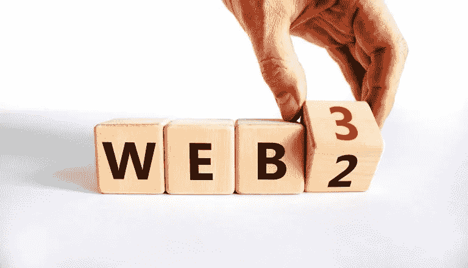
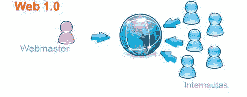
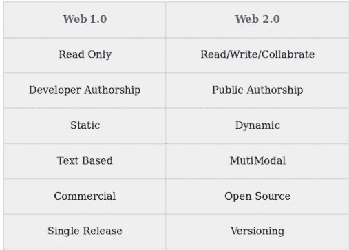
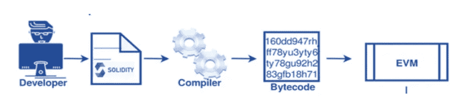
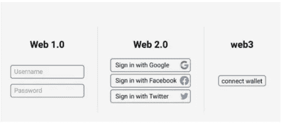

# web 3.0——即将到来的时代

> 原文：<https://medium.com/coinmonks/web-3-0-the-upcoming-era-165a6ef21ad4?source=collection_archive---------7----------------------->

Web3 ( **Web 3.0** )是万维网新一轮的想法。数据隐私和数据政策是重中之重。使用基于区块链的分散化解决了这一问题，该分散化给予用户对其数据的完全所有权。

**网页历史**

Web 1.0 — 由**蒂姆·伯纳斯·李**于 1990 年推出。互联网是一堆相互连接的电脑。Web 1.0 是一个静态网站，用户只能阅读网站开发者创建的内容。基本的通信模式是 HTTP，网页是用 HTML 开发的

就像在 web 1.0 中一样，任何人都可以向世界上的任何人发布任何类型的信息，而不需要经过中央把关者的许可，这为 web 2.0 铺平了道路

**Web 2.0 —** 于 2004 年推出，允许用户参与内容创作。众所周知，web 2.0 对移动、社交媒体和云产生了重大影响。在 web 2.0 中，交互不再局限于 HTML/XML。

web 2.0 的集中化概念引发了对隐私的担忧，因为公司开始通过跟踪消费者的在线活动来利用消费者的数据，并通过向他们显示有针对性的广告来产生收入，例如，Alphabet 在 2021 年的 82%的收入，即 2100 亿美元，来自于 YouTube、谷歌搜索、地图、YouTube 等各种平台上的广告。简而言之，我们可以说，在 web 2.0 迭代中，企业利益主导了消费者保护，大企业比用户群体整体受益更多。

**Web 3.0 —** Web 3.0 (Web3)是 Web 技术发展的第三代。它由区块链、人工智能、元宇宙、物联网和机器学习提供支持，旨在通过利用分散协议的力量来提高透明度和问责制。有了 Web3，你将不再需要每个社交媒体平台的单独账户，因为正在开发一个集中的存储库。它保护个人财产和隐私。

**Web 3.0 特性**

*   **分散化。**在前两代 web 中，治理和应用程序在很大程度上是集中的，与之相反，Web 3.0 将是去中心化的。应用程序和服务将以分布式方式启用，这里没有中央机构。
*   **基于区块链。区块链自动信托公司。用户不需要相信记录，因为它们是由网络验证的。**信任被编码到系统本身中，并分布在所有网络参与者中。这是一个由陌生人组成的自治网络社区。同样，社会给你钱是因为你给了它所需要的，区块链给你硬币是因为你给了网络它所需要的。****
*   **支持加密货币。**加密货币的使用是 Web 3.0 服务的一个重要特征，并在很大程度上取代了法定货币的使用。
*   **自主，人工智能。总体而言，更多的自动化是 Web 3.0 的一个关键特征，而这种自动化将在很大程度上由人工智能驱动。**

# **Web 3.0 中的可靠性**

智能合同是存储在区块链平台上的软件，可以自动执行协议。它是用 Solidity、Rust 或 Vyper (Solidity 但是 Python 风格)编写的，它是任何去中心化应用程序的关键组件，为其业务逻辑提供动力，并允许您在区块链上存储信息

Solidity 是一种高级的、面向对象的编程语言，可用于在基于 EVM(以太坊虚拟机)的区块链上编写智能合同。

## 以太坊虚拟机的可靠性工作(EVM)

以太坊是一个具有原生加密货币(ETH)的区块链网络。此外，它还提供像令牌(ERC20 等)这样的功能。)、智能合约、dApps 等。智能合约是部署在区块链上的自动可执行代码，当满足编码条件时就会执行。为了在以太坊区块链上执行智能合约，我们需要以太坊虚拟机(EVM)。这是一个图灵完整系统，这意味着它可以执行任何带有计算功能的逻辑步骤。

*   开发人员使用 Solidity 编写智能合约的代码。
*   固化代码→(转换成)→操作码→(编译成)→字节代码。
*   字节码是一种低级机器语言，由 EVM 执行和保存。

# Web 3.0 的局限性:

*   Web 3.0 技术还没有准备好。
*   新手可能难以理解
*   不先进的设备将无法处理 Web3。
*   更多的时间将花在网上冲浪

## web 1.0 vs web 2.0 vs web 3.0

# 结论

即将到来的 Web3 远远超出了加密货币的用途。它将提供个性化的浏览体验，更智能的类人助手，以及其他分散的好处，将建立一个无偏见的网络。Web 3.0 将使用机器学习算法加密连接来自机器、个人和公司的数据，这将产生新的商业模式和市场。

👋感谢阅读，下次见

让我们在 [Twitter](https://twitter.com/PhilipBency) 和 [LinkedIn](https://www.linkedin.com/in/bency-philip-0a4646172/) 上连线。😊

> 交易新手？试试[密码交易机器人](/coinmonks/crypto-trading-bot-c2ffce8acb2a)或[复制交易](/coinmonks/top-10-crypto-copy-trading-platforms-for-beginners-d0c37c7d698c)