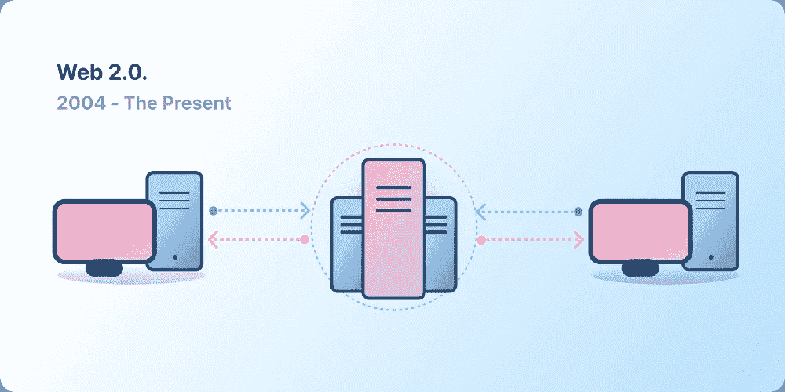
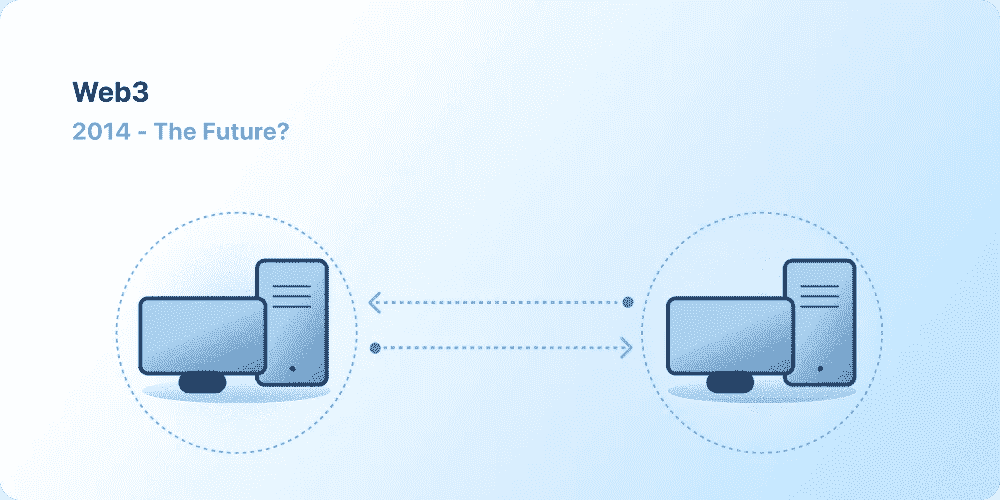

# Web 3

> 原文：<https://medium.com/coinmonks/web-3-a650d5bc775c?source=collection_archive---------25----------------------->

许多人都在谈论 web3，它将如何颠覆互联网，如何成为社交媒体的未来。但是 Web 3 到底是什么？让我们一步步深入这个话题。

# 网络的发展

## Web 1

由蒂姆·伯纳斯·李发明的万维网与我们今天所知的互联网完全不同。只有一小部分人可以访问它，而且它主要由静态网站组成。互动几乎不可能，大多数网站只是公司的静态网站。这就是为什么 Web 1 也被称为“只读 Web”的原因。

## Web 2

Web 2 始于 2004 年左右社交媒体平台的出现。它变成了一个网站的读写网络，充满了平台拥有的用户生成的内容，这些内容被发布在上面。这些公司不再是主要的内容创造者。这是广告驱动的收入模式的开始，公司开始利用通过他们的网络效应产生的流量。这导致了巨大的不成比例的流量，因为少数顶级网站或公司产生了整个网络的大部分流量。

Source: [https://ethereum.org/en/web3/#introduction](https://ethereum.org/en/web3/#introduction)

## Web 3

Web 2 和 Web 3 的区别不在于像第一代 Web 那样的特性，而在于去中心化和所有权。在 Web 3 中，平台归社区所有，在一个分散的网络中运行，不附属于任何公司。你的内容完全属于你自己，你可以决定如何处理它(与 Web 2 相反)。Web 3 目前正处于创建阶段，截至 2022 年 11 月还没有被大量采用。

Source: [https://ethereum.org/en/web3/#introduction](https://ethereum.org/en/web3/#introduction)

## 但是什么是 Web 3 呢？

Web 3 被认为是一个非常广泛的话题，这使得一个严格的定义几乎是不可能的。它使用 NFTs、加密货币和区块链，有 4 个核心原则。

*   **分散**(分散所有权)
*   **无权限**(权利平等，无排斥)
*   **本地支付**(集成加密货币)
*   **不信任**(经济机制和激励)

这些原则为 web 3 提供了不同于 web 2 的优势。这些优势之一是每个人创建的所有内容的所有权方面。内容的提供者也是内容的所有者。而不是 web 2 中的平台或公司。这个原则不仅适用于内容，也适用于游戏的游戏内项目。不是游戏开发者是它的主人，而是你作为 NFT 的物品持有者。web 3 的新所有权特性使内容创作者和游戏玩家能够在公开市场上自由交易他们的内容或项目，完全独立于平台或游戏。没有人有能力禁止任何行为，这已经导致了 web 3 的下一个优势:审查阻力。平台不可能禁止特定的内容或用户，因为它们都存储在一个不可变的区块链上。即使创作者不能再在一个平台上发表文章，但有了 web 3，就有可能用同样的数据插入另一个平台，因为你的内容存在于区块链上。它将使创作者和消费者更容易改变平台，而不会像以前那样受到负面影响。已经有一种方法可以用你的以太坊档案登录到不同的平台，这反过来允许你在一个地方处理你所有的档案，也可以用一个主档案登录到不同的平台(另见[用以太坊登录](https://login.xyz/))。
但也许甚至不需要改变平台，因为 Dao 也是 Web 3 的一部分。一个道是一个分散的自治组织，基本上是一个公有组织。股东(很可能是用户)可以决定平台的未来。所有权允许他们通过智能合约对决策进行投票，从而强制执行投票结果。目前，每个 DAO 都有不同程度去中心化，其他特性也在探索中，因为它们是相对较新的发明。

## 限制

因为 web 3 是建立在一个区块链上的(大部分是在以太坊上，因为它是最成熟的智能合约区块链)，所以你在上面做的几乎所有事情都会是一个交易。以目前的交易成本，完全使用 web 3 在经济上是不可行的。尤其是在不太富裕的环境或发展中国家，高交易成本导致用户减少。web 3 的另一个问题是，它目前正处于与互联网初期相同的阶段。为了正确使用它，用户需要了解技术文档，区块链和钱包如何工作，以及如何浏览不直观的网站。
因为 web 3 比较新，所以大部分人不知道它是什么，或者甚至没有听说过它。它的成功将是至关重要的，web 2 将被用来为它和它的好处做广告。web 3 成为 web 2 引发的所有问题的可行解决方案可能需要很长时间。

你对 web 3 有什么看法？请在下面的评论中告诉我！

> 交易新手？试试[密码交易机器人](/coinmonks/crypto-trading-bot-c2ffce8acb2a)或者[复制交易](/coinmonks/top-10-crypto-copy-trading-platforms-for-beginners-d0c37c7d698c)