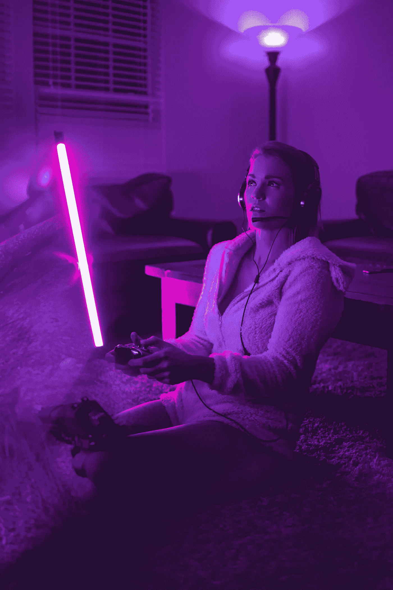
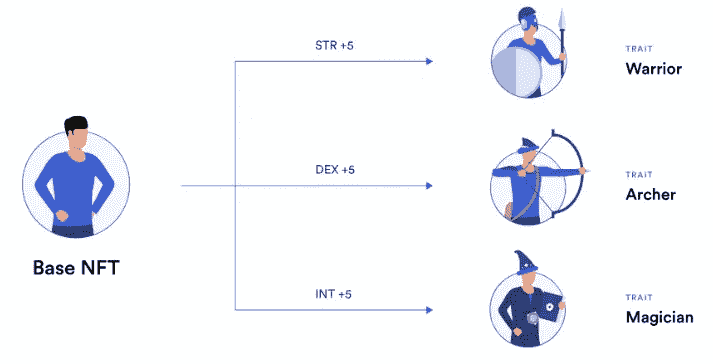

# Web 3 游戏；为区块链理工大学带来大规模采用

> 原文：<https://medium.com/coinmonks/web-3-gaming-bringing-mass-adoption-to-blockchain-tech-f9a0765f379b?source=collection_archive---------40----------------------->

游戏可能会让区块链理工大学和 web 3 大规模采用吗

这是班克勒斯岛作家群的四篇文章之一

Photo by [Alexander Jawfox](https://unsplash.com/@jawfox_photography?utm_source=unsplash&utm_medium=referral&utm_content=creditCopyText) on [Unsplash](https://unsplash.com/?utm_source=unsplash&utm_medium=referral&utm_content=creditCopyText)

仅在 2022 年上半年，[博彩业 NFT 就筹集了 4 倍于 NFT 其他行业的资金](https://bitcoinke.io/2022/08/h1-2022-crypto-funding-statistics/)。

Gamefi 的资金已经有了 175%的增长

然而游戏玩家讨厌它。加密和去中心化 maxis 认为，它有很好的机会让区块链技术得到大规模采用，而机会主义游戏玩家则继续从它目前提供的丰厚收益中获利。

Web 3 游戏几乎是一个总称，包括 P2E、玩一玩就赚、NFT 游戏，甚至区块链游戏。

对大多数人来说，这都是一个骗局。那些看到大局的人会继续努力在这个相对较新的利基市场淘金。

一个旨在将 web 3 的去中心化的创作者奖励本质引入视频游戏的游戏——这本身就是一股默默地寻求主宰娱乐行业的力量。

视频游戏在疫情的第一年就创造了相当可观的[1460 亿美元的收入，](https://cedars.cedarville.edu/2022/05/video-games-stake-in-the-entertainment-industry/)相比之下，音乐和电影产业的总收入为 627 亿美元。两者都被疫情重创。

web 3 游戏很可能是将 Web 3 和区块链技术的无限可能性融入视频游戏的缺失环节。

这篇文章旨在证明 web 3 和区块链技术能够为视频游戏行业中的游戏、工作室和内容创作者这三大关键角色提供什么。

我们也将看看目前 web 3 游戏的趋势，以及我们是如何走到这一步的，同时预测我们可能看到的趋势。

我们还将强调一些关键问题，如果我们想要看到大规模采用，就需要解决这些问题。

所以系好安全带，这将是一次地狱之旅。

## Web 3 能给视频游戏行业带来什么？

这个问题已经被游戏工作室和游戏玩家反复问过。虽然大多数工作室对区块链和 NFTs 的环境影响保持警惕，但少数尝试过的工作室遭到了他们社区的抵制。

这大部分可以归因于在大多数流行的 NFT 游戏中看到的游戏到战利品的模式。

玩家不希望感觉自己只是另一个庞氏游戏中的棋子，让这一切看起来像一个笑话，或者只是开发者从游戏玩家那里榨取金钱的另一种技术。

**针对游戏玩家**； ***真正的所有权屹立不倒。***

你可以交易游戏中的资产。比如说，我个人玩了 5 年的《部落冲突》,在这个过程中，我的基础已经达到了极限。

当我决定放弃的那一天，我放弃了我所有的成就。花费的时间、金钱和精力。全没了。

如果我们采用已经在 NFTs 中使用的概念，创建你可以交易游戏内资产的市场，而不像传统的单向市场，你被购买的物品卡住，不能转售，会怎么样？

看着我在同样的游戏中投入更多的金钱和努力，即使我知道有一点点可能得到回报。

我多年的时间、努力和金钱仍然可以被挽救。不是说我不喜欢这个游戏，而是这种感觉让一切都值得。

**为工作室**；他们都将受益于 ***更好的创收模式。再次想想我们在今天的 NFTs 中已经看到的版税。不要再遵循旧的剧本，推送不相关的更新，只是为了创收。我们将看到的任何更新都将是纯粹的创新，别无其他。所有人的双赢。***

> 速度未提取— **Arad**

**对于早期帮助传播这些游戏的创作者来说，他们将获得奖励** 。

这一次，考虑在 2017 年制作 YouTube 视频或写博客解释堡垒之夜的游戏，并积累$fort 代币。

你逐渐成为你热爱的公司的利益相关者，并会尽你所能看着这个游戏发展得更好。Web 3 再次辉煌。

在这一点上，有些人会继续争辩说，虽然所有这些都是创新和专业的 web 3，但一些工作室试图在不一定使用区块链技术的情况下执行它们。

我会说我们仍然需要区块链技术。

想象一下，游戏设计师设计了智能合约，可以在特定的登录次数后自动更新游戏中的角色。

[michael robinson](https://twitter.com/77MichaelR/status/1569099271370047489) on twitter

加上区块链交易是公开的。我的意思是，你可以看到你将要购买的堡垒之夜皮肤去过的所有地方。没有技术比它做得更好。

## 我们不是偶然来到这里的

现在我们知道了 web 3 和区块链技术对视频游戏的意义，让我们看看过去发生了什么。

web 3 游戏最流行的模式是投资计划。

在游戏赚取模式下，玩家通过购买 NFT 进行投资，然后被迫每天登录。他们最不感兴趣的游戏。然后，目标就变成了拿回他们的资本并获得一些利润。拿出利润，看着机会主义者大量离场。这发生在 Axie 的游戏中，我敢说这将发生在 99%的不可持续模式的游戏中。

## 我们现在在哪里？

我们正处于这样一个阶段，每个人都已经不再热衷于不可持续的盈利模式。

***目前的趋势是风投支持的游戏免费，以吸引真正的游戏玩家。***

资金在流入，我们看到更多的实验和随之而来的创新。我们现在正在讨论**即玩即赚**。在这里，玩成了首要目标，赚钱只是附加条件。任选一个。资金在这里，建设者在工作，势头正在形成。就连阿西也在重塑自己。

虽然看起来革命性的游戏即将到来，但我打赌还需要几个周期。

值得一提的是由 [**DigiDaigaku**](https://twitter.com/digidaigaku) ，率先推出的自由拥有模式，这是一个 2022 年的供应项目，在一个月内从自由拥有发展到 24，000 美元。

他们就像是由一群真正的粉丝组成的工厂 NFT，他们和球队一起建设。那些买它的人把他们的赌注押在了这个队上。

毕竟他们免费发布了 NFTs。不像许多其他人，我们已经看到在没有丝毫游戏制作经验的情况下，通过卖地筹集资金。

主游戏很可能是免费的。这种模式可能是最佳选择。让我们看看这一切是如何展开的。

我觉得这是生态系统朝着正确方向迈出的重要一步。这个模式成功了，我们可以看到更多的大型 web 2 工作室探索区块链理工大学和 Web 3。

我们目前在这个空间中的摩擦形式有

> 用户体验
> 
> 可量测性
> 
> 安全性
> 
> 可持续的游戏经济和令牌组学设计。

> 我 10 岁的小老弟不会为了玩一个他自己都不觉得有趣的游戏——匿名游戏而去打开一个加密钱包

## 未来的一瞥

建立在区块链技术上是新的，相对困难，更不用说一个革命性的游戏了。

我们会看到越来越多的独立创意者通过网络 3 的方式获得资助，同时在这个过程中建立一个社区。

那些证明了自己的人最有可能继续从风投那里获得额外的资金来扩大规模，或许在适当的时候带来 web 2 游戏专家。

我们也将继续看到更多大型 web 2 工作室的员工离开，来构建和试验 web 3。有了他们被证明的过去，他们最有可能从零开始得到资助。

## 面向游戏的区块链

目前区块链活跃用户数量甚至在下跌熊市中也处于前列的有 [**蜡区块链**](https://linktr.ee/WAX_Blockchain) 和 [**蜂巢区块链**](https://www.hiveblockchain.com/) **。**

两者都有一个共同点。一个人们喜欢玩的游戏。

蜡与 [*外星世界*](https://alienworlds.io/) 和蜂巢与[夹板 *r* 陆地](https://splinterlands.com/) *。*

[**索拉纳**](https://solana.com/) 非常有机会凭借其非常低的交易费用和永远活跃的社区。然而，问题是网络能否在不停机的情况下适应其当前 10000 的 TPS。随着时间的推移，肯定会变得更好。

mysten labs 即将推出的区块链 [**隋**](https://mystenlabs.com/) **将自己标榜为更好优化的 Solana。更有趣的是在 testnet 上看到的游戏优化。把它放在 mainnet 上，他们可能会有一个很好的机会。**

值得一提的是伙计们有[恩尼金](https://enjin.io/)和以太坊缩放平台[多边形](https://polygon.technology/)。许多其他人也在默默地建造。

几年后回顾过去，看到这些连锁店仍然站在创新的最前沿，带给更多的人，这将是一件很酷的事情。

## **游戏上**

Photo by [Alexander Andrews](https://unsplash.com/@alex_andrews?utm_source=unsplash&utm_medium=referral&utm_content=creditCopyText) on [Unsplash](https://unsplash.com/s/photos/gaming?utm_source=unsplash&utm_medium=referral&utm_content=creditCopyText)

这是一场人与人之间的竞赛，我们还处于大计划的初期，目标仍然是 10 亿用户。

尽早下注，支持你最喜欢的项目和区块链。

然而，不要沉迷于游戏。

把他们当成真正的创业公司。

这都是实验，而实验孕育创新。

许多人会失败，少数人会成功。

直到我们得到第一个革命性的游戏。

游戏即将开始。未来在等着我们。

**参考文献**

 [## 密码游戏:一个最实用的论题

### 作者:阿拉德

medium.com](/collab-currency/crypto-gaming-a-most-practical-thesis-ec4f55f53408)  [## 区块链游戏的未来。

### 我很幸运处在一个可以建立我所宣扬的东西的位置。就像投资时，我把我的想法推到网上，就像…

www.loop-news.com](https://www.loop-news.com/p/the-future-of-blockchain-gaming) 

> 交易新手？尝试[加密交易机器人](/coinmonks/crypto-trading-bot-c2ffce8acb2a)或[复制交易](/coinmonks/top-10-crypto-copy-trading-platforms-for-beginners-d0c37c7d698c)