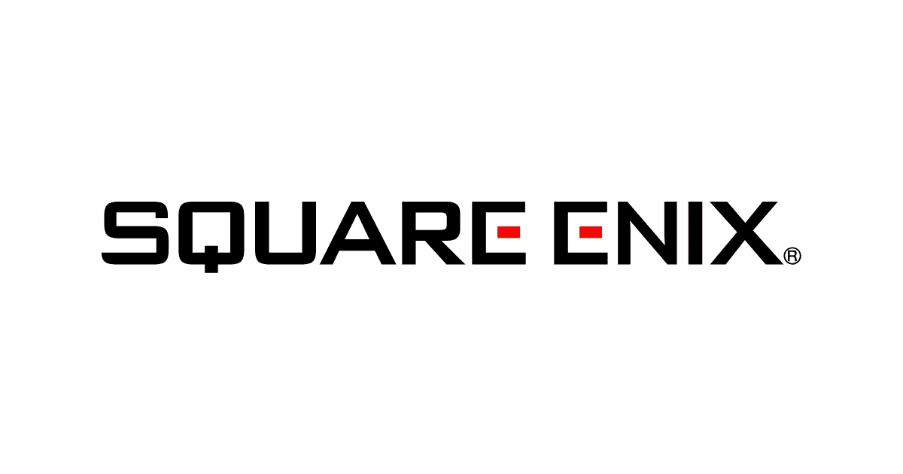
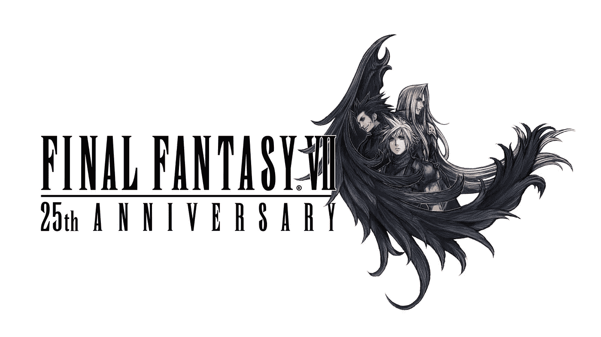
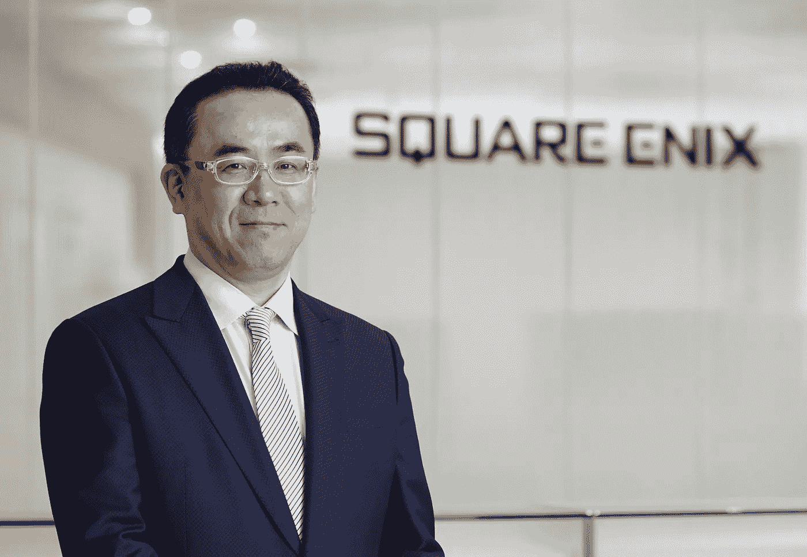

# Web 3 游戏:最终幻想进入元宇宙

> 原文：<https://medium.com/coinmonks/web-3-gaming-final-fantasy-enters-the-metaverse-608542447884?source=collection_archive---------20----------------------->

标志性的日本游戏发行商 Square Enix 将进入元宇宙，并于明年为其标志性的最终幻想系列推出一系列 NFT。仍有待观察的是，长期的最终幻想粉丝是否会支持娱乐集团向 Web 3 和区块链数字收藏品的过渡。

长期以来，铁杆游戏玩家一直坚决反对 Web 3 和 NFTs，认为它们只不过是希望跟上视频游戏货币化最新趋势的公司贪婪的现金掠夺者。对 Web 3 的尖酸刻薄令人想起了大约十年前游戏玩家对慢慢进入这个领域的微交易的反应。当时，在游戏圈里呆上一段时间，就不可能听不到人们对微交易的抱怨，然而，任何精通商业的游戏玩家都能看出这个行业的发展方向。十年后，微交易是大多数游戏的核心盈利模式。许多游戏玩家不再反对微交易，有些人甚至希望在游戏中购买数字资产。

这就是为什么观察在这个关键阶段拥抱 Web 3 的游戏工作室和发行商是如此有趣。Square Enix 正在利用金恩基于 Polkadot 的 Efinity 平台，将区块链的数字收藏品引入其标志性的最终幻想系列。据 Decrypt 报道，“然而，NFTs 不会是纯粹的数字产品。它们被绑在基于 smash 角色扮演游戏(RPG)最终幻想 7 的物理动作人物和交易卡上，以纪念最初的 PlayStation 游戏 25 周年。”

虽然 Square Enix 对区块链理工大学的初步进军将主要围绕实体+数字收藏品，但数字游戏很可能是一种将他们庞大的玩家群慢慢纳入 Web 3 的方式。Square Enix 可能受到育碧(Ubisoft)的启发，匆忙进入该领域，在推出更具雄心的产品之前，它采取了一种审慎的方式。

Square Enix 总裁松田隼在今年早些时候的新年信中表示了对区块链博彩的支持。“我认为 2021 年不仅是‘元宇宙:第一年’，也是‘NFTs:第一年’，因为在这一年，快速扩大的用户群对 NFTs 充满了热情，”

如果 2021 年是元宇宙和 NFTs 的“第一年”，那么我们才刚刚开始这个漫长而艰难的旅程。尽管乏味的游戏玩家表达了愤怒，但看起来游戏行业正稳步向 Web 3 的未知前沿进军。这种转变并不容易，但我有信心说，就像微交易一样，正如我们所知，在不久的将来，区块链科技将成为游戏中无处不在的因素。

感谢您的阅读。

看看我在推特上未经过滤的想法:

[https://twitter.com/wasifmrahman](https://twitter.com/wasifmrahman)

在 LinkedIn 上关注我的职业生涯:

https://www.linkedin.com/in/wasifmrahman/

我对媒体的另一个想法是:

【https://medium.com/@wasifmrahman 

来源:

 [## 最终幻想 NFTs 来到广场 Enix 的波尔卡多特，金恩联盟-解密

### 简而言之，Square Enix 对 NFTs 采取了“非常谨慎”的态度，与金恩一起发布了《最终幻想》NFTs。的…

decrypt.co](https://decrypt.co/105592/final-fantasy-nfts-coming-to-polkadot-in-square-enix-enjin-alliance)  [## Square Enix 总裁重申专注于区块链游戏，“游戏贡献”趋势-解密

### 《最终幻想》和《王国》等电子游戏背后的日本开发商 Square Enix 的总裁松田隼佑介…

decrypt.co](https://decrypt.co/89604/square-enix-president-reiterates-focus-blockchain-games-play-to-contribute-trend) 

> 交易新手？尝试[加密交易机器人](/coinmonks/crypto-trading-bot-c2ffce8acb2a)或[复制交易](/coinmonks/top-10-crypto-copy-trading-platforms-for-beginners-d0c37c7d698c)