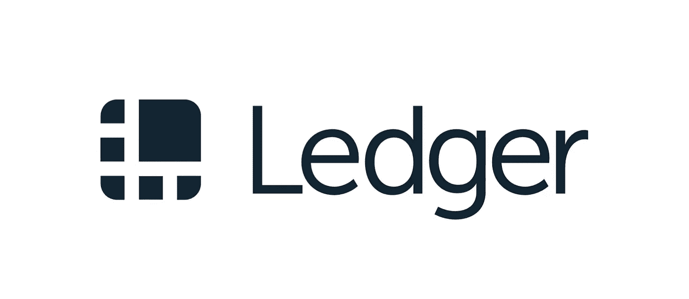
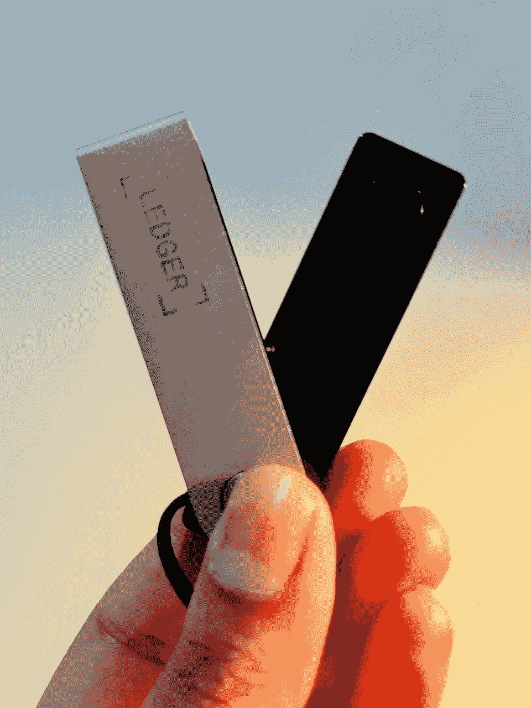

# Web 3 安全性—设置我的分类帐硬件钱包

> 原文：<https://medium.com/coinmonks/web-3-security-setting-up-my-ledger-hardware-wallet-bb3a30bb087e?source=collection_archive---------21----------------------->

在一个同事因为鱼叉攻击而失去了所有的非功能性交易后，我得到了我的分类账硬件钱包。这是几个月前的事了，作为一个不太懂技术的人，我推迟了设置它，主要是因为对这个过程感到害怕。

随着我不断收集大量 NFT 作品，我变得越来越多疑。我不会点击链接或将钱包连接到新网站。我也非常害怕任何出现的铸造机会。这导致我实际上错过了当前的免费薄荷元非功能性测试。创建一次性钱包是一种选择，但跟踪我的密码已经感觉像一份兼职工作，我只是不想管理更多。

当我做了一个噩梦，梦见自己辛辛苦苦挣来的所有密码和非功能代码都被一个骗局骗走时，这一切变得太难以承受了。我半夜醒来，检查我的钱包…什么都没有出现…我的幻影只是加载缓慢，但我回去睡觉，相信我失去了一切。市场表现如此糟糕，我已经感觉很糟糕了，所以我甚至没有勇气去面对它。

谢天谢地，早上我意识到一切都很好，我终于采取措施来设置我的分类账硬件钱包。我不打算说谎…这有点乏味和耗时，但一旦我设置好了，一切都非常顺利，我可以看到有一个硬件钱包如何真正确保我的数字安全。此外，随着最近许多加密公司倒闭的消息，如果需要的话，我现在有一个地方来移动和存储我的数字资产。

我早就应该这么做了。也许在过去的几个月里我可以睡得更安稳一点。如果你还没有硬件钱包，那就帮自己一个忙，买一个吧。我听到太多的故事，人们失去了一切的骗局，感觉就像每天都在发生。

感谢您的阅读。

> 交易新手？试试[加密交易机器人](/coinmonks/crypto-trading-bot-c2ffce8acb2a)或者[复制交易](/coinmonks/top-10-crypto-copy-trading-platforms-for-beginners-d0c37c7d698c)

看看我在推特上未经过滤的想法:

【https://twitter.com/wasifmrahman 

在 LinkedIn 上关注我的职业生涯:

[https://www.linkedin.com/in/wasifmrahman/](https://www.linkedin.com/in/wasifmrahman/)

我对媒体的另一个想法是:

[https://medium.com/@wasifmrahman](/@wasifmrahman)