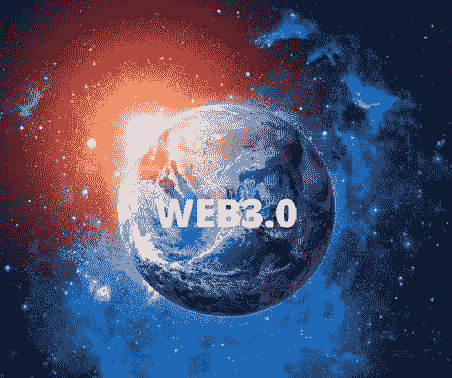

# Web 3 简化版

> 原文：<https://medium.com/coinmonks/web-3-simplified-cef6136e376f?source=collection_archive---------15----------------------->

这是目前科技领域最受追捧的词汇之一。Web3.0 是继 web 2.0 之后互联网的第三次迭代。这个互联网版本将用户数据、内容和数字资产的所有权委托给它的用户(你和我)，不像 web2.0 有一个集中的系统，将用户数据和内容的所有权委托给政府或大型科技公司，如脸书、twitter、YouTube 等。

**如何开始**

1989 年 3 月，CERN(欧洲核研究组织)的前雇员、英国科学家 Tim Bernes-lee 提交了一份关于有效/增强 CERN 通信系统的提案，但 Tim 后来意识到这一想法可以在全球范围内实施，而不仅仅是针对 CERN。1990 年，他和比利时计算机科学家罗伯特·凯丽奥提出用超文本“链接和访问各种信息，就像用户可以随意浏览的节点网络”。这个提议导致了万维网的诞生，在它被设计和测试之后。

**网页 1 — —只读内容**

Web1 是互联网的最早形式，存在于 1989 年至 2005 年。这是一个非交互式的互联网，包含的信息只能由用户阅读，没有评论、反馈、建议、回复或反应的机制。公司和大企业主要使用互联网向世界各地的潜在客户展示产品(如目录或小册子)。web 1.0 网站的一些例子包括 geocites page、craigslist 和 Slashdot

**web 1.0 的核心特性**

Web 1.0 互联网页面是静态的

通常被称为只读内容，为用户提供零交互，主要用于获取信息

世界上任何人都可以在任何时间和任何地方访问这个互联网版本

包含线性信息

无法在 web 1.0 上更改信息

HTML、HTTP 和 url 是 web1 中使用的核心 web 协议

**Web 2.0 — —用户生成的内容**

不像 web 1，用户只阅读互联网上的内容。这个互联网版本允许用户在互联网上阅读、写作、分享想法、意见，还可以提出评论和建议

Web 2.0 于 2004 年发布，它见证了大型社交媒体平台的诞生和发展，包括 facebook、Instagram、twitter、YouTube 等。它为你我提供了成为内容创造者和生产者的机会。

综上所述，我们可以有把握地得出结论，web 2.0 比 web 1 有很多优势，然而它最大的挑战之一是集中化。云服务、应用交付和平台由集中的权威机构管理，如 facebook、youtube 等。web 2 的这种集中特性为严重的安全威胁、出于恶意目的访问用户私人信息和数据收集创造了空间。

**Web 3.0**

与向用户提供读写能力的 web 2.0 不同，web3.0 还提供互联网上数字资产和内容的所有权**。**该互联网版本将通过基于区块链技术的分散式生态系统，帮助解决与 web2.0 相关的安全威胁、数据收集和隐私问题。

**web 3.0 的特点**

**分权**

这标志着与 web 2 相关的互联网集中化结构的彻底脱离，在 web 2 中，用户依赖 facebook、谷歌或苹果等科技巨头来调节互联网，而是个人(你和我)拥有和管理互联网的某些部分。

**不可信**

“无信任”这个词意味着你不需要依赖或依靠任何中介、科技巨头或大公司来使用互联网或市场运作，而是你、我和其他参与者可以直接与网络互动

**无许可**

每个人都可以参与，不需要任何当局或中央管理机构的授权

使用加密货币作为支付模式，而不是 web2.0 中使用的法定支付模式

[硬币和密码](https://medium.com/u/fffbcf90a5c9?source=post_page-----cef6136e376f--------------------------------)[Blockchain.com](https://medium.com/u/e4f5246afb5c?source=post_page-----cef6136e376f--------------------------------)[game infinity web 3 Gaming](https://medium.com/u/f052ca2fd21f?source=post_page-----cef6136e376f--------------------------------)[Readl-web 3 讲故事工具](https://medium.com/u/4e051534b5c5?source=post_page-----cef6136e376f--------------------------------)[Readl-web 3 讲故事工具](https://medium.com/u/4e051534b5c5?source=post_page-----cef6136e376f--------------------------------)

> 交易新手？尝试[加密交易机器人](/coinmonks/crypto-trading-bot-c2ffce8acb2a)或[复制交易](/coinmonks/top-10-crypto-copy-trading-platforms-for-beginners-d0c37c7d698c)或 [Rea](https://medium.com/u/4e051534b5c5?source=post_page-----cef6136e376f--------------------------------)