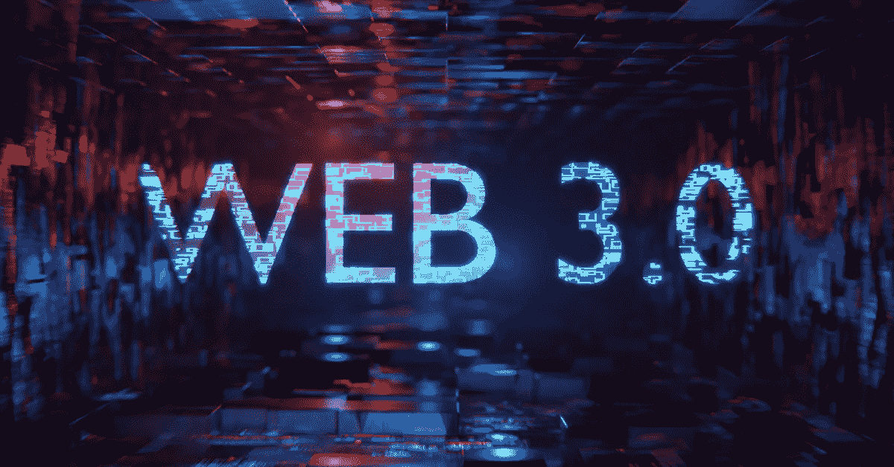

# Web 3:下一代互联网

> 原文：<https://medium.com/coinmonks/web-3-the-next-generation-of-the-internet-a096eac1f7ab?source=collection_archive---------39----------------------->

随着互联网的不断发展和扩大，新一代的 web 技术正在出现:Web 3。虽然互联网已经成为世界各地许多人日常生活中不可或缺的一部分，但 Web 3 承诺通过提供更加个性化、高效和安全的在线体验，将事情推向一个新的高度。

那么，Web 3 到底是什么，它与当前版本的互联网 Web 2 有什么不同？

Web 2 出现于 20 世纪 90 年代末，其特点是具有交互性和社会性，如社交媒体、博客和维基。它还促成了电子商务和在线广告的兴起，从而创造了一个庞大的数字经济。

> 交易新手？在[最佳密码交易所](/coinmonks/crypto-exchange-dd2f9d6f3769)上尝试[密码交易机器人](/coinmonks/crypto-trading-bot-c2ffce8acb2a)或[复制交易](/coinmonks/top-10-crypto-copy-trading-platforms-for-beginners-d0c37c7d698c)

另一方面，Web 3 专注于使用人工智能、区块链和物联网(IoT)等新技术来创建更加直观和互动的在线体验。它旨在通过使用机器学习和其他先进技术来分析和理解用户的行为和偏好，使互联网更加适应和响应用户的需求。

Web 3 的关键组成部分之一是区块链技术的使用。区块链是一个去中心化的分布式账本，允许安全透明的记录保存，而不需要中央机构。这使得它非常适合广泛的应用，包括金融交易、供应链管理，甚至投票系统。

在 Web 3 的环境中，区块链技术可以用来创建分散的应用程序(dApps ),这些应用程序运行在分散的网络上，而不是单一的服务器上。这将使黑客更难访问敏感数据，也使用户更容易控制自己的数据和隐私。

Web 3 的另一个重要方面是物联网(IoT)的集成。物联网指的是物理设备的互联网络，如智能电器和可穿戴技术，它们可以相互通信和交换数据，也可以与互联网通信和交换数据。Web 3 旨在通过使用机器学习和其他先进技术来分析和理解用户行为和偏好，使这些设备更容易通信和协同工作。

Web 3 和物联网的一个潜在应用是智能城市的发展，在智能城市中，传感器和其他技术被用来收集和分析关于交通模式、能源使用和城市生活其他方面的数据。这些数据可以用来优化城市服务，提高市民的生活质量。

Web 3 还有可能彻底改变我们与互联网互动的方式。例如，虚拟和增强现实技术可以用来创建比传统网站和应用程序更具吸引力和互动性的沉浸式在线体验。这些技术还可以用于增强远程工作和学习，使人们能够以更加真实和直观的方式进行协作和交流。

尽管 Web 3 有令人兴奋的潜力，但也有一些挑战需要解决。一个主要的担忧是安全问题，因为分散的系统可能更容易受到黑客的攻击。另一个挑战是标准化的需要，因为不同的 Web 3 技术可能互不兼容。最后，还有一个问题是如何确保 Web 3 的利益得到公平分配，并且该技术不被用来加剧现有的权力不平衡。

总的来说，Web 3 代表了互联网发展的一个重大进步，并有可能改变我们的生活和工作方式。虽然仍有一些挑战需要解决，但这项激动人心的新技术前景光明。