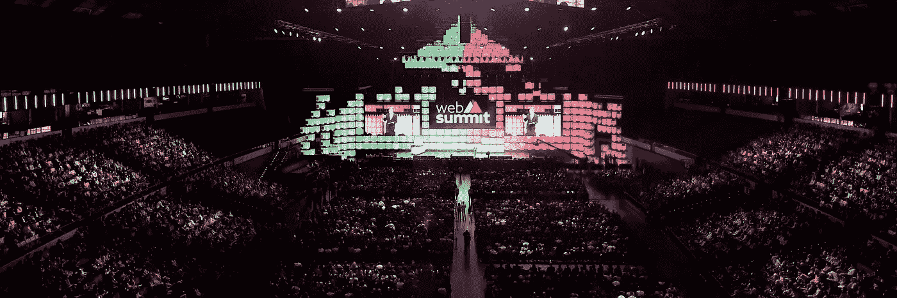
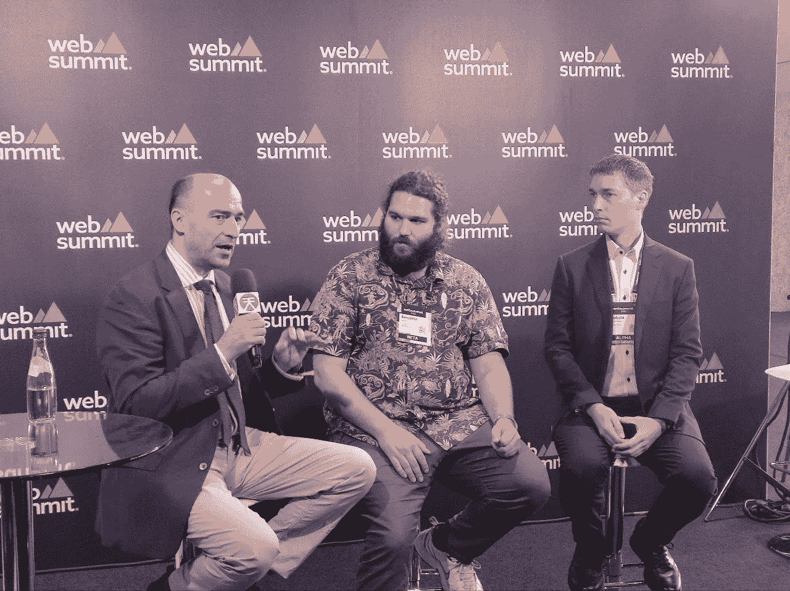

# 网络峰会 2022 亮点

> 原文：<https://medium.com/coinmonks/web-summit-2022-highlights-47f474efa3aa?source=collection_archive---------8----------------------->

Web Summit 2022 Main Stage. Source: [Twitter](https://mobile.twitter.com/websummit)

**欢迎参加 2022 里斯本网络峰会，这是世界领先的科技会议之一，汇聚了科技界最重要的人物！这是我们对议程的概述。**

网络峰会于 11 月 2 日至 4 日举行，汇集了来自 160 个国家的 71，000 多人。来自不同领域的 1，050 名演讲者就从医学到领导力和工程等多个主题分享了他们的想法。除了技术开发人员，世界领导人、体育明星、音乐家和演员也参加了活动。例如，奥莱娜·泽伦斯卡(乌克兰第一夫人)、诺姆·乔姆斯基(美国语言学家、哲学家、认知科学家、历史散文家、社会评论家)、克里斯蒂娜·费雷拉(葡萄牙电视节目主持人和女商人)、托托·沃尔夫(奥地利亿万富翁赛车运动高管、投资者和前赛车手)和约旦王后拉妮娅·阿卜杜拉陛下——这些人的组合令人印象深刻。2022 年，Web3 毫无例外地成为 WebSummit 讨论的最大话题之一。

以下是我们希望与您分享和讨论的亮点列表:

*   第二天，关于加密货币的**未来的激烈辩论开始了。这些立场各不相同，从莫莉·怀特(Molly White)的“加密正在摧毁人们的生活”，Web3 将成为伟大的创造者，到 Cardano 创始人查尔斯·霍斯金森(Charles Hoskinson)提出加密可以成为现有金融系统的替代方案，“老实说，去他妈的吧”。**
*   CZ 谈到了币安对 Twitter 的 5000 亿美元投资，并分享了他对这个**加密冬天**的看法，他说加密是最稳定的东西——它没有改变:

*   英裔印度商人 Herman Narula 是“不可能的世界”有限公司的联合创始人兼首席执行官，他解释了为什么脸书**Meta**与真正的元宇宙毫无关系，而更像是一个电子游戏。一言以蔽之:一个完全封闭的平台，对用户没有吸引力，硬件欠缺的体验。顺便说一下，脸书监督委员会表示，允许美国前总统唐纳德·特朗普返回社交媒体网站现在是可能的。
*   [Theneo](https://www.theneo.io/) 赢得[推介比赛](https://websummit.com/blog/theneo-pitch-2022-siemens)——世界领先的早期**创业公司**的现场舞台战。Theneo 是一个格鲁吉亚人工智能平台，用于生成高质量的交互式 API(应用程序编程接口)文档，并将其转换为各种编程语言。其他入围者包括来自西班牙的企业软件解决方案初创公司 Gataca，以及来自奥地利的医疗技术和制药初创公司 Biome Diagnostics。总而言之，近 2300 家初创公司出席了峰会(超过 1000 名投资者——我们希望有很多好的匹配)。
*   来自体育界的代表也在这里。梅赛德斯-AMG PETRONAS Formula 1 [车队负责人兼首席执行官托托·沃尔夫(Toto Wolff)谈到](https://youtu.be/6bxS8pyzcH8)赋予 F1 技术优势——利用技术和实时分析在停机坪上打造冠军。此外，Socios.com 首席执行官亚历山大·德雷福斯和前意大利足球运动员亚历山德罗·德尔·皮耶罗讨论了区块链对体育迷的影响。
*   乐高集团的全球首席产品和营销官 Julia Goldin 谈到了将**儿童**安全纳入 Web3:

> “我们想确保孩子们有机会参与这个世界(元宇宙)，并保护他们玩耍的权利。这真的很重要，因为 web 2.0 不是为孩子设计的。大多数孩子在对他们不安全的数字平台上；那不保护他们，”——*朱丽亚说。*

*   **也讨论了 cbdc**:日本馆主办 Soramitsu，讨论了[柬埔寨的 Bakong 数字支付系统](https://www.observers.com/sora-offered-its-help-to-sri-lanka-what-background-does-this-company-have/)。发展经济学家、德蒙特福特大学教授理查德·沃纳称 CBDCs 为“向银行系统宣战”。

Richard Werner (on the left) and Makoto Takemiya, CEO of Soramitsu (on the right at the panel discussion

*   没有什么大事件可以不受政治的影响:乌克兰第一夫人奥莱娜·泽伦斯卡参加了开幕式，乌克兰副总理米哈伊洛·费多罗夫前来寻找 Starlink 的替代者并为该国吸引投资:

> “乌克兰是欧洲未来的 IT 中心。是时候投资我们的 IT 了，因为领先的技术是通往胜利的途径，”*他在谈到* [*建设一个更美好的乌克兰*](https://youtu.be/Dxa8M8MttLE) *时说。*

*   另一个[令人惊讶的科技会议]讨论主题是" **femtech** ":女性健康、商界女性和女性领导者面临的挑战等。此外，还讨论了将国家森林基金用于**慈善项目**:

> “我们如何让世界各地的更多人联系起来，筹集更多资金，创造更多影响，并以更透明的方式做到这一点？”——*伊娃·朗格利亚边说边问。*

我们还发现了一些有趣的公告:

*   据宣布，包括 Bonfida、Tezos Domains、Polkadot Name System、Hedera、Syscoin 和 Klaytn Name Service 在内的区块链和 Web3 领先企业成立了 **Web3 域名联盟**，旨在防止恶意网络钓鱼攻击、假冒 Web3“顶级域名”的不良行为者、域名抢注和 Web3 域名冲突:

> “Web3 没有 ICANN(互联网名称与数字地址分配机构)。我们认为不应该有。我们认为在 Web3 的精神和特质中应该有某种自我调节。我们认为应该有一个这样的小组，帮助讨论和谈论这个问题。这就是我们今天刚刚宣布的团队。”

*   **生产 3D 打印零件[的 Arevo](https://www.animocabrands.com/animoca-brands-and-arevo-partner-to-produce-nft-centric-carbon-fiber-bikes)** 与和 **Animoca Brands** 合作，生产一系列定制碳纤维自行车，灵感来自并装饰有个人拥有的 NFT 艺术品，将“独特的数字商品与独特的实体商品”联系起来。

> *💡为了更深入地了解，我们推荐您在这里观看网络峰会的广播:* [*第一天*](https://youtu.be/i4mCREzVah8) *，* [*第二天*](https://youtu.be/vGsj1fwkZnI) *和* [*第三天*](https://youtu.be/D5p2gt7htDMo9) *。*

你访问过 WebSummit 或者在网上看过吗？请和我们分享你的经历！你认为最有趣和最重要的是什么？你想进一步了解什么？我们期待您的评论，并计划明年访问 WebSummit，与您实时分享我们的观察结果。

> 交易新手？尝试[加密交易机器人](/coinmonks/crypto-trading-bot-c2ffce8acb2a)或[复制交易](/coinmonks/top-10-crypto-copy-trading-platforms-for-beginners-d0c37c7d698c)