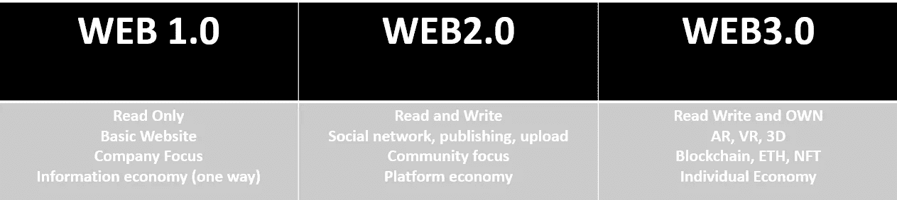
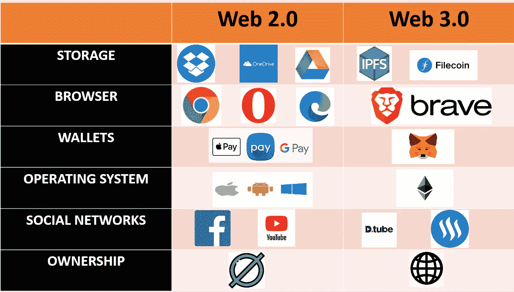

# Web2.0 技术与 Web 3.0 共存

> 原文：<https://medium.com/coinmonks/web2-0-technologies-co-exist-with-web-3-0-9ceb8ba6064e?source=collection_archive---------15----------------------->

Web3.0 是继 web1.0 和 web2.0 之后互联网发展的第三个阶段，它基于支持区块链技术的去中心化生态系统。Web 3.0 利用机器学习、人工智能和区块链来实现真实世界的人类交流。

web 3.0 与 web2.0 和 web1.0 的主要区别在于，人们可以拥有互联网上的数据。那么，让我们来看看不同版本的 Web 和 Web 3.0 革命。

Comparision between web1.0, web2.0 and web3.0

Web 1.0 是互联网的第一个版本。它创建于 90 年代，是一个只读的互联网。你只能去网站和阅读信息。这是一个信息经济的时代，信息在互联网上传播。然而，你不能向互联网发布新信息，这些功能是 Web 2.0 带来的，在 2000 年代，我们可以称之为促进读写互联网的**平台经济**。除了消费信息，我们还可以在社交媒体上创造信息、新闻、博客和反馈。我们可以发布和张贴信息。任何人都可以有博客，都可以和互联网互动，我们不仅仅是消费者，我们也是互联网的创造者。然而，web2.0 有一个限制，即我们不拥有自己创建的数据。比如我们做的推文，上传的视频，都是平台拥有数据，有权利在需要的情况下删除数据。在 Web 3.0 中，你可以阅读、写作和**拥有**互联网。Web 3.0 通过使用 AR/VR 和区块链，使我们能够从静态内容转向虚拟经济。

The technology used in web1.0,web2.0, and web3.0 — **Source convergence catalyst research**

所以问题来了，用户如何拥有 web 3.0 中的东西。在基础设施方面，用户将使用区块链和 IPFS 星际文件系统，而不是本地服务器或云。控制权从集中转移到分散，或者至少比现在分散得多。

如上图所示，比较 Web 2.0 和 Web 3.0 中使用的工具，并不意味着在 Web 3.0 中，我们不使用谷歌浏览器？这意味着其他工具在更分散和 Web 3.0 风格的体验中为您提供了更好的体验。

因此，就 Web 2.0 中的存储而言，我们有 AWS、Google Drive 和 Dropbox 等云提供商，而在 Web 3.0 中，我们有 [IPFS](https://ipfs.io/) 存储，这是一个分散的存储平台，浏览器我们有 Web 2.0，我们有 Internet Explorer、Microsoft Edge 和 Google Chrome。对于 Web 3.0，我们有像 [Brave](https://brave.com/) 这样已经集成了加密货币钱包的浏览器。

> 交易新手？试试[加密交易机器人](/coinmonks/crypto-trading-bot-c2ffce8acb2a)或者[复制交易](/coinmonks/top-10-crypto-copy-trading-platforms-for-beginners-d0c37c7d698c)

目前，我们使用贝宝和银行账户等东西，现在我们有其他钱包，如 [MetaMask](https://metamask.io/) 和许多其他钱包，我们可以拥有和控制我们的资产，而不是像银行这样的第三方。

这同样适用于操作系统。在 web3.0 中，我们将拥有分散的应用程序或 Dapps，它们运行在以太坊上。

社交网络，我们曾经有脸书和 YouTube，我们现在甚至有像 Steem 和 DTube 这样的平台，这是一种去中心化的社交网络，你拥有自己的内容。例如，如果你在 Steem 和 DTube 上发布视频或博客，每当有人喜欢你的内容时，你就可以获得一点加密。

我们举一个去中心化土地的例子——[去中心化土地](https://decentraland.org/)，这个网站大概是托管在云上的。可以是 AWS，也可以是其他任何云服务器。但他们也可以在 IPFS 星际文件系统，这是分散的云存储。我试图解释的是，应用程序的一部分可能仍然在传统的云或本地服务器上。无论你购买虚拟土地的合同有多聪明，它都在区块链。所以，每次你买卖，例如，一个虚拟的土地，这是在区块链上的部分，而不是网站或平台。想象一下，将 5GB 的平台放在区块链上并分布在 10K 节点上，这将使区块链变得非常慢且不可持续。

但逻辑、交易、所有权将是区块链的一部分，平台的其余部分将是服务器、云或 IPFS。

**参考文献**

[https://www . geeks forgeeks . org/we b-1-0-we b-2-0-and-we b-3-0-with-thes-difference/](https://www.geeksforgeeks.org/web-1-0-web-2-0-and-web-3-0-with-their-difference/)

[https://www . martechalliance . com/stories/what-the-difference-we B- 1.0-we b-2.0-和-web-3.0](https://www.martechalliance.com/stories/whats-the-difference-between-web-1.0-web-2.0-and-web-3.0)

 [## Web 1.0、Web 2.0 和 Web 3.0 概述

### 现在你可以在网上找到一切，成为生活的必需品。这种先进的互联网技术…

www.sfexaminer.com](https://www.sfexaminer.com/marketplace/an-overview-of-web-1-0-web-2-0-and-web-3-0/article_c2f320f0-80c0-57d4-b372-99e4a34d78a0.html) 

> 加入 Coinmonks [电报频道](https://t.me/coincodecap)和 [Youtube 频道](https://www.youtube.com/c/coinmonks/videos)了解加密交易和投资

# 另外，阅读

*   [加拿大最佳加密交易机器人](https://coincodecap.com/5-best-crypto-trading-bots-in-canada) | [库币评论](https://coincodecap.com/kucoin-review)
*   [用于 Huobi 的加密交易信号](https://coincodecap.com/huobi-crypto-trading-signals) | [HitBTC 审查](/coinmonks/hitbtc-review-c5143c5d53c2)
*   [TraderWagon 回顾](https://coincodecap.com/traderwagon-review) | [北海巨妖 vs 双子 vs 比特亚德](https://coincodecap.com/kraken-vs-gemini-vs-bityard)
*   [如何在 FTX 交易所交易期货](https://coincodecap.com/ftx-futures-trading)
*   [OKEx vs KuCoin](https://coincodecap.com/okex-kucoin) | [摄氏替代品](https://coincodecap.com/celsius-alternatives) | [如何购买 VeChain](https://coincodecap.com/buy-vechain)