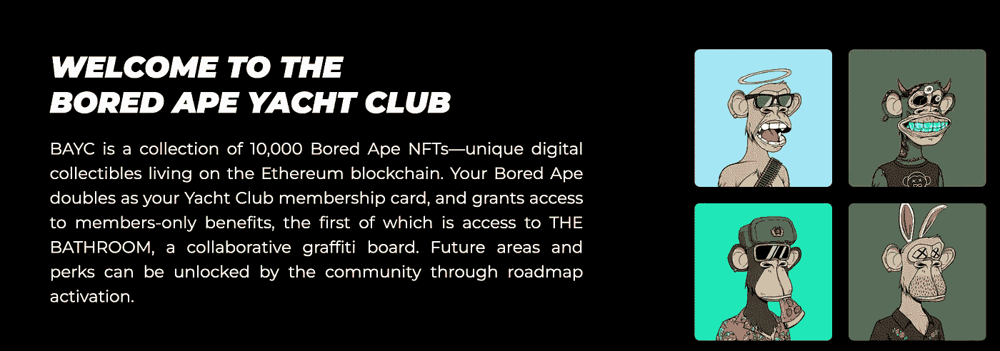

# Web3 项目的 Web2 品牌

> 原文：<https://medium.com/coinmonks/web2-branding-for-web3-projects-3b8026c460d8?source=collection_archive---------16----------------------->

大多数 Web3 项目在品牌方面都很糟糕。

NFT 项目尤其有罪。

元宇宙遍布这样的项目:

1.  没有明确定义的受众
2.  他们没有解决明确定义的问题
3.  没有解决问题的明确计划
4.  没有行动呼吁
5.  没有使命或愿景

没有这五个要素，你就没有品牌。传统企业明白这一点。为什么 Web3 业务没有？

这是因为我们太专注于:

*   给我们的包打气
*   努力让自己听起来聪明
*   通常专注于我们自己

换句话说，我们离自己太远了。

结果，我们因为缺乏清晰度、傲慢和马虎而疏远了我们的潜在用户/客户/拥护者。

> 我们太专注于创造一个新的空间，以至于忽略了过去那些真正有效的商业策略。

**有什么解决办法？**

将 web2 品牌引入 web3 项目。

我们可以通过使用最有效的品牌框架来做到这一点:

它叫做[童话品牌](https://storybrand.com/downloads/private-workshop/digital-workbook/StoryBrand-Participant-Workbook-2020-(SB-Workshop-Facilitator-Digital).pdf)，被全世界的公司所使用。

让我们分解框架，看看大多数项目在哪里犯错误，并举例说明如何澄清你的信息，以获得更多的用户，赚更多的钱。

Note: I have no affiliation with StoryBrand. I just think it’s a useful framework.

# StoryBrand 框架

StoryBrand 框架分为 7 个部分，大致遵循主人公的旅程模板:

1.  一个角色
2.  有问题
3.  然后遇到一个向导
4.  谁给他们一个计划
5.  并号召他们行动起来
6.  这有助于他们避免失败
7.  并帮助他们取得成功

让我们一步一步地分解它，用现实生活中的例子和可行的技巧来阐明你的信息。

# 1.角色

大多数 web3 项目都把自己框定为英雄。那是错误的。你的客户/用户/持有者才是“英雄”，而不是你和你的项目。

如果你不清楚地定义你的用户，你会疏远所有人。

想象一下，一个价值 10，000 英镑的 NFT 项目在他们的主页上说，“这个项目不是为了…”。没人会这么做。为什么？

**因为我们害怕。**

我们认为“更多的买家=更多的包包”。但是我们错了。我们只是认为，我们必须开放网络来吸引每个人，因为我们还没有看到任何项目实际上细分的例子。

第一个具体、明确定义其受众的项目将成为这一领域的赢家。

> 如果你的观众是每个人，你将无法接触到任何人。

让我们用一个假设的项目作为例子。

假设您运行一个 DeFi 项目，作为 Stripe 的销售点替代品。Stripe 和 Square 等服务向商家和小企业主收取 3%的交易费，而您的 DeFi 项目允许商家接受 stablecoins 支付，并且只收取 1%的费用。

*   ***谁是你的客户/用户？具体点。***

小商人和店主。

*   ***他们想要什么？简单点。***

停止支付不必要的交易费用。

*   ***你的客户想成为谁？***

这是一个蓬勃发展的小企业挑战大企业的有力例子。

最后一个问题可以打开你信息传递的大门。即使开发人员定义了他们的用户，也总是不能清楚地表达他们用户的期望身份。

弄清楚你的用户和顾客想成为什么样的人，然后在你的网站和营销材料中反复强调，这就是你提升项目的方法。

> 注意:
> 
> 许多 web3 状态项目都做对了这一部分。例如，无聊猿游艇俱乐部完全是围绕销售一个有抱负的身份。就在名字里！“游艇俱乐部”
> 
> 这意味着，如果你买了这些 NFT，你就会成为一个拥有名人和其他网络时尚人士的专属数字俱乐部的成员。

Fuck a 401k — where does DJ Khaled hold his assets??

## 你的作业

针对您的项目回答以下三个问题:

*   谁是你的客户/用户？具体点。
*   他们想要什么？简单点。
*   *你的客户想成为谁？*

# 2.问题是

您的用户会遇到三个层次的问题:

1.  **外部问题**:在条带替换 DeFi 公司的例子中，客户面临的外部问题是支付过多的交易费用。
2.  **内部问题**:这是客户对外部问题的感受。继续这个例子，客户可能会感到迷惑、紧张和失败。
3.  哲学问题:为什么这个问题在道德上是错误的？Stripe、Square 和其他 PoS 公司从小商户的利润中抽取 3%是不道德的。

大多数 web3 项目出售外部问题的解决方案，但是人们购买内部问题的解决方案。理解这个哲学问题会让一切变得更好。

人们不关心你或你的项目。

他们没有。

他们只关心你，因为你能解决他们的问题，让他们的生活变得更好。

定义他们面临的问题，用比他们自己更好的方式表达出来。然后重复给他们听，一遍又一遍。

## 你的作业

定义客户的外部、内部和哲学问题。

# 3.指南

你的用户需要一个向导来帮助他们，而不是一个引人注目的人。记住:他们是英雄，不是你。

你和你的公司只是向导——你就像甘道夫，或者尤达，或者邓布利多。

This is you n your web3 homies chillin in the cut

你如何定位自己是一个值得信赖的导游？通过表达同情和展示权威。

## 你的作业

*   写一句话，表明你理解顾客的不满。(例如，“我们知道你厌倦了将收入的 3%用于交易费用。”)
*   用一句话展示你的能力和权威。(例如，“我们已经帮助超过 100，000 名企业主将交易费用降低到 1%。”)

# 4.这个计划

客户希望你有一个明确的计划，然后再把他们的血汗钱给你。

如果他们来到你的网站、造币页面或社交媒体，而你没有传达一个清晰的计划，他们会说，“这太令人困惑了，”或“我会等到以后。”

DeFi 协议是最糟糕的。一切都太混乱了。

看看这个来自 DeFi 协议的例子，我不会说出它的名字:

我在这个地方生活和工作，我不知道那有一半是什么意思。这就是我所说的 web3 抑制我们的傲慢和不安全感:

> 我们更关心炫耀我们所知道的，而不是真正清楚地交流。

我曾经有一个导师，他会因为我的写作过于迂腐而找我麻烦。

“这太令人困惑了，”他会说。

“但这是对的，”我会反驳道。

“确实如此。但你可以是正确的，也可以是有效的。”

他的意思是:

**我让技术上正确的需求妨碍了正确观点的表达。**

我毫不怀疑上面截图中的一切在技术上是正确的。但是没有效果。

如果你不能解释得足够清楚，以至于你的祖母能明白，那么你就不明白。

清晰沟通的最佳方式是将你的过程分成三个简单、清晰的步骤。

## 你的作业

*   *创建 3 个步骤，用户可以采取这些步骤开始与您合作。*
*   给这个计划起个名字。

费用减少的 DeFi 协议的一个例子:

**1%计划:**

1.  **预订演示**
2.  **下载 PoS 钱包**
3.  **为你的底线增加资金**

# 5.号召他们行动起来

除非受到挑战，否则人们不会采取行动。让你的行动号召清晰明了，并在你的网站和其他营销材料中重复这些号召。

有两种类型的行动号召:

1.  **直接**
2.  **过渡性**

直接 CTA 是为那些现在就准备购买/创造/与你合作的人准备的。这应该是一个颜色鲜艳的按钮，放在你网站的显著位置。

直接 CTA 的示例:

*   现在薄荷
*   启动应用程序
*   二手购买
*   预订演示
*   安排咨询

**过渡性 CTA**是为有兴趣但还不确定的人准备的。这些人代表了大多数 web3 项目错过的巨大机会。

在这里，你可以提供一个免费的好东西作为奖励，将他们添加到电子邮件列表、不和谐服务器或类似的东西中。

## 反向空投

想象一下，一个成功的 NFT 项目铸造了他们的 10，000 个 NFT。这些非上市公司正在二级市场上积累价值。人们为它们支付数百甚至数千美元。

现在想象他们创造了第二批 10，000 个生成性 NFT。他们一个都不卖。他们免费赠送它们，但是只给那些对他们的项目感兴趣并且还没有他们的主要收藏之一的人。

这就像反向空投:

> 你给了人们一个独特的好东西来表达你的兴趣。

Web2 网络营销商做得很好:如果你订阅他们的时事通讯，他们会免费赠送电子书。你会得到一个免费的网上研讨会，让你在 Twitter 上关注他们。

创建连接免费商品的过渡 CTA。一些例子:

*   下载免费指南
*   铸造你的免费 NFT
*   下载 DeFi 安全清单
*   免费试用该应用程序

## *你的作业*

针对您的项目回答以下问题:

*   *你网站的直接 CTA 是什么？*
*   对于还没有准备好做出承诺的潜在客户，你能创造出什么样的过渡性产品？

# 6.帮助他们避免失败

人们会做任何事情来避免失败。尤其是在 web3 中，这涉及到巨大的风险。当人们投资一个 web3 项目时——无论他们是购买一台 NFT 还是注册您的 DeFi 协议——他们都在冒着风险:

*   社会的
*   金融的
*   和精神健康

你必须清楚地列出如果用户不采取行动，他们将会失去什么，从而克服这些恐惧。

在交易费 DeFi 协议的例子中，潜在客户将失去他们向 Stripe/Square 支付的额外 2%的收入。

因此，他们将无法雇佣扩展和发展业务所需的帮助。

## 你的作业

针对您的项目回答以下问题:

*   如果客户不采取行动，他们会失去什么？
*   那次损失的结果会是什么？

# 7.帮助他们获得成功

人们希望你描绘出一幅特定的图景，如果他们买了你的 NFT 或者和你一起工作，他们的生活会是什么样子。

例如，以下是 Bored Ape 游艇俱乐部为潜在持有人创造的愿景:

所以我买了这个价值 10 万美元的 JPEG 图片，而我得到的唯一回报是可以使用一个数字涂鸦板？

*“社区可以通过路线图激活解锁未来领域和福利。”*

你不可能比这更含糊了。

想象一下，如果他们这样说:

我会使用一些因为我们的项目而创造出来的语言*。我的意思是,“潜入”这个短语是因为无聊的猿类而产生的。但网站上却没有？*

我还想强调一些案例研究，比如贴身男仆詹金斯，一位 NFT 投资者，他买了一只看起来像贴身男仆司机的猿，并以此为基础创造了一整套创造性的特许经营权。

> 为你的用户创造一个天堂的景象，他们会一直跟着你到那里。

## 你的作业

回答这个问题:

*   *如果你的客户使用你的产品和服务，他们会有什么好处？*

# 你所有的家庭作业:

## 1.一个角色

针对您的项目回答以下三个问题:

*   谁是你的客户/用户？具体点。
*   *他们想要什么？简单点。*
*   *你的客户想成为谁？*

## 2.有问题

定义客户的外部、内部和哲学社会问题。

## 3.然后遇到一个向导

*   写一句话，表明你理解顾客的不满。(例如，“我们知道你厌倦了将收入的 3%用于交易费用。”)
*   写一句展示你的能力和权威的话。(例如，“我们已经帮助超过 100，000 名企业主将交易费用降低到 1%。”)

## 4.谁给他们一个计划

*   *创建 3 个行动步骤，用户可以采取这些步骤开始与您合作。*
*   *给计划起个名字。*

## 5.并号召他们行动起来

针对您的项目回答以下问题:

*   *你现在可以通过什么直接 CTA 让你的客户采取行动？*
*   对于那些还没有准备好做出承诺的潜在客户，你能创造出什么样的过渡性产品？

## 6.这有助于他们避免失败

针对您的项目回答以下问题:

*   如果你的客户不采取行动，他们会失去什么？
*   那次损失的结果会是什么？

## 7.并帮助他们取得成功

回答这个问题:

*   如果你的客户使用你的产品和服务，他们会有什么好处？

***

如果你想和我一起工作，我为 Web3 项目写内容、文章、游戏知识等等。给我发电子邮件到 greg@greg-larson.com，在推特上关注我 https://twitter.com/TheGregLarson。

> 交易新手？尝试[加密交易机器人](/coinmonks/crypto-trading-bot-c2ffce8acb2a)或[复制交易](/coinmonks/top-10-crypto-copy-trading-platforms-for-beginners-d0c37c7d698c)