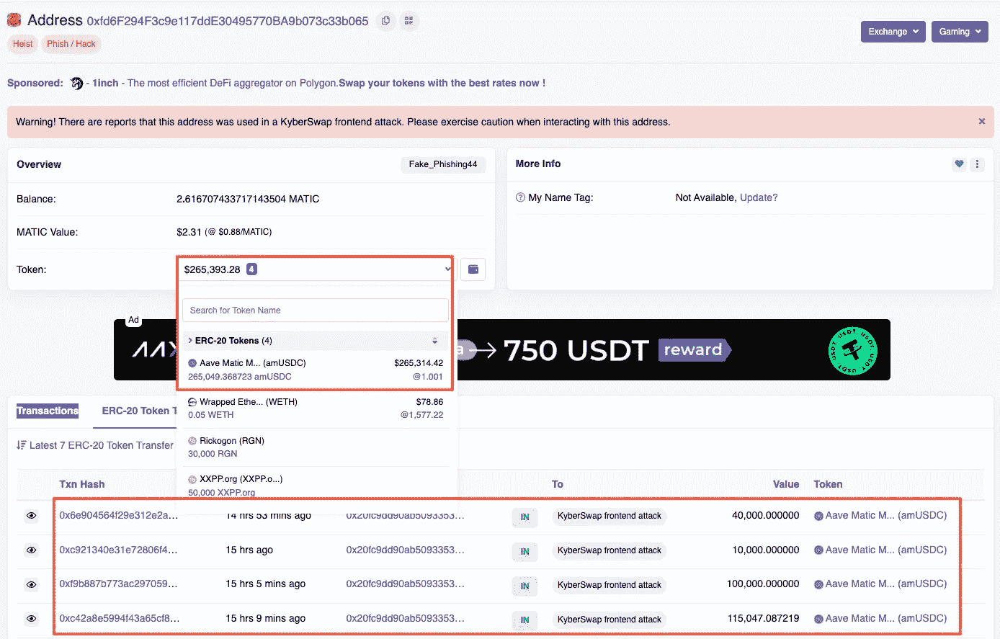

# Web2 继续向 Web3 提供漏洞

> 原文：<https://medium.com/coinmonks/web2-continues-to-feed-web3-with-vulnerabilities-e95e55c6070c?source=collection_archive---------17----------------------->

直接利用智能合约的另一种方法是使用前端代码或系统来获利。

将用户友好的 URL 转换成计算机可以理解的 IP 地址的协议被称为域名系统或 DNS。它本质上是互联网版的电话簿。

DNS 是公司运营的重要组成部分，需要防火墙的批准，防止网络管理员限制 DNS 流量。正因为如此，它已经成为威胁者的主要目标，他们已经成功地对企业网络进行了多次基于 DNS 的攻击。

为了在主要的区块链协议上运行附加功能，许多 Web3 项目继续依赖 Web2 框架和技术。因此，当试图窃取项目和用户资金时，黑客开始利用 Web2 漏洞作为攻击媒介。

从 Curve Finance 和 KyberSwap 的例子中，我们可以推断出对更大的社区的某些安全建议。

去中心化交换 2022 年 9 月 1 日，KyberSwap 经历了一次前端漏洞利用。这是该项目五年来首次遭到攻击。

根据该公司的公告，黑客利用谷歌标签管理器(GTM)脚本渗透到应用程序的前端。这是一个 Web2 漏洞，因为 GTM 与 KyberSwap 的智能合约或区块链协议功能无关。特别是，鲸鱼钱包是剧本的主要目标。

# 曲线融资缺口

2022 年 8 月 9 日，美国东部标准时间下午 4 点 20 分左右，Curve Finance 的 DNS 记录被黑客攻击，并被重定向到一个流氓网站，该网站是真实 URL 的近似复制。但是，攻击者在这个克隆副本中插入了恶意代码，提示用户批准未经验证的合同的令牌。

如果用户授权该交易，攻击者使用该恶意合同将资金从用户转移到黑客的地址。

这种攻击类似于 7 月 17 日发生的 Premint 漏洞，涉及向网站前端注入恶意代码，试图欺骗用户为所有交易设置批准。

在这种情况下，黑客使用了一个恶意的合同，当相互作用时，会将钱导向黑客的钱包。恶意 DNS 会为与欺诈性合同相关的每个交易寻求用户批准。

值得注意的是，这不是一起钱包流失攻击。我们可以看到其中一个受害者钱包里的钱在流动，而这个钱包并没有被行动击中。

这个漏洞是 Web2 漏洞如何对 Web3 用户产生有害影响的另一个例证。Web2 基础设施经常出现单点故障，这可能会导致严重的损失，无论攻击是针对 Discord、Twitter 还是某个网站。

通过破坏 Curve Finance DNS，黑客将用户导向一个包含恶意代码的网站。与 Premint hack 类似，攻击者植入恶意代码，让用户签署 SetApprovalForAll()方法，将用户的 NFT 转移到漏洞的钱包中。

这次袭击总共有 7 名不同的受害者。这些资金被发送到黑客的钱包，换成以太坊(ETH)，然后转到币安的 FixedFloat，另外还有 27 个 ETH 转到 Tornado Cash。

# 结束语

避免 DNS 服务器受损总是比事后修复容易。普通用户可以通过避免点击可疑的链接，经常清理他们的 DNS 缓存，并定期检查他们的设备是否有恶意软件来保护资金。

访问受损 DNS 服务器的用户将经常被重定向到一个几乎不可能与他们想要查看的主页区分开来的主页。项目应该确保他们选择一个安全、可靠的域管理供应商，因为这是为全球数百万用户提供服务的加密公司的责任。

还有一件事，如果 Curve 的漏洞被忽视了，哪怕是多一天，造成的伤害都可能是不可挽回的，可能会让用户损失数百万美元。

> 交易新手？试试[加密交易机器人](/coinmonks/crypto-trading-bot-c2ffce8acb2a)或者[复制交易](/coinmonks/top-10-crypto-copy-trading-platforms-for-beginners-d0c37c7d698c)