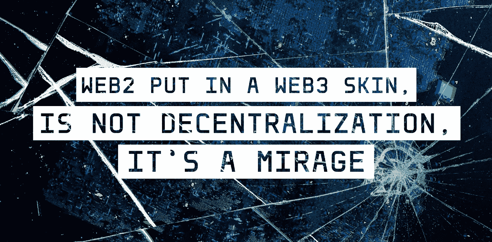
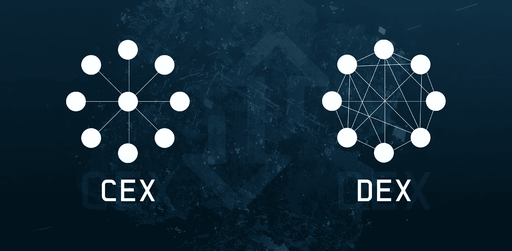
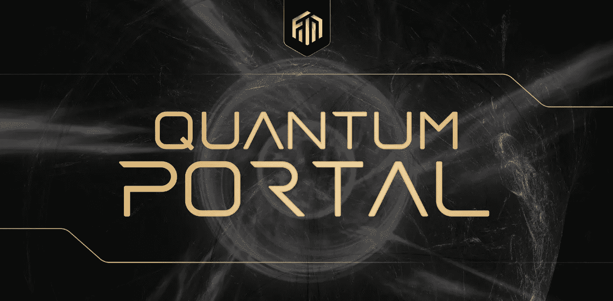

# WEB2 披上了 WEB3 的外衣，这不是去中心化，而是海市蜃楼

> 原文：<https://medium.com/coinmonks/web2-put-in-a-web3-skin-is-not-decentralization-its-a-mirage-d1bbbe1f00ae?source=collection_archive---------30----------------------->

在上周 FTX-加密货币衍生品交易所灾难之后，以及奇怪的推文在 T2 和 SBF 发布之后，很明显我们比以往任何时候都更需要 Web3 的去中心化。在 Web3 中创建集中化并不能解决 Web3 注定要解决的问题。它只是用新的皮肤重新包装它们。

# Web3 仍然是人类前进的最佳途径

关于 [@SBF_FTX](https://twitter.com/SBF_FTX) 和[@ FTX _ 官方](https://twitter.com/FTX_Official)的失败，最不幸的事情是它们对加密应用的影响。然而，即使这种不断演变的崩溃造成了巨大的破坏，web3 仍然是去中心化的公民动力未来的最佳候选。

# 当你并不分散时，停止假装分散

事实上，整个 [SBF](https://twitter.com/SBF_FTX) 的情况证明了这一点。想想吧。

> *什么是*[*@ FTX _ 官方*](https://twitter.com/FTX_Official) *？集中交易。*

本质上，这种实现需要用户、投资者和任何相关人员将他们的信任交给一个集中的实体。

这不是[不可信](https://twitter.com/hashtag/trustless?src=hashtag_click)分散[的](https://twitter.com/hashtag/decentralized?src=hashtag_click)世界网 3 承诺的。正如 [Kyle Chasse](https://twitter.com/kyle_chasse) 昨天在 [Mario Nawfal](https://twitter.com/MarioNawfal) 主持的空间中提到的，这是另一个穿着 web3 服装的 web2 应用程序的例子。

# web2 reliance 对 web3 应用程序有坏处吗？

现在，我并不是说任何利用 web3 某些方面的 web2 应用程序是不好的。事实上，在

[铁网](https://medium.com/u/f0644f6212cb?source=post_page-----96101a324e8--------------------------------)

，我们还推出了一些适用于利益相关方并为其所要求的集中式解决方案。

很明显，CEXs 没有什么不同，他们有自己的使用案例，他们可以提供客户关怀、支持，至少我们认为，保证资金是 [#SAFU](https://twitter.com/hashtag/SAFU?src=hashtag_click) 的，但是还有更好的方法吗？我相信有。✔️

# 文分散订书 ser？

直到今天，我们还没有问自己为什么没有大量采用分散式订单簿。[血清项目](https://medium.com/u/57414c9668e9?source=post_page-----96101a324e8--------------------------------)已经在这一领域取得了一些进展，但这就足够了吗？

# 为什么 CEXs 这么受欢迎？

为了更好地理解为什么 [#CEXs](https://twitter.com/hashtag/CEXs?src=hashtag_click) 存在并在分散解决方案的世界中如此受欢迎，我们需要问为什么选择人们使用 [#CEX](https://twitter.com/hashtag/CEX?src=hashtag_click) 而不是 [#DEXs](https://twitter.com/hashtag/DEXs?src=hashtag_click) 和其他分散解决方案。

有什么猜测吗？

我将此归结为以下原因:

人们使用 [#CEXs](https://twitter.com/hashtag/CEXs?src=hashtag_click)

1.  作为[#菲亚特](https://twitter.com/hashtag/FIAT?src=hashtag_click) < > [#Crypto](https://twitter.com/hashtag/Crypto?src=hashtag_click) 的入口匝道和/或出口匝道。
2.  享受[#无气](https://twitter.com/hashtag/gasless?src=hashtag_click)[#交易](https://twitter.com/hashtag/trades?src=hashtag_click)和/或降低[#费用](https://twitter.com/hashtag/fees?src=hashtag_click)
3.  利用相对更容易预测的机会订购书籍

让我们来定义这三个用例👇

# 菲亚特← →加密入口匝道和/或出口匝道？

像这样的公司

[怀尔](https://medium.com/u/eaf6087c3e95?source=post_page-----96101a324e8--------------------------------)、[月嫂](https://medium.com/u/5521a4ad657f?source=post_page-----96101a324e8--------------------------------)、[比特币基地商业](https://medium.com/u/b81fc8ac124b?source=post_page-----96101a324e8--------------------------------)、[盛世资本](https://uplinkdefi.com/)等已经开始着手解决这个问题。

# 无汽油交易和/或更低的#费用？

[dex](https://twitter.com/hashtag/DEXs?src=hashtag_click)像[Dfyn Network](https://medium.com/u/8fa311d19ab6?source=post_page-----96101a324e8--------------------------------)from[Router Protocol](https://medium.com/u/bcf8c8fe0c69?source=post_page-----96101a324e8--------------------------------)等等，已经试图通过用他们自己的令牌赚取的费用来补贴或奖励用户来解决这个问题。

然而，这不同于 API 调用一个 [#CEX](https://twitter.com/hashtag/CEX?src=hashtag_click) 更新他们数据库中的记录，用于以后提款时的结算。又名不是真正的[#无气](https://twitter.com/hashtag/gasless?src=hashtag_click)。

# 那么，我们如何在 DeFi 中实现无气交易呢？

这是一个十亿美元的问题，可能会改变整个行业的格局，并帮助数十亿人获得分散的金融服务。

这能通过[物质实验室](https://medium.com/u/ce7010e1f5b3?source=post_page-----96101a324e8--------------------------------)的 [zkSync](https://zksync.io/) 解决吗？ [#zkSnarks](https://twitter.com/hashtag/ZKSnarks?src=hashtag_click) 和 off-chain [#zkRollups](https://twitter.com/hashtag/zkRollup?src=hashtag_click) 会在这里发挥重要作用吗？

同样的解决方案也适用于[订单](https://twitter.com/hashtag/order?src=hashtag_click)书。或许利用 IPFS。

# 铁网络对权力下放的贡献

最激动人心的部分是什么？你可以利用[铁网络](https://medium.com/u/f0644f6212cb?source=post_page-----96101a324e8--------------------------------)的[量子门户](https://twitter.com/hashtag/QuantumPortal?src=hashtag_click)在任何链条上构建所有这些，并通过由铁创始人 [Naiem Yeganeh](https://twitter.com/naiemk) 发明的[价值约束 Pos 汇总](https://twitter.com/hashtag/ValueConstrainedPosRollups?src=hashtag_click) (VCPR)等开创性解决方案来保护。

我们在[铁网](https://medium.com/u/f0644f6212cb?source=post_page-----96101a324e8--------------------------------)的团队正在不断建设，让大众更容易接触到 web3。我们监控、评估、从行业发展中学习，然后构建解决这些问题的解决方案。

你对 CeFi 如何更加分散化有什么想法吗？给我们的推特留言。

敬请期待！

非常真诚地属于你，

*铁网团队*

# 关于铁网

铁正在引领区块链互操作性 2.0 时代。由称为量子门户的多链消息引擎提供动力，铁网络的 mainnet 将为行业中的每个链带来价值、数据和功能互操作性。

利用铁网络在一个网络上构建和部署解决方案，并立即启用多链功能，而没有管理多链基础架构带来的负担或技术债务。

# 铁网络重要环节

[网站](https://ferrum.network/) | [电报](http://telegram.ferrum.network/) | [推特](https://twitter.com/FerrumNetwork) | [YouTube](https://www.youtube.com/channel/UCN658dMRTaH4C4dP32VHi6Q) | [不和](https://discord.gg/HEfKq57asd)

> 交易新手？尝试[加密交易机器人](/coinmonks/crypto-trading-bot-c2ffce8acb2a)或[复制交易](/coinmonks/top-10-crypto-copy-trading-platforms-for-beginners-d0c37c7d698c)