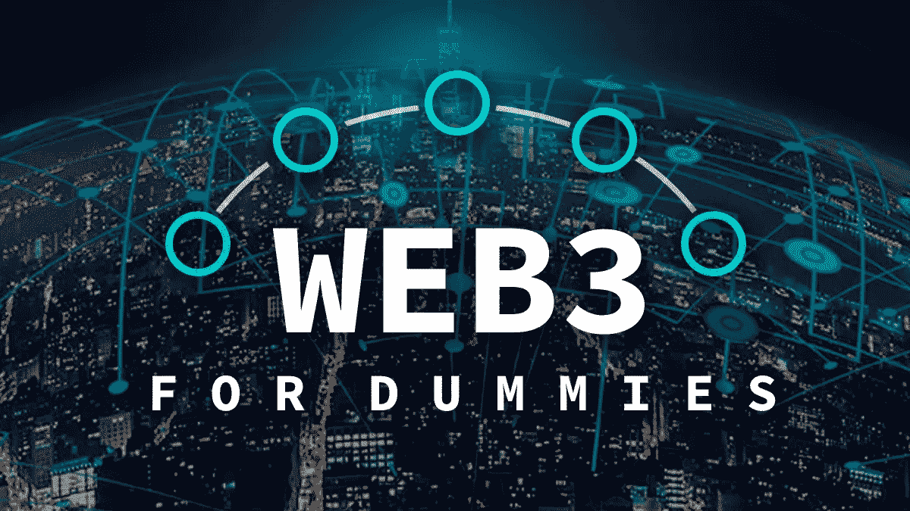
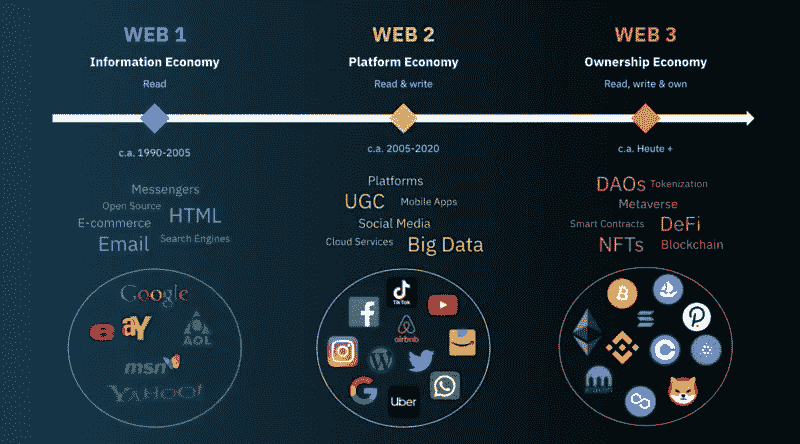

# 面向傻瓜的 Web 3.0:我们(仍然)不知道的未来！

> 原文：<https://medium.com/coinmonks/web3-0-for-dummies-the-future-of-the-internet-that-were-still-unaware-of-b7ffe0c74375?source=collection_archive---------7----------------------->

你听说过 Web 3.0 吗？如果你不知道那是什么，完全没有必要难过！*你并不孤单*。《哈佛商业评论》今年早些时候进行的一项研究表明 [70%的人不知道什么是 web 3.0](https://hbr.org/2022/05/what-is-web3)。

人们仍然在与区块链和加密做斗争——但这里有一些东西:区块链和加密导致了去中心化互联网的基础；因此，他们不再只是为了投机者！最好在别人到达之前上船！

Web3.0: Explained for Dummies!

Web3.0 可能会改写几十年的规则:垄断可能会被打破，财富可能会被创造和失去，新的商品和服务类别可能会出现。Web3.0 是一个值得出售的想法，因为它提供了振兴互联网和使用新视角构建平台的机会。当我们着手创建这个新的互联网和经济体系时，我们必须有一定的指导原则…

….也许普通人会这么想，*但是* …

# 权力的现实存在于何处？

Web3.0 是一个去中心化的、位于区块链的互联网生态系统，由用户拥有和运营，是一场向更好、更公平的互联网发展的运动，这一观点是围绕它的最有说服力的叙事之一。

请记住这一点，因为这是典型的 Web3.0 支持者会一直争论的问题。他设想了一个互联网，在这个互联网中，用户可以从少数提取机构、中央机构和所有平台收回控制权。因此，每个有互联网连接的人都可以在平等的基础上竞争，因为每个人都是用户。

然而，如果我们认为这是一个公平的机会，并遵循[罗尔斯的正义理论](https://corporatefinanceinstitute.com/resources/knowledge/other/a-theory-of-justice/)，我们应该像不知道我们当前的社会地位一样对待这一点，包括我们的出身家庭、财富水平和其他因素。

如果缺乏这方面的知识，建造者更有可能创建基于公平和为所有人考虑的系统。一个分散的系统将不再允许杠杆作用，即使他们有这种知识。

这种破坏 Web2.0 的知识通常被视为“**用户数据**”，Web3.0 将通过围绕完整的用户活动加密建立一个全新的基础设施来丢弃这些数据，该加密由用户匿名支持。

# 什么触发了什么:我们是如何来到这里的？

**简单回答:**web 2.0 的数据隐私问题，我们其实并不太关心这个问题，但后来——它超出了我们的理解范围！Web2.0 无非是用户数据的一个经纪点。

Web2.0 对用户交互和参与的持续关注无意中导致了一个新的用户数据市场的出现。人们还跟踪了互联网最受欢迎网站背后的公司是如何找到出售用户帖子、跟踪用户互动内容、同时控制用户可以互动内容的方法的。

**快速提问:** *由于用户数据的持续泄露，几乎所有用户数据都面临持续的网络安全威胁。而且越大的公司或平台，网络安全的几率越大。像 GDPR 这样的法律是为了满足用户隐私和安全需求而制定的。但说真的，网络罪犯对用户数据的驱动力和胃口停止了吗？*

# …但是 Web3.0 是所有产品的衍生物！

Web3.0 融合了 Web2.0 的发展成果，同时也解决了 Web2.0 前身的缺点。随着区块链技术的出现，Web3.0 似乎正在民主化和开放互联网，同时使用户数据更加隐私和安全。

The Evolutionary Stages of the Internet

潜在的可能性是，区块链将服务于直接的点对点或企业对用户的互动，将用户体验从大型平台转移出去。因此，企业需要为内容消费、数据访问和存储因区块链技术和 Web3.0 而经历的范式转变做好准备，因为…

# Web3.0 可能会变得过于安全！

在加密货币投资者 [Stefan Thomas 损失了 7002 个比特币](https://www.nytimes.com/2021/01/12/technology/bitcoin-passwords-wallets-fortunes.html)(约 2 . 2 亿美元)之后，我们可以有把握地推断，区块链的应用程序使其数据无法被任何不参与虚拟合同“握手”的人访问即使有人像 Stefan 一样忘记了密码，加密软件也会让事情变得更糟，在永久删除数据之前，将猜测次数限制在 10 次。

这给组织的业务连续性带来了问题。如果企业没有保护在区块链环境中访问和存储的数据的程序，那么如果机器丢失、团队成员离开或加密密钥被遗忘，企业将面临永久丢失数据的风险。

虽然区块链上的数据将更加安全，不会被网络犯罪分子窃取，但一个错误就可能导致重要数据 100%被擦除。因此，组织需要加快步伐。当然，这意味着网络安全制度的终结，但这需要正式的、计划周密的管理，因为这不太可能有机地发生。

**所以，是的，Web3.0 实际上可能*太*安全了(对傻瓜来说)，如果它没有被适当的变更管理和连续性计划规范化的话。**

> 交易新手？试试[加密交易机器人](/coinmonks/crypto-trading-bot-c2ffce8acb2a)或者[复制交易](/coinmonks/top-10-crypto-copy-trading-platforms-for-beginners-d0c37c7d698c)