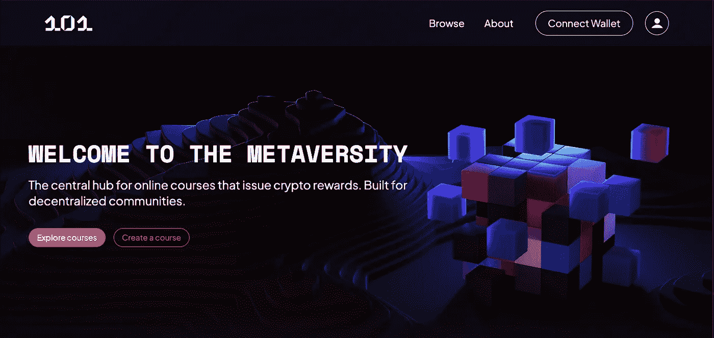
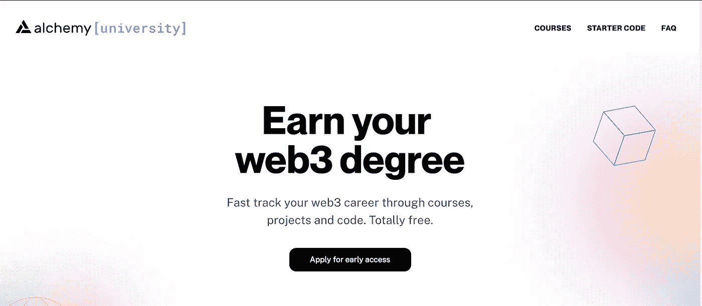

# Web3 101:入职教育

> 原文：<https://medium.com/coinmonks/web3-101-education-to-onboarding-8acd40c4b071?source=collection_archive---------12----------------------->

# 教育作为入职手段的重要性:

Web3 是技术的珠穆朗玛峰，是过去二十年来构建的最美丽但最具挑战性的平台之一。爬到顶端，甚至是大本营，需要全面了解每个独特的区块链，智能合同在幕后如何工作，以及如何管理您在生态系统中的活动和安全。然而，如果一个用户能够准备和学习网上生活是如何运作的，这可能是一个人在网上能够拥有的最有力量和最令人兴奋的经历之一。从构建者到用户，每个接触到 crypto 的人都必须一头扎进这个新的网络，由于一些令人兴奋的社区，这种冒险在去年变得更加容易。为了让下一波用户加入生态系统，教育将通过提供一种简单的方法来缩短非加密原生用户的学习曲线，从而在用户体验中发挥关键作用。在我们探索在哪里以及如何建立你的 web3 知识之前，我们将分解 3 个最重要的课程来让你熟悉它们，以及为什么它们是必不可少的:

**连锁账户**

就像在互联网的上一次迭代中一样，新用户必须创建一个帐户，允许他们存储自己的凭据和支付方式，以便与应用程序进行交互。因为 Web2 有登录或注册按钮，所以 Web3 有“连接钱包”用户的钱包是他们进入区块链的通行证，允许他们验证交易，托管自己的资金，并管理其个人资料的连接位置。不仅仅是重要；新用户必须高度熟练地维护他们的钱包安全，当他们使用钱包连接到应用程序时会发生什么，以及它如何与它所绑定的网络通信。如果不了解这一点，用户可能会购买不正确的代币，在不知道谁控制代币的情况下确认交易，或者将资金发送到错误的网络地址并永远失去资产。不可否认，对你的资产和信息的主权是强大的，但是如果不正确的话，盲目的进入是非常有害的。没有合适的装备或准备，不要去远足。

**智能合约交互**

分散式应用程序由智能合约提供支持，智能合约就像一个协议，交易通过运行在各自区块链上的代码来签署。每个合同都有其独特的参数和功能集，允许应用程序运行，包括但不限于金融应用程序、社交平台和游戏。基于智能合约的应用程序令人兴奋的部分是，“它们的代码是透明的，可以公开验证，这意味着任何有兴趣的人都可以看到智能合约在接收数字资产时遵循的逻辑”([比特币基地学习](https://www.coinbase.com/learn/crypto-basics/what-is-a-smart-contract))。然而，由于代码的不可逆性质，理解驱动这些应用的机制是至关重要的。如果用户要执行交易，无论是与价值相关联还是与访问钱包的许可相关联(如果合同背后有任何恶意意图)，用户的资金和信息都可能处于风险中。

**独特的区块链生态系统**

就像 90 年代的互联网一样，各种各样的区块链已经出现，并且正在争夺 web3 的主导权。对于新用户来说，识别哪个链是最强大的可能没有建立在它们之上的应用程序的好处重要，但仍然有必要知道网络之间的细微差异。有些可能延迟更低，允许更快的交易处理或更低的交易费用，而另一些可能更重视安全性，并在其基础上构建更可靠的应用程序。在 web3 生命周期的这一点上，没有明确的赢家，每个链都有其支持者和信徒社区，所构建的应用程序的价值将被证明在该领域中具有最长的寿命。

# 慷慨

奖金为新用户提供了一种令人兴奋和有利可图的方式，通过教程和指南来学习如何与个人应用程序进行交互，并在完成后给予用户金钱奖励。与 Web2 公司向推荐朋友测试应用的用户发放积分或折扣类似，dapps 提供这些奖励，希望展示有利的利益和用户体验。在过去的几年里，奖金经历了几次演变，最初是作为 ico 的一种营销策略，然后作为新用户的一种参与方式，现在已经成为一种广泛采用的措施，用于奖励项目贡献者和测试新功能的用户。

像 Layer3 这样的平台提供了一个广阔的奖金市场，由 dapp 创建和列出，引导用户了解项目的独特价值主张，然后在用户完成使用该应用程序的步骤后，用加密奖励来激励用户。在 Layer3 中，项目可以联系团队并构建一个特定的 bounty explorer，引导新用户完成入职流程的每个步骤，从获得利基令牌到投入流动性池或在 DEX 上进行首次掉期。

# 盘问

另一个吸引和教育用户的好方法是通过人类可读的测验来解决链上互动的难题。比特币基地在这一战略中采取了积极主动的方法，通过提示所有新用户完成一些探索独特生态系统或加密投资方面的测验，让用户熟悉他们投资的技术。像奖金一样，大多数测验完成后会有一些奖励或成就；在比特币基地的例子中，用户从与测验相关的生态系统中获得少量代币作为奖励。

web3，101 中最著名的教育平台之一，为新用户提供了一种吸引人的方式，通过公司创建的测验与教育内容进行互动。101 的平台使公司能够创建定制的课程，发布唯一绑定的 NFT 或密码以供完成。这些完成证明徽章可在链上验证，并可作为特定内容、功能或平台的访问通行证。独家绑定奖励教育的应用为用户提供了一个令人兴奋的机会，让他们学习特定应用的基础知识，并随着知识的扩展解锁新功能，提高他们的理解并降低他们探索 web3 的风险。

# **课程**

如果一个新用户或开发者想一头扎进 web3，他们可以通过 Alchemy 大学的编码训练营走一条技术性和知识性很强的路线。学习的很大一部分是通过试错，Alchemy 的教育平台为新的和有经验的开发人员提供了一个强大的课程，引导他们从零到一地构建。这个训练营最好的部分是它对开发者来说是绝对零成本的！通过总共 20 周的课程计划和指导，新的构建者可以从对构建 dapp 一无所知到部署他们的第一个区块链应用程序。对建筑商来说，通往 web3 的道路从未像现在这样容易实现。

# 网络之路 3

web3 的开发者为了让新用户群更容易访问他们的应用程序而迈出的每一步，都是向主流采用区块链迈出的一步。有多种机制可以实现这一点，正如我们在本文中所探讨的，教育是实现这些目标的最乐观的工具之一。除了通过基于菲亚特的支付或投资或针对非加密本地市场定制的动态用户流来构建可接近的平台之外，平台可以采取的以下步骤是通过可嵌入内容来教育新用户。一旦生成帐户或连接钱包，或者通过用户自己的时间学习模块的选项，这看起来像是必修测验。测验或奖金的存在允许用户通过吸引人的和潜在金钱回报的内容来探索一种新的技术。通过迎合没有 web3 经验的更重要的细分市场，dapps 向更广泛的用户群开放他们的服务和产品。通往 web3 的道路需要在与罪犯赛跑和杠杆交易之前学会驾驶。

> 交易新手？试试[加密交易机器人](/coinmonks/crypto-trading-bot-c2ffce8acb2a)或者[复制交易](/coinmonks/top-10-crypto-copy-trading-platforms-for-beginners-d0c37c7d698c)