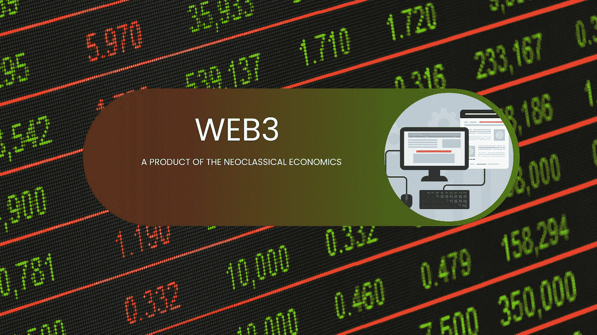

# web 3——新古典经济学的产物

> 原文：<https://medium.com/coinmonks/web3-a-product-of-the-neoclassical-economics-cd00e1425e33?source=collection_archive---------35----------------------->

# **简介**

Web3 已经慢慢成为一种陈词滥调。你到处都能看到它，每次都能听到人们谈论它。

虽然预计 web3 是在当前世界(web2)的基础上改进的新技术，但这项技术将经历自己的发展；失败和成功。为此，需要纠正的一个谬误是认为 web3 将消除 web2 中的一切。事实上，web3 只是在 web2 的基础上有所改进。

正如我们今天所知，web3 中流行的概念在 web2 中也有其基础，这并不奇怪。说到这里，一个可以和 web3 联系起来的经济学概念就是 ***新古典经济学*** 。

# **什么是新古典经济学？**

我明白了，这是关于 web3 的。等等…我们为什么要讨论经济学？

回答这个问题的第一个方法是——如果 web3 的目标是大规模采用，那么 web3 解决 web2 的不同方面是很重要的。

对这个问题更直接的回答是【web3 和新古典经济学的潜在概念的相似性。

新古典经济学是一种经济概念，认为商品价格是需求和供给的函数。

新古典经济学不考虑生产成本，消费者对产品的感知价值最终决定了产品的价格。有了这个概念，产品就有可能定价过高或过低；考虑消费者的感知价值优先于制造商的期望。

自然，不满足消费者价值需求的产品需求会减少，产品价格也会下降。

这一概念于 1900 年引入，是对经典经济学规范的突破。

# **Web3 与新古典经济学**

没错。是时候让我们看看这篇文章是关于什么的了。

尽管 web3 和新古典经济学并不完全解决同样的问题，但这两个概念似乎有一些相似之处。

web3 最大的支持者之一是“这是一个创造者的经济”简单来说，用户优先；从 web3 服务中获益最多。

虽然新古典经济学深入研究价格、供给和需求等概念，但要点是消费者似乎有很大的控制权。为了生存，企业必须愿意为消费者生产被认为是高价值的东西——尽管这并不是什么火箭科学。

我们可以同意，web3 和新古典经济学都旨在创造一个用户友好的环境，可以提高产品的价值感知。在我看来，Web3 可以被视为新古典经济学的产物。

虽然 web3 仍处于起步阶段，但我们已经看到许多公司/想法进进出出，试图了解这种下一级技术，并建立最好的 web3 产品/服务。作为一个消费者主导的经济，它不可能像 web2 一样被公司垄断(理论上)。这意味着只有相关的产品/服务才能最终经受住时间的考验——不完全符合用户目的的产品将被淘汰。

Web3 无疑是一个适者生存的例子，只有最优秀的才能胜出。

说一家 web3 公司知道其消费者的所有需求是不现实的，因此，需要将 web3 项目作为[开源](https://en.wikipedia.org/wiki/Open_source)。这有助于公司接受来自他们的用户/消费者的直接贡献和升级；继续做生意。

看到以 [DAOs](/coinmonks/what-is-a-dao-7d876e802f78) 方式运行的项目成为 web3 中最成功的项目并不令人惊讶——因为它们所做的一切都是倾听消费者的需求。

Web3 可能是现代新古典经济学的产物。

Gif from Giphy

# **结论**

这篇文章反映了 web3 和新古典经济学的相似之处，并不意味着这些概念完全相同。然而，它表明 web3 是一个简单的概念，可以发展成为我们日常生活的一部分。