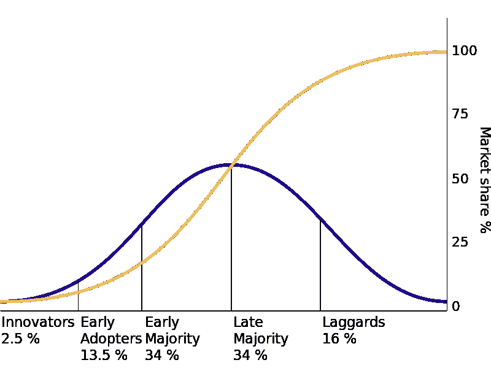

# Web3 采用曲线

> 原文：<https://medium.com/coinmonks/web3-adoption-curve-f4e210e82cf8?source=collection_archive---------3----------------------->

采用新技术有一个可预测的模式。Web3 也不例外。埃弗雷特·罗杰斯于 1962 年在其开创性的著作《创新的扩散》中提出了以下框架。

Diffusion of innovations with successive groups of consumers adopting the new technology (shown in blue), its market share (yellow) will eventually reach the saturation level. From Diffusion of Innovations by Rogers Everett (1962).

这个框架一次又一次地被证明是正确的，并且在过去的几十年里被技术世界所采用。

如图所示，毫无疑问，第一个采用新创新的群体是创新者。

An innovator’s room (MidJourney generated)

# 创新者的特征

创新者是对新事物充满动力和激情的人。他们是修补者，已经花费时间和精力在新的相关技术上。一个人可以在某个特定领域创新，也可以在另一个领域彻底落伍。换句话说，那些在下一个流行趋势出现前几年就预见到它们的人，不太可能对下一个将席卷食品生产领域的农业技术创新有同样的远见。

让我们看看区块链的开始。它始于工程师和技术极客。为开源项目做出贡献并对深入研究密码学感到兴奋的人。这个小组偶然发现了 Sitoshi 关于比特币的原始白皮书，并认为它将改变世界。他们建立了第一个比特币矿，并且不停地谈论它。

当创新者看到新的和新奇的东西时，他们会告诉他们所有的朋友和同行。他们是值得信赖的专家，并揭露其他创新者和采纳者。

创新者看过去粗糙的边缘，对缺点有耐心。他们将通过共同的摩擦点工作。他们看到了潜力。他们看到了更大的视野和影响。最重要的是，他们想成为塑造它的一部分。

Early adopters (MidJourney Generated)

# 早期采用者的特征

早期采用者群体类似于创新者，但他们不一定具有相同的专业知识水平。他们对新的创新充满热情，愿意花时间去尝试。他们也同样愿意越过粗糙的边缘。

当杰夫·贝索斯创办亚马逊时，他的愿景是拥有一个出售所有商品的网上商店。但他并不是一开始就在网站上随机加载一系列商品。他从书开始。

亚马逊学会了如何做好书。他们很快建立了数以百万计的目录，找到了简化运输过程的方法，并且能够储存比当地书店多得多的东西。他们保留了当地零售商不能提供的旧书，他们早期销售的一半是人们在当地书店找不到的书。谁买这些又旧又难找的书？爱好者。早期采用者。

一旦他们主宰了图书市场，他们有两个选择:继续为阅读书籍的客户群服务，或者扩展到其他市场。

易贝也有类似的故事。该拍卖网站最初是一个平台，主要是豆豆娃收藏家，他们会互相买卖。垄断了那个市场后，他们没有直接去卖跑车和工业剩余。他们坚持与爱好者，并继续是一个在线交易收藏品的地方。

Early blockchain adoption (MidJourney generated)

# 早期采用区块链和 web3

回到 web3 和区块链，我们不能忽视金钱这一关键驱动力。区块链简直就是在利用互联网造币！当然，贪婪和投机是驱使人们来到这个世界的巨大力量。

在早期，单个比特币几乎不值几分钱，但随着价值的不断上升，它吸引了新的爱好者。

有技术背景的人继续寻找他们的比特币之路，创新者继续在现有的基础设施上建设，分享他们的知识，并记录他们的工作。通过这样做，他们允许其他没有深入了解的人参与进来。

Vitalik Buterin 为比特币杂志撰写文章，探索自己的想法，最终创造了一种分布式虚拟网络计算机，称为以太网。

其他人正在建立交易所，以简化使用比特币买卖比特币和其他商品的过程。

多年来，这些早期采用者经历了许多繁荣和萧条周期。但是他们坚持下来了，技术继续成熟。

由于比特币是一个开源项目，许多复制品和衍生区块链被创造出来，最终以太坊出现了。这在 2017 年的 ICO 热潮中达到高潮，当时每天都有新的区块链代币推出。ICOs 是初始硬币发行的简称，它让参与者疯狂投机，一枚代币一夜之间产生 10 倍甚至 20 倍的回报并不罕见。看到他们在几个小时内损失那么多也是很平常的事。

到这个时候，区块链空间已经有了大量的基础设施，从分散的交易所到币安和比特币基地等更标准化的交易所，有许多购买、出售和交易加密货币的方式。 [CoinMarketCap](https://coinmarketcap.com/) 汇总了所有交易所的上市信息，使其成为价格投机的来源。

虽然你不能忽视那个时代的贪婪和发财心态，这种心态给我们带来了“文”这样的短语还有‘文月亮’？”意思是，我什么时候能买到兰博基尼，或者价格什么时候会涨到月球上去？成千上万的工程师、企业家和其他专家将他们的时间和精力投入到技术开发和实验中。ICO 热潮实质上资助了一个快速发展的分散创新实验室。

这为下一批采纳者的跟进奠定了基础。2017 年，比特币成为主流，但这是短暂的，因为市场预计会崩溃。

Crossing the threshold (MidJourney generated)

# 跨过门槛

早采用者和晚采用者之间的界限直到 2020 年疫情来袭时才真正跨越。大约在这个时候，比特币的价值从接近 3000 美元的低点开始再次上涨(在 2017 年达到近 2 万美元的峰值后)。在这一点上，早期采用者投资者已经做了很多基础工作，他们试图在公开市场上创造受监管的加密货币产品。像特斯拉这样的公司宣布，他们正在将比特币加入他们的资产负债表。Cash App、Robinhood 和其他主流金融科技服务允许人们在其平台上像购买股票一样轻松地购买加密货币。

当区块链成为主流时，非功能性测试刚刚获得一批新的早期采用者的关注。2018 年推出的 Cryptopunks。一万个独特的像素化头像被免费赠送给任何愿意从他们的网站上铸造它们的人。一小群数字艺术家正在探索将他们的作品放在 NFTs 上，一群早期的收藏家开始购买。

NFT 市场开始出现，2021 年 NFT 热开始。人们探索了 NFTs 的新的可能性和用途，术语 Web3 也开始被使用。到 2021 年底，NFTs 跨过了从早期采用者到主流受众的门槛。

今天，像星巴克这样的品牌宣布了一项基于 NFT 的奖励计划。[蒂芙尼为隐朋克持有者打造独特的珠宝](https://blockworks.co/tiffanys-wants-cryptopunk-holders-to-buy-matching-bling-for-50k-eth/)。丝芙兰和其他 LVMH 品牌也参与进来。Instagram、Twitter、Reddit 和其他社交媒体平台已经集成了 NFT。

Web3 enthusiasts (MidJourney generated)

# 网络 3 今天为爱好者

目前，构建 Web3 产品和社区的机会跨越了采用曲线的整个范围。

在创新者方面，仍然有相当多的基础设施产品需要创造。在区块链之间建立安全有效的桥梁是重中之重。持续的安全挑战可能总是会对上游产生巨大影响。许多这样的机会存在于技术、治理和协议层。这些领域需要高水平的专业知识、智力和技能。

在早期采用者方面，发挥创意。尤其是涉及到 NFTs 的时候。它们很灵活。它们可以是门票、收藏品、财产合同和许多其他东西。

只要把 NFT 和任何小众受众结合起来，你就有了生意。

NFT +体育迷怎么样？

就拿[透风](https://www.draft.ly/)这样的吧。他们允许体育迷购买 NFT 收藏品。这不是一个精通技术的群体，只是购买体育用品的爱好者。现在，他们可以想花多少就花多少，收集他们最喜欢的运动队的 NFT。

还是 NFT +现场活动？

[黄心](https://yh.io/)是一个使用 NFTs 购买活动门票的组织。

还是 NFT +农业？

还是 NFT +玻璃吹制？

或者 NFT + …好吧，你明白了。任何形式的 NFT +爱好者都是一种商业理念。

Mainstream Web3 (MidJourney generated)

# 面向主流的 Web3

在鸿沟的另一边，后采用者和落后者——大品牌现在可以提供简单的入口，就像我们已经看到的前面提到的公司一样。这个群体的产品和服务也需要不同类型的团队。创新者和早期采用者的产品是由制造者和建造者建造的。人们喜欢制造东西的艰苦工作，但不一定喜欢与监管机构、法律程序和谈判伙伴关系的艰苦工作。

这对主流观众来说是至关重要的。这个群体有一天会拥有和使用 NFTs，甚至不知道它。

这就是重点——这项技术应该退居幕后。没人说我是从云托管网站上买的那本书。总有一天他们会停止说看看这个 NFT。

*原载于 2022 年 9 月 26 日***。**

> *交易新手？尝试[加密交易机器人](/coinmonks/crypto-trading-bot-c2ffce8acb2a)或[复制交易](/coinmonks/top-10-crypto-copy-trading-platforms-for-beginners-d0c37c7d698c)*