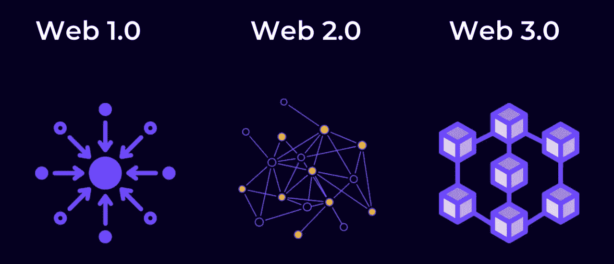

# Web3 以及它将如何改变互联网

> 原文：<https://medium.com/coinmonks/web3-and-how-it-will-change-the-internet-ce0bca7862c5?source=collection_archive---------12----------------------->

由于 NFTs 和元宇宙的引入，Web 3.0 越来越受欢迎，但它并不是一个全新的现象。

以太坊的联合创始人加文·伍德在 2014 年创建了它。蒂姆·伯纳斯·李(Tim Berners Lee)创造了“语义网”一词，用来描述 Web 3.0 通过在智能家居、交通和工作场所直接吸引用户、设备和系统来改变互联网体验的能力。

在日益增长的数字时代，Web 3.0 还有很多值得了解的东西。因此，让我们分解并解释所有关于 Web 3.0 的特性和工作方式的基本事实。

但在我们理解 Web 3.0 之前，有必要了解一下它的前辈:分别创建于 2005 年和 1989 年的 Web 2.0 和 Web 1.0。

第一个网络就是万维网，由蒂姆·伯纳斯·李于 1989 年创建，它允许任何拥有技术知识的人以分散的方式在网上发布信息。Web 2.0 于 1999 年在一篇杂志文章中出现，它创造了简单的工具，让每个人，而不仅仅是专家，都能在网上创建内容。

Web 2.0 是 Web 1.0 的发展。从静态到用户生成内容的转变以及允许用户互动的社交媒体平台的增长被称为 Web 2.0。例子包括谷歌地图、谷歌文档、YouTube、WordPress、脸书和 Twitter。

Web3 通过省略“. 0”和一个空格引入了一种印刷趋势，允许支持者拥有两个世界的最好的东西:易于使用的、分散的技术。

Web3 的核心概念是利用我们所知的互联网，将区块链——支撑比特币等加密货币的技术——添加到一切事物中。

**什么是 Web 3.0？**

人工智能(AI)、物联网(IoT)、区块链技术是 Web 3.0 的三大支柱。

区块链将有助于实现去中心化的数据存储，并培养对虚拟世界的信心。人工智能将帮助解码和过滤在线数据，并为用户提供最合适的选择。物联网将帮助 Web 3.0 的互操作层连接互联网和智能设备。

Web 3.0 的创建是为了通过不断解释用户的数字足迹来提供更好、更相关的互联网体验。这种体验的一个例子是，当用户在电子商务平台(如 Flipkart)上看到具有相似购买特征的购物者购买的相关商品时。

> 交易新手？试试[密码交易机器人](/coinmonks/crypto-trading-bot-c2ffce8acb2a)或者[复制交易](/coinmonks/top-10-crypto-copy-trading-platforms-for-beginners-d0c37c7d698c)

另一方面，它通过使上述互联网控制机构成为用户数据的所有者而偏袒这些机构，这些数据随后被出售给第三方广告。用户的个人信息正在被滥用。

Web3 的支持者认为，在线活动应该由大众来引导，而不是由少数人的动机和偏见来引导。毕竟，为什么大公司有权控制我们的个人信息？

Web 3.0 将颠覆现有系统，让消费者成为其数据的唯一所有者，并对他们的在线数据进行补偿。它可以与 NFT 相媲美，NFT 让人们拥有他们购买的独一无二的数字艺术。

每个用户都可以选择是否在语义网上分享个人信息。Web 3.0 的用户也将摆脱恼人的和不可避免的广告和弹出窗口。Web 3.0 用户将被允许选择他们想看的广告数量，如果他们不想看，将会得到奖励。

在一个 Web3 世界中，活动和数据将被托管在一个使用区块链的计算机网络上，而不是企业服务器上。最初，互联网肯定会有相同的外观和感觉。你的加密钱包和通过分散应用程序(dApps)托管的网站，在区块链网络上运行的数字应用程序，将仍然代表你的互联网活动。

尽管每个来源对 Web3 的描述可能不同，但该系统几乎肯定会包括以下功能:

*   匿名单点登录
*   个人所有权和令牌化
*   自治的

# Web 3.0 将如何改变数字时代？

Web 3.0 有潜力引领一个开源的、以消费者为中心的、私有的、安全的未来网络。

它将允许机器和用户通过对等网络交换数据和价值。语义网将为一系列新的可能性打开大门，包括去中心化自治组织(Dao)、全球规模去中心化自治公司(DAC)、自我主权身份和去中心化数据市场。

允许不可信的数据传输、基于加密货币的自动化支付和简单的所有权转移将从根本上改变人类和机器的交互方式。

以太坊目前是许多新的 Web 3.0 应用程序的基础，通常被称为去中心化应用程序(dApps)。DApps 由用户操作的节点托管在以太坊区块链上，允许任何人使用它们，而不用将用户的数据货币化。此外，没有中央权力机构可以限制 DApps 或控制其访问。

虽然有一些 Web3 DApps，但没有 Web3 基础设施可以与现有的互联网相比。因此，如果要实现 Web3 的愿景，将需要大量的总体开发、整合和可访问性计划。

就全球人类联系而言，Web3 可以通过提供比喜欢或分享更有吸引力的东西来吸引更广泛的人群:进入全球经济。

“随着世界向流动、无国界的互联网和经济发展，它鼓励以前被排除在全球商业之外的个人更多地参与进来，”MetaMap、数字信托和身份识别初创公司的首席执行官兼创始人菲利普·维克托(Filip Victor)说。“然而，10 亿人缺乏数字身份，如 FICO 信用评分或社会安全号码，另外 34 亿人有一些身份，但很难在网上交流。这意味着世界上一半的人口被排除在数字经济之外。”

Victor 进一步补充道，“由于这些公司无法验证个人身份，数十亿人被众多应用和服务拒之门外——想想零工、短期和长期租赁以及密码交换。参与加密货币等高信任度服务可以推动地区经济增长数十亿美元，让我们更接近 Web 3.0 的真正潜力。"

当涉及到主流采用时，有很多因素需要考虑，所以 Web3 可能不会达到预期。仍有一些问题将在很长一段时间内得不到解答。Web3 会迎来互联网统治的新时代吗？有可能教育和改变公众对 Web3 的看法吗？

> 加入 Coinmonks [电报频道](https://t.me/coincodecap)和 [Youtube 频道](https://www.youtube.com/c/coinmonks/videos)了解加密交易和投资

# 另外，阅读

*   [Botsfolio vs nap bots vs Mudrex](/coinmonks/botsfolio-vs-napbots-vs-mudrex-c81344970c02)|[gate . io 交流回顾](/coinmonks/gate-io-exchange-review-61bf87b7078f)
*   [CoinFLEX 评论](https://coincodecap.com/coinflex-review) | [AEX 交易所评论](https://coincodecap.com/aex-exchange-review) | [UPbit 评论](https://coincodecap.com/upbit-review)
*   [AscendEx 保证金交易](https://coincodecap.com/ascendex-margin-trading) | [Bitfinex 赌注](https://coincodecap.com/bitfinex-staking) | [bitFlyer 审核](https://coincodecap.com/bitflyer-review)
*   [Bitget 回顾](https://coincodecap.com/bitget-review) | [双子座 vs BlockFi](https://coincodecap.com/gemini-vs-blockfi) cmd| [OKEx 期货交易](https://coincodecap.com/okex-futures-trading)
*   [AscendEx Staking](https://coincodecap.com/ascendex-staking)|[Bot Ocean Review](https://coincodecap.com/bot-ocean-review)|[最佳比特币钱包](https://coincodecap.com/bitcoin-wallets-india)
*   [霍比审核](https://coincodecap.com/huobi-review) | [OKEx 保证金交易](https://coincodecap.com/okex-margin-trading) | [期货交易](https://coincodecap.com/futures-trading)