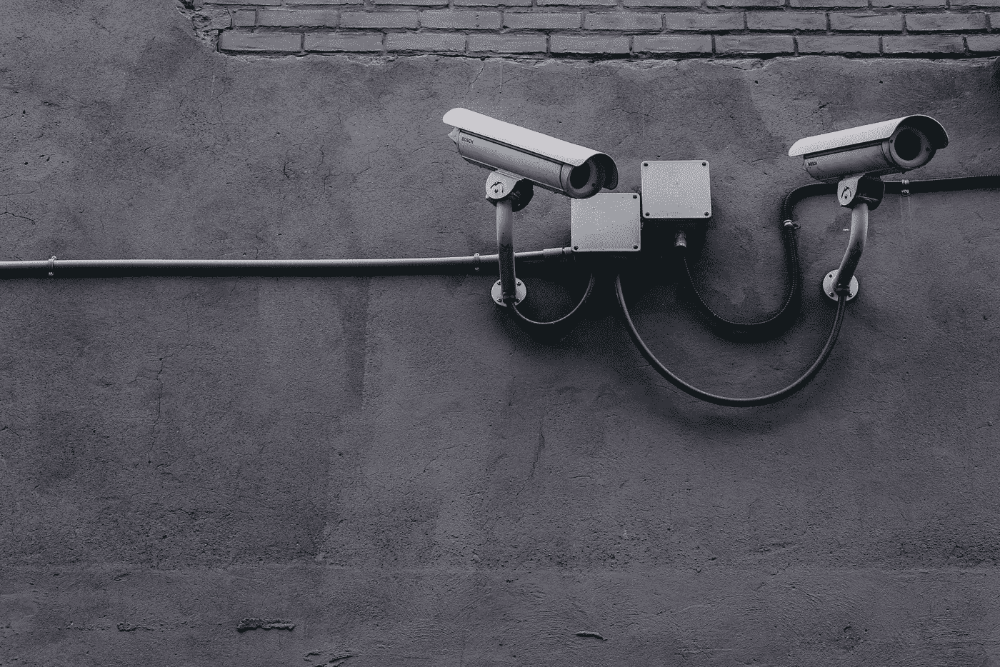

# Web3 充斥着“安全”这个词

> 原文：<https://medium.com/coinmonks/web3-buzzing-with-the-word-security-8cfd9ed7a6fd?source=collection_archive---------18----------------------->

## 随着 Web3 在未来几年面临诸多挑战，创新者只有克服这些挑战，才能释放其全部潜力

Web3 空间已经成为高调黑客攻击的温床。大多数星期至少有一次重大黑客攻击，从一个加密项目中窃取了数百万美元。此外，这些位于区块链的项目容易受到某些安全问题的攻击，这助长了昂贵的 Web3 攻击。

在本帖中，我们将讨论一些与 Web3 项目相关的最重要的安全挑战。

## Web2 和 Web3 上的代码场景不同

虽然应用程序的安全性不应该仅仅依赖于其源代码的保密性，但是许多开发人员采取措施使他们的代码难以被逆向工程。

Web3 的一个缺点是智能合约大多是开源的，并且都部署在区块链上，这为攻击者提供了更多的机会来逆向工程代码和利用漏洞。

区块链的不变性也使修补合同代码中已识别的漏洞变得复杂，因为区块链的账本不能被修改。

编写防黑客代码是不可能的，这也适用于智能合约，因为这正是它们的本质。例如，它们可能包含错误或漏洞。

有几个因素会导致智能合约中的漏洞。

我们已经在之前的文章中讨论过了。事实上，智能合约有一个陡峭的学习曲线，通常在该领域没有先例。

## 区块链交易的价值令人难以置信，而且是最终的

Web2 中的网络安全事件往往影响有限，事件响应通常侧重于恢复正常运营和系统。

尽管存在勒索病毒感染和数据泄露，但公司可以从备份中恢复数据，为客户部署身份监控以保护他们的身份，并继续前进。如果钱被盗，金融机构可以撤销欺诈交易。

耗资百万美元的 Web3 黑客攻击并不罕见，而区块链的不变性使得非法交易无法取消。

对于 Web3 组织来说，更重要的是专注于损害控制，以便受影响的用户可以获得损失补偿。

## 遗产

不管是好是坏，过去总有一个方面会保留下来。Web3 继承了 Web2 的一些流程、框架和功能，这带来了流行的攻击媒介。

例如，使用 Web2 的人经常收到可疑的短信和电子邮件，试图让他们泄露密码或财务信息等个人信息。

同样，最近针对 OpenSea 和 BadgerDAO 等知名平台的网络钓鱼活动表明，Web3 协议及其用户容易受到传统和新型网络钓鱼攻击。

由于攻击者可以直接访问金融资产，因此 Web3 比 Web2 构成了更严重的威胁。

此外，恶意行为者利用暴露的 DNS 基础设施和 API 以及网络钓鱼等社会工程攻击策略。通常，Web3 API 请求没有加密签名或加密，这使得它们容易受到数据拦截和路径攻击。

## 看着一棵树，如何判断水果的质量

创业公司经常在他们有一个成熟的产品之前被投资，给他们资金来达到生产，开始赚取收入，并在他们的产品准备好之前还清这些投资。风险资本家和其他熟知项目潜在风险的个人通常执行这些初始投资。Web3 的一个主要问题是，高价值项目在其初期的创建为欺诈打开了大门，如地毯拉，这似乎是在实施的过程中。

## 幕后的行动

产品背后的团队缺乏可见性也使区块链欺诈变得更加严重。大多数 Web2 公司都有一个非常显眼的高管团队。如果出了问题，谁该负责是显而易见的。另一方面，Web3 项目通常有匿名参与者。这使得欺诈者更容易实施诈骗或其他欺诈行为。

## 漏洞是控制不足的结果

Web2 受到大量新发现的软件漏洞的困扰，导致越来越多的高调黑客攻击。然而，Web3 已经看到了由于智能合同缺乏适当的安全测试而导致的数十亿美元损失。

*到目前为止，未经审计的 DeFi 项目被黑的最多。*

## 跟上 Web3 的发展

在 Web3 中，用户和开发者带来的安全风险最大。在投资一个 Web3 项目之前，用户应该进行自己的研究，以确保该项目是合法的。Web3 项目的安全审计对减少潜在的风险有很大帮助。我们可以通过 **kunal@goharbor.xyz** 联系我们的区块链安全专家来帮助您保护您的 Web3 项目

为了战胜当前的安全挑战，Web3 必须从清楚地了解风险开始。说起来容易做起来难，但并非不可能。

> *交易新手？试试* [*密码交易机器人*](/coinmonks/crypto-trading-bot-c2ffce8acb2a) *或* [*复制交易*](/coinmonks/top-10-crypto-copy-trading-platforms-for-beginners-d0c37c7d698c)
> 
> *分散加密持股，了解* [*币安的替代方案*](https://coincodecap.com/binance-alternatives)
> 
> *加入 Coinmonks* [*电报频道*](https://t.me/coincodecap) *和* [*Youtube 频道*](https://www.youtube.com/c/coinmonks/videos) *获取每日* [*加密新闻*](http://coincodecap.com/)

# 另外，阅读

*   [复制交易](/coinmonks/top-10-crypto-copy-trading-platforms-for-beginners-d0c37c7d698c) | [加密税务软件](/coinmonks/crypto-tax-software-ed4b4810e338)
*   [网格交易](https://coincodecap.com/grid-trading) | [加密硬件钱包](/coinmonks/the-best-cryptocurrency-hardware-wallets-of-2020-e28b1c124069)
*   [密码电报信号](/coinmonks/top-3-telegram-channels-for-crypto-traders-in-2021-8385f4411ff4) | [密码交易机器人](/coinmonks/crypto-trading-bot-c2ffce8acb2a)
*   [最佳加密交易所](/coinmonks/crypto-exchange-dd2f9d6f3769) | [印度最佳加密交易所](/coinmonks/bitcoin-exchange-in-india-7f1fe79715c9)
*   [面向开发人员的最佳加密 API](/coinmonks/best-crypto-apis-for-developers-5efe3a597a9f)
*   最佳[密码借贷平台](/coinmonks/top-5-crypto-lending-platforms-in-2020-that-you-need-to-know-a1b675cec3fa)
*   [免费加密信号](/coinmonks/free-crypto-signals-48b25e61a8da) | [加密交易机器人](/coinmonks/crypto-trading-bot-c2ffce8acb2a)
*   [杠杆代币终极指南](/coinmonks/leveraged-token-3f5257808b22)