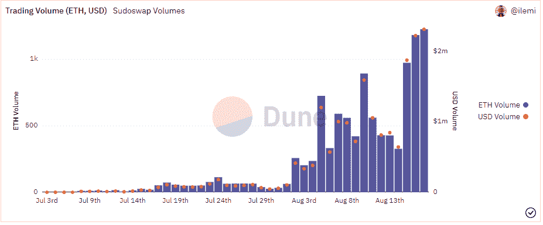

# Web3 数据指南:Sudoswap

> 原文：<https://medium.com/coinmonks/web3-data-guide-sudoswap-aaeca8974dbf?source=collection_archive---------5----------------------->

Image by Author

*以上是我的镜像账号* *上首次发布的* [*，一定要在那里订阅哦！*](https://ath.mirror.xyz/K-S_Mwhj7osTBqN-AOWbCmfNn9TZViEkzICCmK-oObM)

*这是我计划做的许多 Web3 数据指南中的第一个。这里的目标是从数据分析师/工程师的角度解释该协议。这些指南旨在为您在仪表盘上看到的数据带来透明度，以及了解为数据分析构建的协议有多好(或不好)。*