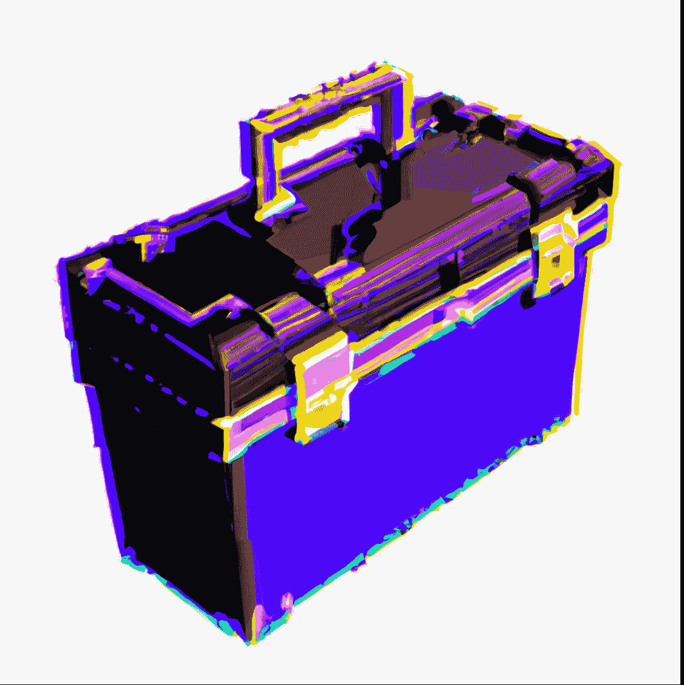

# Web3 开发者工具箱

> 原文：<https://medium.com/coinmonks/web3-developer-toolbox-15c0d9d5cc4f?source=collection_archive---------43----------------------->

作为一名 web3 开发人员，拥有一个工具和资源工具箱是很重要的，它可以帮助你构建分散式应用程序(DApps)并与以太坊区块链进行交互。在本文中，我们将探索一些对 web3 开发者最有用的工具和资源。从开发框架和 JavaScript 库到浏览器扩展和编程语言，这些工具可以帮助您构建高质量的 DApps 并优化您的工作流程。无论您是经验丰富的专家还是 web3 开发领域的新手，这些工具都可以帮助您将技能提升到一个新的水平，并构建下一代的分散式应用程序。

> 交易新手？在[最佳密码交易所](/coinmonks/crypto-exchange-dd2f9d6f3769)上尝试[密码交易机器人](/coinmonks/crypto-trading-bot-c2ffce8acb2a)或[复制交易](/coinmonks/top-10-crypto-copy-trading-platforms-for-beginners-d0c37c7d698c)

**IDE(集成开发环境)**

集成开发环境(IDE)是一种软件应用程序，它为软件开发提供了一整套工具。ide 通常包括代码编辑器、调试器、编译器或解释器，以及其他工具，如版本控制、代码重构和代码分析。ide 旨在使开发人员更容易编写、测试和调试代码，它们通常是为特定的编程语言或平台量身定制的。

一些流行的 ide 示例包括:

*   **Remix** : Remix 是 Solidity 编程语言的开源集成开发环境(IDE)，用于在以太坊平台上编写智能合约。Remix 提供了一系列用于开发、测试和调试智能合约的工具，包括代码编辑器、调试器和编译器。Remix 的一个关键特性是它的测试环境，允许开发者在一个模拟的以太坊区块链上测试他们的智能合约。这使得在将合同部署到实时以太网之前很容易发现错误和缺陷。Remix 还包括一系列有用的资源，如文档和教程，以帮助开发人员开始智能合约开发。
*   **Visual Studio(Windows 版)** : Visual Studio Code (VS Code)是微软开发的免费开源代码编辑器。它适用于 Windows、macOS 和 Linux，并且支持广泛的编程语言和平台。VS Code 旨在成为一个轻量级的、快速的、高效的代码编辑器，重点是提供开发人员高效工作所需的工具和特性。它包括代码完成、调试和重构等特性，以及与 Git 等版本控制系统的集成。它还拥有丰富的扩展生态系统，允许开发人员通过插件和扩展来自定义和扩展编辑器的功能。

**区块链工具**

区块链工具是用于构建、管理和与区块链网络交互的软件应用或平台。开发人员、企业和个人可以使用这些工具来执行与区块链技术相关的广泛任务，包括构建分散式应用(DApps)、创建和管理智能合同以及与区块链网络进行交互。

区块链工具的一些例子包括:

*   **Ganache** : Ganache 是一个本地以太坊区块链，设计用于测试和开发目的。它允许开发人员测试他们的分散式应用程序(DApps ),而不需要实时以太网。Ganache 的一个关键特性是它提供了一个完全由开发者控制的模拟以太坊区块链。这允许开发人员设置特定的条件，例如他们的帐户余额或智能合约变量的值，以便测试他们的 DApps 的行为。Ganache 还包括一系列用于调试和测试 DApps 的工具，例如暂停和恢复区块链的能力，以及在任何时间点查看智能合约的状态。
*   **Truffle** : Truffle 是一个在以太坊平台上构建去中心化应用(DApps)的开发框架。它提供了一组工具和库，使得开发人员在以太坊区块链上构建、测试和部署 DApps 变得更加容易。块菌的一些主要特征包括:
*   代码编译器:Truffle 包括一个 Solidity 编译器，允许开发者将他们的智能合约编译成字节码，可以部署到以太坊区块链。
*   测试框架:Truffle 包括一个测试框架，允许开发者为他们的 DApps 编写和运行自动化测试。
*   **开发控制台** : Truffle 包括一个控制台，允许开发人员以用户友好的方式与他们的 DApps 和以太坊区块链进行交互。
*   **一个部署工具** : Truffle 包括一个将 DApps 部署到以太坊区块链的工具，包括管理多个网络和环境的能力。

**套餐**

在 web3 开发的上下文中，包是捆绑在一起的代码和资源的集合，可以很容易地在不同的项目中共享和重用。包可以包含很多东西，比如库、框架、实用程序和其他代码模块。

Web3 包通常使用包管理系统来分发，比如 npm(对于 JavaScript)或 pip(对于 Python)。这些系统允许开发人员轻松地搜索和安装软件包，以及管理它们的依赖关系和更新。

Web3 包是 web3 生态系统的重要组成部分，因为它们允许开发人员轻松地重用代码和资源，避免重新发明轮子。有许多流行的 web3 包可用，包括用于与以太坊和其他区块链网络交互的库，用于构建分散应用程序(DApps)的开发框架，以及用于智能合约和其他基于区块链的技术的实用程序。受欢迎的软件包包括 **Ethers.is、Web3.is 和 Openzeppelin。**

**前端**

# 反应

React 是一个用于构建用户界面的流行 JavaScript 库，它可以与 web3 结合使用来构建分散式应用程序(DApps)。React 允许开发人员创建可重用的组件，这些组件可以很容易地组合起来构建复杂的用户界面，并且它被设计为快速高效。

将 React 与 web3 结合使用可能是一个强大的组合，因为它允许开发人员创建交互式的、用户友好的 DApps，可以与以太坊和其他区块链网络进行交互。借助 React，开发人员可以构建能够读写区块链数据、显示区块链实时数据以及执行 dapp 中常见的其他任务的 dapp。

要在 web3 中使用 react，开发人员通常会使用 npm 之类的包管理器来安装 React 和 react-dom 包。然后，他们将创建 React 组件，这些组件可用于构建他们的 DApp 的用户界面，他们将使用 web3 库与区块链进行交互并执行其他任务。

# Next.js

Next.js 是一个 JavaScript 框架，旨在简化构建服务器渲染和静态生成的 web 应用程序。它可以与 web3 结合使用，构建可以与以太坊和其他区块链网络交互的分散式应用程序(DApps)。

Next.js 的关键特性之一是其处理服务器端渲染和代码分割的能力，这有助于提高 web3 DApps 的性能和 SEO。Next.js 还包括一系列工具和功能，使开发人员更容易构建和部署 web 应用程序，包括自动代码分割、热模块替换和对无服务器功能的内置支持。

要在 web3 中使用 Next.js，开发人员通常会使用 npm 之类的包管理器安装 Next 和 react 包。然后，他们将创建可用于构建 DApp 用户界面的 Next.js 页面和组件，并使用 web3 库与区块链进行交互并执行其他任务。

**API**

API 或应用程序编程接口是一组用于构建软件和应用程序的协议、例程和工具。在 web3 的上下文中，可以使用 API 与以太坊和其他区块链网络进行交互，并执行诸如向区块链读写数据、执行智能合约以及与分散式应用程序(DApps)进行交互等任务。

Web3 APIs 通常由以太坊等区块链平台提供，它们允许开发人员通过一组标准化的方法来访问区块链平台的功能。可以使用各种编程语言访问 Web3 APIs，如 JavaScript、Python 和 Java，它们可以用于构建各种应用程序和服务，包括 DApps、wallets 和其他工具。

有许多可用的 web3 APIs，可以根据它们提供的功能类型将它们分成不同的类别。web3 APIs 的一些示例包括:

*   **区块链 API**:这些 API 允许开发者与底层区块链交互，比如读写数据到区块链，执行智能合约。
*   **DApp API**:这些 API 允许开发者与 DApp 交互并执行任务，比如调用函数和从 DApp 访问数据。
*   **钱包 API**:这些 API 允许开发者与钱包软件进行交互，并执行诸如发送和接收加密货币和其他数字资产的任务。

总的来说，web3 APIs 是 web3 生态系统的重要组成部分，因为它们提供了构建以太坊和其他区块链网络并与之交互所需的工具和资源。

**一些经常访问的网站**

**以太扫描:**以太扫描是区块链以太坊的区块链浏览器和分析平台。它允许用户在以太网上搜索、验证和跟踪交易和智能合同。

使用 Etherscan，用户可以查看单个交易的详细信息，如发送方和接收方地址、传输的以太网(ETH)数量以及与交易相关的数据。Etherscan 还为开发人员提供了与以太坊网络进行交互和分析的工具，包括合同验证器和合同调试器。

除了浏览器和分析功能，以太扫描还为以太坊用户提供一系列服务，如以太坊钱包、测试以太网的水龙头和开发人员的 API。对于任何使用以太坊区块链或者在其上构建应用程序的人来说，以太扫描都是一个重要的资源。

**十六进制到十进制:**“十六进制到十进制”网站是提供将十六进制数字转换为十进制表示的工具或实用程序的网站。十六进制(也称为“hex”)是一种使用 16 为基数的数字系统，而不是十进制中使用的 10 为基数的系统。它使用 16 个唯一的数字，由数字 0-9 和字母 A-F 表示。

要使用十六进制到十进制的网站，通常需要在网站的表单或文本字段中输入十六进制数字，然后网站会将该数字转换为十进制并显示结果。一些十六进制到十进制的网站可能还允许你输入一个十进制数来转换成十六进制。

网上有许多十六进制到十进制的网站，对于任何使用十六进制数字或需要在不同数字系统之间转换的人来说，它们都是有用的资源。十六进制到十进制网站的一些示例包括:

*   HexToDecimal.com**:这个网站允许你输入一个十六进制数，并显示十进制等效值。**
*   RapidTables.com**:这个网站提供了一个十六进制到十进制的转换器，以及其他各种处理数字和数据的在线工具。**
*   ConvertBinary.com:这个网站提供了一个十六进制到十进制的转换器，以及在其他数字系统之间进行转换的工具，比如二进制和八进制。

**关于作者**

嗨，我是 Innocent，一个 Web3 内容作者，有计算机工程和分布式系统的背景。在过去的几年里，我一直在写关于区块链技术和去中心化应用的文章，我热衷于帮助人们理解 Web3 的潜力以及它如何塑造互联网的未来。

我拥有 Olabisi Onabanjo 大学的计算机工程学位，并参与了许多 Web3 项目。作为一名作家，我的重点是帮助人们了解 Web3 的技术和哲学基础，以及探索这一新兴技术的实际应用和意义。

你可以在我的网站 [**中页**](/@eluferedonatus) 上找到更多我写的东西，或者在 [**LinkedIn**](https://www.linkedin.com/in/innocent-elufere-935117221?lipi=urn%3Ali%3Apage%3Ad_flagship3_profile_view_base_contact_details%3BABgffhr7RxeFVORha6YBgA%3D%3D) 上与我联系。如有任何问题，请随时联系。