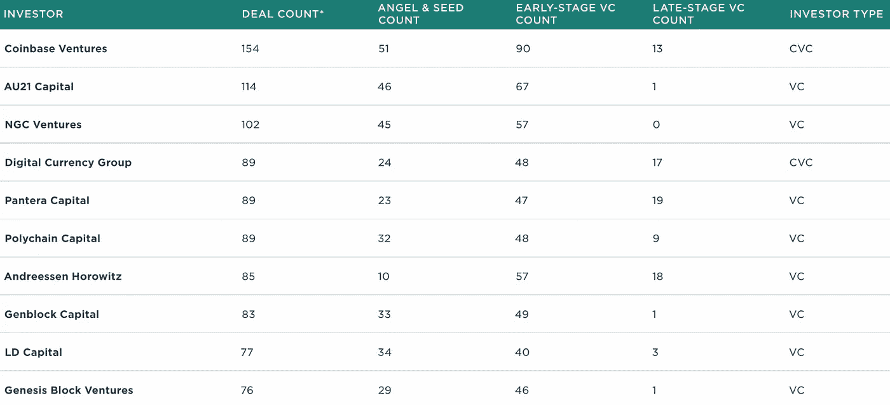

# Web3 生态系统市场地图

> 原文：<https://medium.com/coinmonks/web3-ecosystem-market-map-6980590de147?source=collection_archive---------3----------------------->

由来自一些最大的加密公司的 5000 多名战略投资者组成的全球辛迪加 WAGMI Ventures 每周审查 2022 年的 10 多项交易。下面的市场地图是每个细分市场中风险投资支持的创业公司的代表性概览。如果我们遗漏了什么，请随时发送至:team@wagmiventures.io，因为我们希望在未来进一步填写。

Source: Pitchbook, Crunchbase

我们将每季度更新一次这份名单(Q2 即将推出)，并重点介绍一些来自世界各地的著名 web3 风险投资支持的交易。Q1 2022 年完成的一些最大的交易:

Source: Pitchbook, Crunchbase

**分类细目如下:**

**企业:医疗保健**:为医疗保健机构开发区块链解决方案的初创公司，涉及生命科学和临床试验等领域(例如:编年史)

**企业:供应链:**初创公司使用
区块链开发供应链解决方案，解决农业中的可追溯性等问题(例如:Aqgromalin)

**企业:其他:**初创公司开发各种针对企业用例的区块链解决方案(例如:许可)

**金融:交易&交易所:**这一类别的初创公司帮助促进
加密货币交易，要么通过开发和
运营加密交易所，要么通过创建加密交易应用
(例如:FTX)

**金融:基础设施:**这类初创公司正在开发区块链
基础设施，旨在促进金融交易(例如:区块流)

**金融:DeFi:** 这类初创公司提供分散的金融
服务(例如:Firefly)

**金融:数据&分析:**这类初创公司提供分散金融交易的金融
数据和分析(例如:南森)

**金融:机构平台&服务:**这一类的初创公司是
向机构提供金融服务或开发区块链
平台供机构利益相关者使用(例如:Fireblocks)

**金融:钱包:**这类初创公司正在开发和运营
加密钱包(例如:幻影)

**金融:房地产:**这一类别的初创公司正在房地产行业提供各种
区块链服务(例如:图)

**基础设施:区块链:**这类初创公司正在利用分布式账本技术(例如:Aptos)开发新颖的
区块链

**基础设施:开发者工具:**这一类别的初创公司正在开发协议、层解决方案、SDK、API 和各种其他软件解决方案，以帮助解决诸如区块链功效、可扩展性和
互操作性(例如:Alchemy)等问题

**基础设施:采矿:**这一类别的初创公司正在开发基础设施，以支持为各种区块链提供动力所需的采矿，主要是比特币(例如:ComputeNorth)

**基础设施:** **Regtech:** 此类初创公司为区块链生态系统提供各种监管和合规解决方案，例如税务合规和反洗钱(例如:TaxBit)

**基础设施:数字身份:**这一类别的初创公司正在使用区块链技术开发数字身份解决方案，旨在促进
更可信的交易(例如:Evernym)

**基础设施:硬件:**该类别的初创公司正在开发各种针对区块链问题的硬件解决方案，比如加密货币安全(例如:Ledger)

**基础设施:智能合同:**这一类别的初创公司正在开发智能合同软件和解决方案，目的是促进
法律合同的自动化结算(例如:温柔地)

**基础设施:数据&分析:**这类初创公司提供区块链数据和分析解决方案(例如:Chainalysis)

**基础设施:安全&隐私:**这一类别的初创公司正在现有区块链(如:Brave)的基础上开发安全和隐私解决方案

**NFTs: Art:** 这类初创公司正在开发 NFT 产品，这些产品
促进了实体和数字艺术的交流(例如:Artory)

**NFTs:收藏品:**这一类别的初创公司正在开发 NFT 产品
，以促进实物和数字收藏品的交换(例如:SoRare)

NFTs:游戏:这一类别的初创公司正在将 NFT 技术融入视频游戏，从而实现新的商业模式，如“边玩边赚”(例如:Forte)

NFTs:娱乐，非游戏:这一类别的初创公司正在开发与体育和音乐等娱乐类别相关的 NFT 体验

**NFTs:基础设施:**这一类别的初创公司正在开发软件
解决方案，如开发工具、协议、可伸缩性和
互操作性解决方案，旨在促进 NFTs(例如:无名)的使用和功能

**NFT:市场:**这一类别的初创公司正在开发和
运营旨在帮助创造和交易 NFT 的交易所(例如:OpenSea)

**NFTs:元宇宙:**这一类别的初创公司正在开发与不断发展的元宇宙相关的 NFT 经验
(例如:Together Labs)

**关键天使&种子网站 3 家公司:**

**主要早期 web3 公司:**

**主要后期 web3 公司:**

**著名的 Web3 投资者:**

**重磅炸弹基金:**

**主题—非功能性测试:**

不可替代令牌(NFT)是存储在区块链上的独特数字记录，通常代表对不同于货币的物理或数字资产的债权。NFT 可以出售、交易或引用，以证明对音乐、土地、数字项目和视频等资产的所有权。

**主题—道:**

不可替代令牌(NFT)是存储在区块链上的独特数字记录，通常代表对不同于货币的物理或数字资产的债权。NFT 可以出售、交易或引用，以证明对音乐、土地、数字项目和视频等资产的所有权。

**主题—开发者工具:**

开发者工具是指区块链软件，如协议、X 层解决方案、API 和 SDK，有助于促进区块链内部和之间的互操作性、可扩展性和更强大的功能。

我们期待下一季度的回顾！如果你是投资者或创始人，加入我们的 WAGMI Ventures 财团。

Tanner Gesek 和 WAGMI Ventures 团队

[LinkedIn](https://www.linkedin.com/in/tannergesek/) | [加入辛迪加](https://www.wagmiventures.io/)

> 交易新手？尝试[加密交易机器人](/coinmonks/crypto-trading-bot-c2ffce8acb2a)或[复制交易](/coinmonks/top-10-crypto-copy-trading-platforms-for-beginners-d0c37c7d698c)