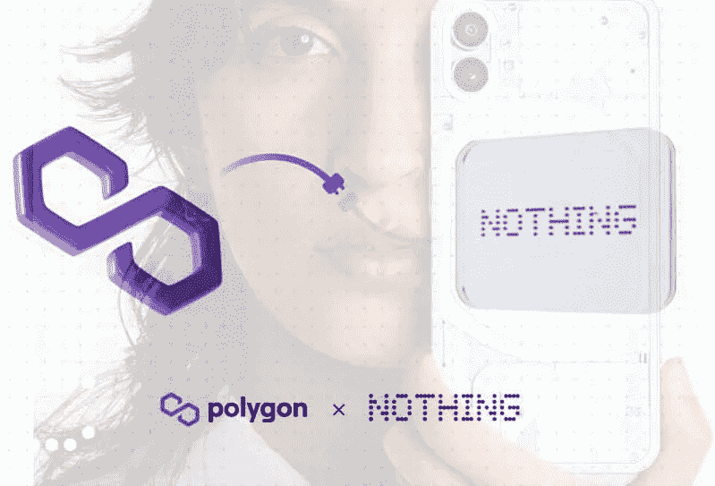
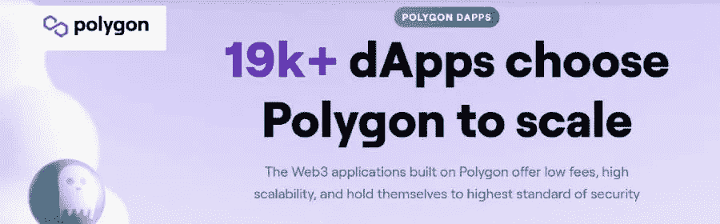
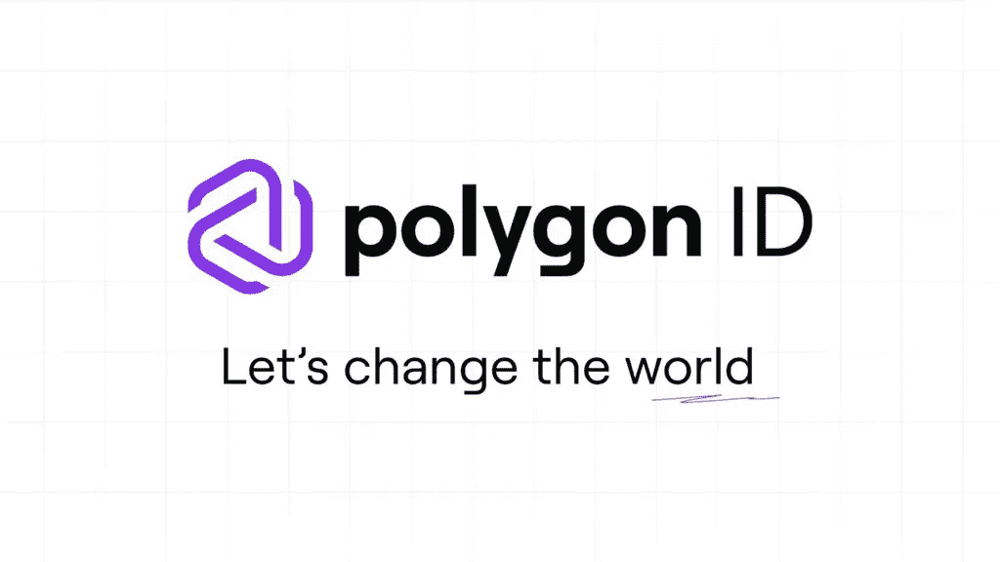
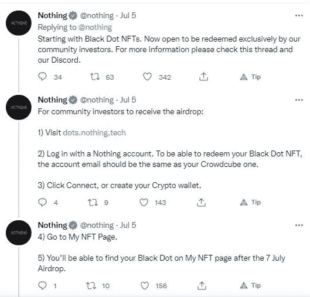
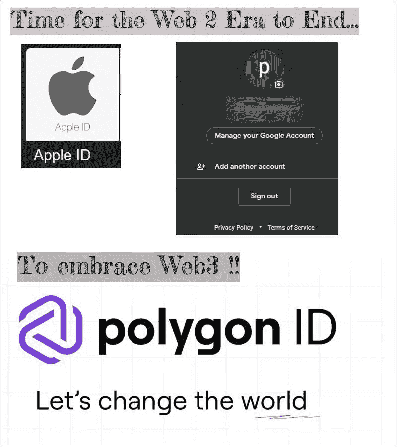

# Web3 时代，区块链功能集成在手机上，如 Nothing Phone (1)

> 原文：<https://medium.com/coinmonks/web3-era-growing-with-blockchain-functionalities-integrated-on-mobile-phones-like-nothing-phone-1-b5bcf6801685?source=collection_archive---------28----------------------->

随着集成了 Web3 技术的手机的出现，web3 将很快成为主流。 [Nothing Phone(1)](https://decrypt.co/104464/much-ado-about-nothing-why-polygon-is-making-a-web3-push-into-mobile) 就是这样一款集成了 Polygon 技术的手机，这些手机用户可以轻松访问 Polygon 的 dapps。

[Source](https://polygon.technology/ecosystem)

所有这些都很酷，但让我兴奋的是，Phone(1)不会使用 Polygon ID，而不是其他手机使用的 Google ID 或 Apple ID。

# Web3 world 使用多边形 ID，而不是 Google ID 和 Apple ID 来保护数据隐私

Polygon ID 是一个专注于隐私的在线身份解决方案，使用零知识证明技术开发，无需收集用户的 ID 文档就可以验证用户的身份。作为一个自我主权身份解决方案，多边形 ID 让用户控制他们的数据。

Apple ID、Google ID 存储您的个人详细信息并通过电话号码或电子邮件 ID 识别用户，Polydon ID 不存储或收集用户的个人详细信息，Polygon ID 仅存储哈希数据作为 Polygon ID 验证用户的标识符。

*可以了解多边形 ID 阅读* [*我之前的文章*](/coinmonks/a-identity-solution-that-empowers-users-with-control-over-their-personal-data-polygon-id-fe951f595eb)*——:*

[使用户能够控制其个人数据的身份解决方案——Polygon ID](/coinmonks/a-identity-solution-that-empowers-users-with-control-over-their-personal-data-polygon-id-fe951f595eb)

用户要访问 Google Play 商店中的任何应用程序，必须链接他们的电子邮件 id。因此，在 Web2 的世界中，公司收集并控制我们的数据，这些数据存储在数据库中，提供给第三方公司和政府机构来跟踪我们，侵犯了我们的隐私。

因此，当我读到 Nothing Phone(1)实际上采用了 Polygon ID 而不是 Google ID 或 Apple ID，这是一个令人高兴的消息。

# 哦，是的，通过 NFTs 为免费的移动用户提供 Web3 激励

早期预订 Nothing Phone(1)或通过众筹支持 Nothing 发布的 Nothing 社区可以获得名为“Nothing 的黑点 NFT”的多边形 NFT，这可以让他们提前获得产品或活动入场券。

[Tweeter](https://twitter.com/nothing/status/1544328306090295298)

再一次，这在 Nothing Phone (1)中加入了如此酷的 Web3 元素。

# 随着 Web3 时代的开始，Web2 的末日越来越近

Web3 刚刚开始渗透到主流中，这有可能击败像苹果这样的 Web 2 领导者，因为 Apple ID 可以很容易地用于跟踪用户，并使用它来获得完整的个人信息和关于用户的私人知识。这些 Web2 公司也通过向广告公司出售我们的数据赚钱，这是众所周知的。

当然，拥有具有区块链功能的手机是很棒的，如果 Nothing Phone (1)因其多边形 dapps 而受欢迎，其他手机也将集成区块链功能，因此这种类型的手机将把更多用户引入 web3 的世界。

***结论***

让我们看看事情是如何形成的，同时继续了解更多关于我们明天将参与的 Web3 空间，因为它肯定是未来。这个时代可能标志着 Web2 的终结，开启 Web3 的时代，我们离那个时代越来越近了。因此，我们越早进入 Web3，区块链的世界，加密和它所提供的一切，从长远来看，我们获得的好处就越多！！

***感谢阅读！！***