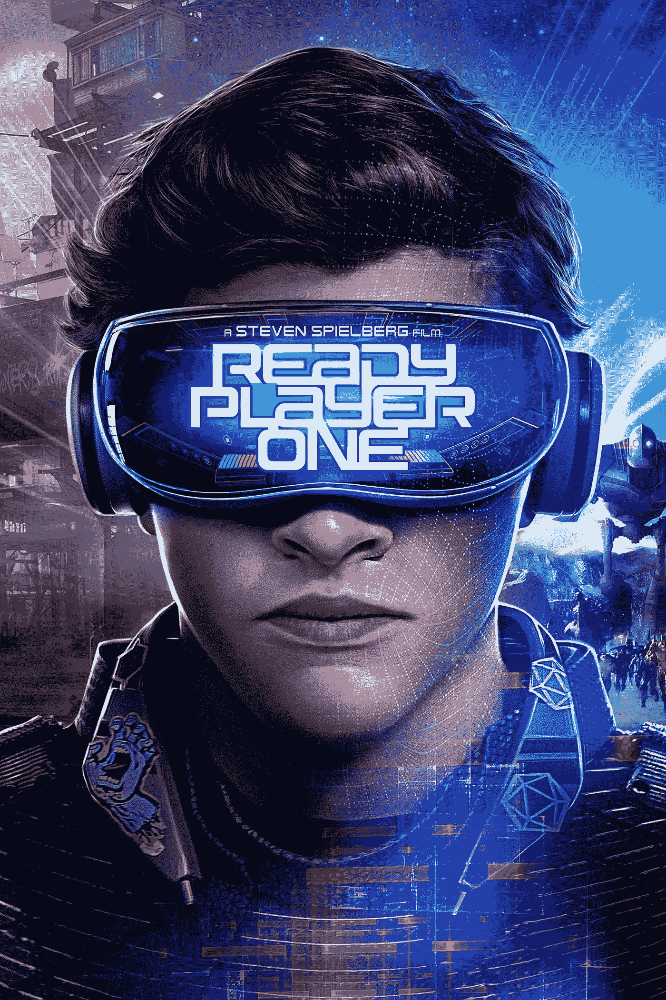
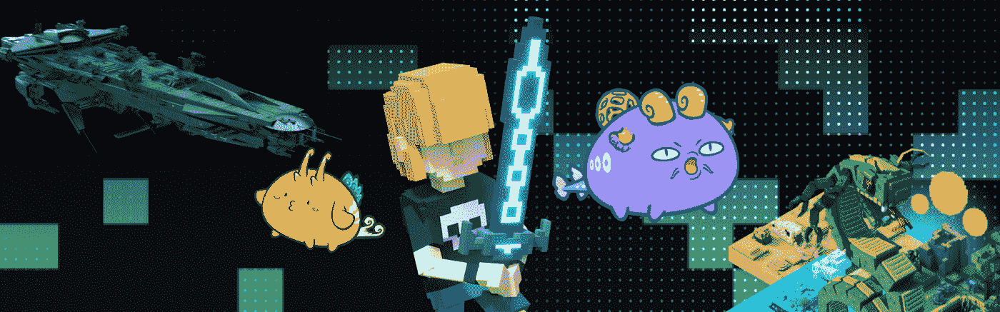
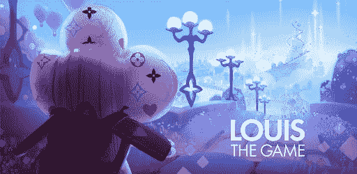
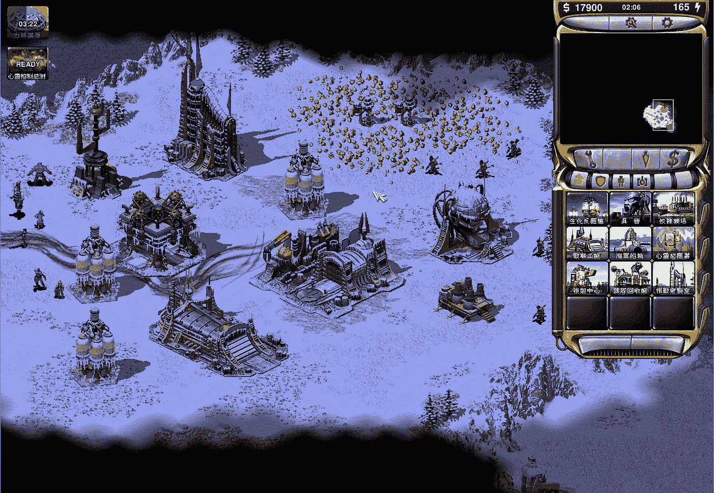
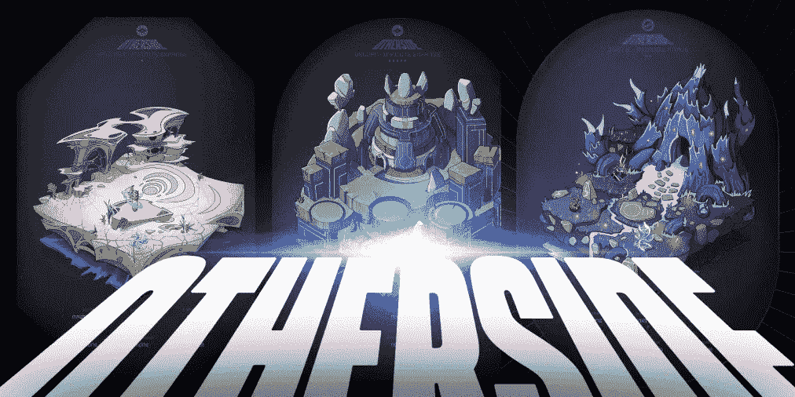

# Web3 游戏将搭载下一个 1 亿用户。

> 原文：<https://medium.com/coinmonks/web3-gaming-will-onboard-the-next-100m-users-5c2f82ad9dc3?source=collection_archive---------40----------------------->

Ready Player One was a game-changer that showcased the future of metaversal gaming.

我认为 web3 游戏将是一个比元宇宙更大的数万亿美元的市场。

至少根据目前的证据。

整理 web3 游戏中的一些新闻:

*   PubG 的创造者宣布**一款基于区块链的新游戏，名为 Artemis** ，将有 NFTs 和元宇宙。(PubG 日均玩家约 3000 万)。
*   像《侠盗猎车手》和《使命召唤》这样的热门游戏的创作者和****推出了一个新的 web3 游戏工作室，**随机游戏。******
*   ****Epic Games** 在 Epic Games Store(拥有超过 1.9 亿用户)上推出了前两款 NFT 游戏**《星际争霸》**和 **Blankos** 。**
*   **《索尼克》的创造者世嘉公司宣布了它的第一款区块链游戏。**

**尽管经历了熊市，但 web3 游戏似乎正在加速发展。**

**理应如此。**

**游戏和娱乐是一个巨大的市场。**

****

**Web3 gaming has evolved so quickly over the years, it has become so amorphous.**

**我们都在某种程度上玩游戏。**

**也许不是现在，但偶尔，当我们年轻或有时间的时候。**

**我认为 web3 游戏的未来是光明的，但不像现在这样。**

**就像毛毛虫变成蝴蝶一样。**

**我们在 web3 游戏中看到的是毛毛虫。**

**当然，它可能是有前途的和迷人的，但与破茧而出的蝴蝶的美丽相比，它是微不足道的。**

**我们要做的是不要把毛毛虫拧成一团，这样它就不会变成一个茧。**

****

**LV made a game and it was a huge hit with the modern generation.**

**Web3 游戏不应该只是让一切游戏化。**

**扔进 NFT，游戏中的信用，把游戏变成迷你赌场或者更好，变成无脑的赚钱机器。**

**换句话说，游戏玩家不应该仅仅因为可以“磨更久，赚更多的钱”而玩 web3 游戏。**

**游戏是…游戏。**

**他们应该是有趣的，无忧无虑的，有娱乐性的，并且有“赢得”某些东西的元素。**

**它可以是完成任务，击中里程碑，拯救遇险少女，在尽可能短的时间内做某事或在与其他玩家竞争时获得尽可能高的分数。**

**还记得你小时候玩超级马里奥的时候吗？因为这个游戏很有趣，动画很可爱，傻傻的但朗朗上口的曲调让你觉得很有趣。**

**或者当你玩《帝国时代》和《红色警戒 2》的时候，因为画面太棒了(请记住那个时代)，你沉浸在故事情节中。**

****

**Anyone who remembers Red Alert 2 Yuri’s Revenge would recall how much excitement and fund it gave the kids of our generation.**

**是的，应该是这样。**

**当然，在 web3 中将游戏符号化和货币化是一个有趣的机制，可以在短期内吸引注意力，但这仅仅是个开始。**

**Framework Ventures 的联合创始人米歇尔·安德尔森认为，加密游戏可以成为“世界上最大的就业形式之一”**

**“迈克尔认为游戏肯定会给 Web3 带来下一个 1 亿用户。”**

**我承认这是让 web2 用户加入 web3 的一个强大而简单的方法。**

**想了解更多或参与 web3？**

**当然，玩一个游戏，自然地成为其中的一部分。**

**此外，NFTs 的繁荣将有机地找到与游戏相遇的方式。**

**我们已经在 web2 游戏中使用了游戏内的积分、头像、物品和购买物品。**

**NFT 和 web3 gaming 是一种自然的共生关系，将相互促进。**

****

**Yuga Labs’ Otherside metaverse play really changed the game for Web3, hopefully in a good way.**

**我们需要在允许玩家参与和拥有真实的游戏体验之间找到微妙的平衡，并在这个过程中获得乐趣。**

**虽然我对 web3 游戏的一些怪异表现以及整整一代年轻人如何无意识地“拼命工作”以赚取几美元感到震惊，但我不得不承认，它确实为那些不太富裕的人提供了一条出路。**

**我非常希望 web3 游戏在适当的时候会像一只美丽的蝴蝶一样出现。**

**现在，让我们耐心一点，给它多一点时间。**

**-**

**web3 游戏在未来会很大吗？**

**-**

**# startups # business # startupx # growth # success # social media # culture # entrepreneurs # strategy # eth # BTC # crypto # web 3 # web 3 gaming # markets # bear market # NFT # games # axie infinity**

> **交易新手？试试[加密交易机器人](/coinmonks/crypto-trading-bot-c2ffce8acb2a)或者[复制交易](/coinmonks/top-10-crypto-copy-trading-platforms-for-beginners-d0c37c7d698c)**