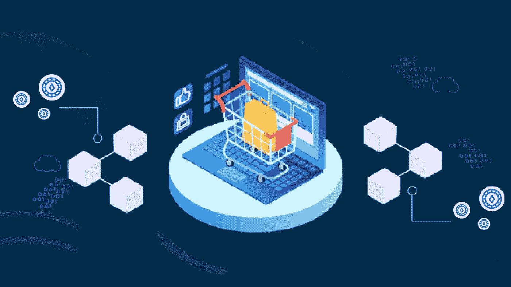

# 电子商务中的 Web3:下一个大变革？

> 原文：<https://medium.com/coinmonks/web3-in-e-commerce-the-next-big-change-69367e0068e5?source=collection_archive---------0----------------------->

你注意到了吗？一些改变我们生活的东西正在成形，而且进展太快了。这里我们指的是“web3”web3 的诞生正带领我们走向一个日益复杂但先进的未来。很明显，它正在重新想象我们的现实，并允许一切都可以通过互联网进行虚拟访问。特别是，web3 的设想是将传统的互联网抛在身后，拥抱去中心化、NFTs 等概念。

当时，网络的发展引入了一个术语，叫做电子商务。它允许我们主要通过互联网买卖商品。今天，正如我们所知，电子商务正在统治市场。但是，随着每一项新的发展和创新，每个行业都必须经历一个转变。电子商务中的 Web3 也带来了一场大变革。这将是博客中讨论的话题。我们将讨论诸如 web3 将提出什么样的解决方案来确保透明和安全的电子商务业务。

随着技术的进步，Web3 变得越来越令人兴奋，并且已经成为许多人感兴趣的事情。因此，记住它仍然是婴儿期，我们将从 web3 的一个小定义开始我们的讨论。

# 什么是 web3？

Web3 这个词是加文·伍德(Gavin Wood)创造的，他是区块链一个著名网络以太坊(Ethereum)的联合创始人。他提到了以太坊背景下的 web3 技术。据他称，利用 web3 将刺激全球科技生态系统的增长。由于基于区块链技术，它完全消除了中间控制，并把权力还给用户。T2 网站呼吁的主要诉求是去中心化和代币经济。从而为用户隐私提供更好的保护。

# web3 的一些关键特征包括:

*   开源信息
*   交易信息保持真实
*   用户本身拥有数据
*   DeFi web3 应用程序正在取代中央货币系统。

我们还想阐明电子商务的总体概念。

# 什么是电子商务业务？

电子商务，也称为电子商务，是在网上进行交易的过程。它允许公司和个人在互联网上买卖商品和服务。用通俗的语言来说，你现在可以在网上购买所有的实物产品或利用在线服务。

然而，电子商务业务并不存在特定的细分市场。它们包含广泛的机会。此外，电子商务生态系统在处理交易时涉及不止一方。

毫无疑问，电子商务已经影响了人们购物和消费产品和服务的方式。它彻底颠覆了零售业的格局，只需点击一下鼠标就能买卖有形产品。但这还不是全部。web3 和电子商务的结合导致了该领域技术更先进的浪潮。继续阅读，找出两者共同带给我们的关键差异。

# web3 给电子商务带来的好处

随着电子商务市场的高速扩张，像 web3 和区块链这样的概念只会加速发展。让我们来浏览一下一些导致电子商务格局转变的真实例子。

***不可信的区块链电子商务***

如果我们告诉你，以后用加密货币支付会和用卡或钱支付一样正常，你会是什么反应？是的，绝对是这样。基于 Web3 的电子商务将帮助我们做到这一点。随着区块链与电子商务的结合，将出现通过 dApps(区块链技术的主要用例之一)在网店购买产品的新趋势。)

***基于 NFT 电子商务的忠诚度奖励***

NFT，或不可替代的代币，似乎改变了数字资产的所有权模式。NFT 是目前电子商务中最流行的用例之一。他们通常允许企业提供货币化的忠诚度计划。对于每一笔购买，这些计划都会用积分奖励客户。这些积分还可以兑换产品、折扣甚至更大的奖金。因此，公司现在可以发行具有预定价值的基于 NFT 的代币，而不是随机点数。

***元宇宙客户体验***

元宇宙正在发生，而且发生得很快。它已经有无数种可能的用例，我们也无法预测将来会有多少种。根据定义，元宇宙是一个虚拟的沉浸式共享世界，允许人们逃离现实，以数字方式重新体验。此外，这个概念融合了许多新兴技术，如区块链和 AR/VR。

电子商务企业可以利用 web3 为他们的客户提供实时和无与伦比的体验。他们不仅可以滚动浏览，还可以访问虚拟商店。这就是电子商务领域的元宇宙所能做的。

***一个强大的认证过程***

更多地使用在线渠道进行交易意味着更多无法追踪的数字足迹。就此而言，使用 web3 技术将为电子商务公司创建一个强大的客户认证机制。与此同时，加密的数字身份将进一步改善管理，保护他们免受滥用或盗窃。

然而，好处不仅限于简单的身份验证。基于 Web3 的电子商务还可以轻松存储、访问、确认和验证保修信息。

# 最后的想法

随着技术的不断发展和未来创新的诞生，电子商务的新标准将会出现。无论这个世界变得多么先进，对于公司来说，客户是他们的国王。因此，顾客满意对任何企业的成功都是至关重要的。有了 web3，除了所有的好处之外，连通性也是公司所追求的。web3 承诺的连接和互动水平令人印象深刻。从而使电子商务体验变得无缝、互动和无风险。

> 交易新手？试试[加密交易机器人](/coinmonks/crypto-trading-bot-c2ffce8acb2a)或者[复制交易](/coinmonks/top-10-crypto-copy-trading-platforms-for-beginners-d0c37c7d698c)