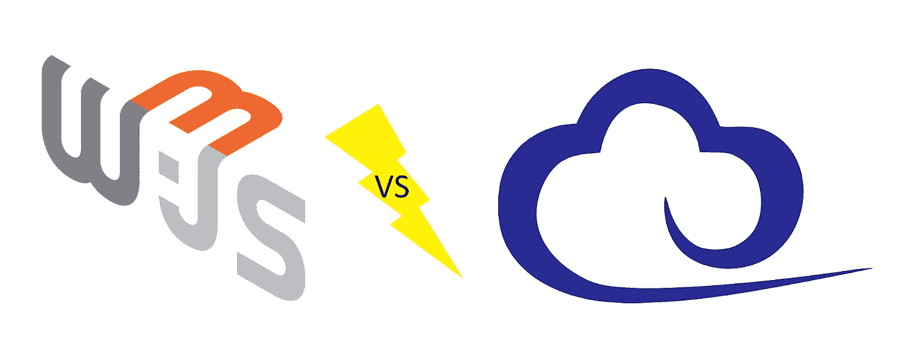
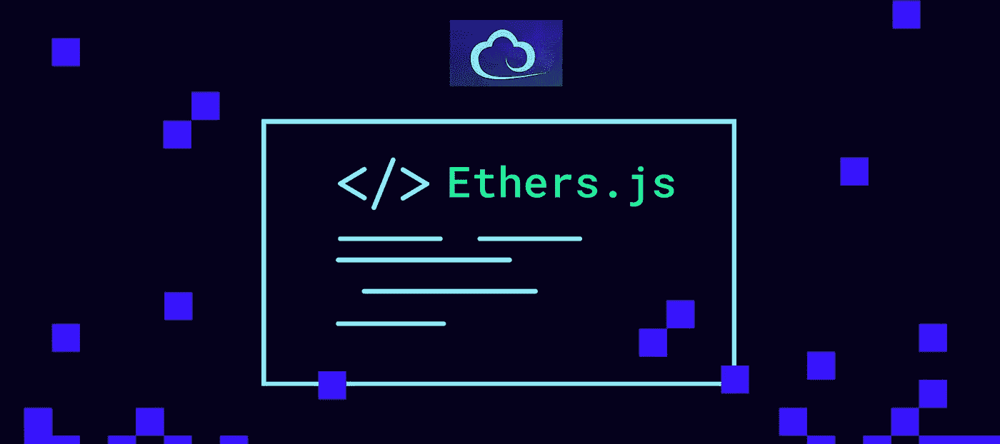

# Web3.js 与 Ethers.js —完全指南

> 原文：<https://medium.com/coinmonks/web3-js-vs-ethers-js-fully-guide-6ce47abfe43c?source=collection_archive---------2----------------------->

如今，加密开发者可以在多种可编程区块链中进行选择。虽然你经常听到“以太坊杀手”这个词，但先行者仍然是王者。因此，大多数区块链开发者仍然关注以太坊。此外，由于其他可编程链倾向于遵循以太坊的领导，他们中的大多数是 EVM 兼容的。因此，相同的 JavaScript 库可以用于跨多个链部署 dApps(分散式应用程序)。考虑到这一点，您应该仔细看看 Web3.js 与 Ethers.js 的比较。

在这里，你将有机会了解什么是 Web3.js 和 Ethers.js。您还将了解 JavaScript 模块。此外，我将快速概述两个 JavaScript ETH 库的模块。然而，本文的核心是 Web3.js 与 Ethers.js 的比较。这将有助于你清楚地了解每个图书馆的优缺点。此外，它还应该使事情变得更清楚，为什么大多数密码行业正在走向两个图书馆中较年轻的一个。

# Web3.js 是什么？

如上所述，Web3.js 是一个开源库或 JavaScript (JS)库的集合。如果你不能回答“JavaScript 是什么？”，请务必阅读我们关于这种流行编程语言的指南。我在介绍中也提到过，Web3.js 是为基于以太坊的项目服务的。因此，它使开发人员在创建 dApps 时能够与以太坊区块链进行交互。而且值得指出的是，Web3.js 库是以太坊基金会搭建的。因此，它背后有一个相当大的社区，这通常是一个附加值。

此外，Web3.js 本质上包含了与以太坊节点通信的功能。这种通信是通过 JavaScript 对象表示法—远程过程调用(JSON-RPC)协议执行的。如果这是你第一次听说 Web3，一定要跳到我的切换[**引导**](/coinmonks/how-frontend-dev-can-upgrade-from-web-2-0-to-web-3-0-b95d55c86504) 到 Web3。此外，在对 Web3.js 和 Ethers.js 进行比较之前，我们需要确保你们都知道什么是 js 模块。现在，注意 Web3.js 和 Ethers.js 都包含模块。

# JS 模块解释

您可以将 JavaScript 模块视为书籍的章节或部分。此外，这种划分原则是所有有经验的程序员都会应用的。因此，你可以看到许多程序和编程库被分成模块。而且，本文涉及的两个 ETH JS 库都遵循这一实践。

此外，模块基本上是代码的集群。因此，当谈到 JavaScript 编程语言时，模块代表了一组有意义的单词和特殊字符的组合。此外，请记住，每个模块通常涵盖一个更大的程序中的特定功能。然而，回到书本章节的类比，与书本章节不同，好的编程模块可以根据需要被删除、添加或重组。此外，所有这些改变不会影响整个系统。因此，它们本质上是高度独立的，具有特定的功能。此外，将程序和库划分为模块也使得可维护性和可重用性更简单。尽管如此，如果您熟悉任何其他编码语言(例如:Java 或 Python)，您可能会想到类。它们非常类似于模块。

# Web3.js 模块

现在您已经知道了什么是 JS 模块，让我们快速了解一下 Web.js 模块:

*   **web 3 . Eth**:*Eth 模块是用来和以太坊网络交互的。它提供了几个子模块，包括 Web3.eth.subscribe、Web3.eth.contract、Web3.eth.accounts、Web3.eth.personal 等等。*
*   **Web3。*.Net**:*Net 模块是用来和网络属性交互的。当然也可能作为子模块与以太坊(Web3.eth.net)进行交互。*
*   **web 3 . Bzz**:*Bzz 模块是用来和 swarm 网络交互的。*
*   **web 3 . Shh**:*Shh 模块用于与耳语协议交互。*
*   **Web3.utils** : *该模块为以太坊 dApps 和其他 web3.js 包提供了实用函数。*

与大多数编程语言、平台和库一样，最好使用它们的文档来了解更多细节。您可以在下面的“Web3.js vs Ethers.js —文档”部分找到 Web3.js 文档的链接。

# 什么是 Ethers.js？

Ethers.js 也是一个以太坊 JavaScript 库，使开发人员能够与以太坊网络进行通信和交互。此外，它是一个拥有 MIT 许可的开源库。那么，如果 Ethers.js 和 Web3.js 的用途一样，那它还有什么意义呢？请记住，有选择通常是件好事。因此，Ethers.js 为 Web3.js 提供了一个令人印象深刻的(在许多方面更胜一筹)替代方案。然而，就像其他产品一样，Ethers.js 和 Web3.js 也有各自的优缺点。在下面的“Web3.js 与 Ethers.js 的比较”一节中有更多的介绍。

# Ethers.js 模块

就像 Web3.js 一样，Ethers.js 也有几个模块。确切的说，这个 JS 库中有四个模块:Ethers.contract、Ethers.provider、Ethers.utils、Ethers.wallets，这些模块是 Ethers.js' API(应用编程接口)的核心。此外，让我们快速浏览一下所有四个 Ethers.js 模块:

*   **醚。提供者** : *这个模块可以让你与区块链以太坊建立连接。您使用它来发出查询和发送签名的事务。通过这个模块，Ethers.js 用户可以改变区块链的状态。*
*   **醚类。Contract** : *您使用该模块来部署智能合同并与之交互。而部署智能合约是 Ethers 的主要目的之一。合同，它可以提供更多。因此，它还包含一些功能，使开发人员能够“监听”智能合约事件(* [*同步和索引智能合约事件*](https://moralis.io/sync-and-index-smart-contract-events-full-guide/?utm_source=blog&utm_medium=post&utm_campaign=Web3.js%2520vs%2520Ethers.js%2520%25E2%2580%2593%2520Guide%2520to%2520ETH%2520JavaScript%2520Libraries) *)。此外，您还可以使用该模块来获取有关智能合约的信息，并调用智能合约提供的特定函数。*
*   **醚类。Utils** : *当您想要格式化数据和处理用户输入时，您将使用这个模块。因此，Ethers.utils 使得构建 dApps 更加容易。*
*   **醚类。钱包** : *如你所想基于。钱包，乙醚。钱包提供了一种连接到任何现有以太坊地址的方式(以太坊钱包)。除了这一重要功能之外，该模块还使您能够创建新的钱包和签署交易。*

# Web3.js 与 ethers . JS-ETH JS 库并列

到目前为止，我们已经介绍了两个 JS ETH 库的基础知识，包括它们的模块。因此，您应该对 Ethers.js 和 Web3.js 有一个正确的理解。此外，你现在知道它们的用途了。因此，你明白它们对于在以太坊区块链或其他 EVM 兼容链上开发 dApps 是非常重要的。

在接下来的小节中，我将介绍这两个 JS 库的主要方面。因此，您将能够使用 Web3.js 与 Ethers.js 的比较来确定使用这两个选项中的哪一个。但是，请注意，您不需要过度考虑这一点。我向您保证，您可以成功地使用两个 JS ETH 库中的任何一个。也就是说，让我们来比较一下 Web3.js 和 Ethers.js。

# Web3.js 与 Ethers.js 的对比

在接下来的小节中，我们将从以下几个方面对 Web3.js 和 Ethers.js 进行比较:

*   背后的团队
*   流行
*   下载
*   更新
*   测试
*   Web 性能
*   证明文件
*   许可证

# web 3 . js vs ethers . js——背后的团队

*   **Web3.js** :是以太坊基金会(非盈利组织)的一个项目。*有了项目背后的整个组织，就有更多的开发人员提供支持。不幸的是，这也意味着对于谁应该确保一切正常没有明确的责任。*
*   **Ethers.js** :由理查德“里穆”摩尔开发维护。显然，这让 RicMoo 承担了全部责任。

如您所见，每种支持类型都有其优点和缺点。你喜欢什么样的后盾？

# Web3.js vs Ethers.js —受欢迎程度

在这里，你需要记住 Web3.js 是先创建的。因此，它赢得总体用例称号是有道理的。依靠 GitHub 的数据，Web3.js 有了更多的明星和更多的知识库。另一方面，当谈到受欢迎程度的增长速度时，Ethers.js 名列前茅。

# Web3.js 与 Ethers.js —下载

比较这两个 JS 库的另一种方法是查看下载。然而，总的下载量并没有描绘出一幅清晰的画面。由于 Web3.js 出现的时间明显更长，它拥有不公平的优势。幸运的是，我们可以更专注于日常下载。根据 npm-stat.com 的说法，Ethers.js 是这方面的赢家。

# Web3.js 与 Ethers.js —保持更新

定期适当地更新库是很重要的。这样可以确保支持团队及时删除所有已知的错误并添加新功能。根据可用的评论和 devs 反馈，两个 ETH JS 库都相对定期更新。

# Web3.js 与 Ethers.js —测试

说到测试，Ethers.js 可能是更好的选择。它有预先编写的测试和清晰的测试文档。但是，您应该记住，这个结论是基于以前版本的 Ethers.js 的，在新版本中，情况可能会有所不同。

# Web3.js 与 Ethers.js — Web 性能

Ethers.js 加载速度稍快，因为它的大小明显更小，这可能会提供更好的性能。不过，尺寸因素只有在涉及小型 dApps 时才会发挥显著的作用。此外，需要指出的是，对于使用 Web3.js 和 Ethers.js 的完全相同的 dApps，没有足够的速度测试数据。因此，任何性能优势都有待证实。

# Web3.js 与 Ethers.js —文档

根据我的经验和开发者的评论，我们可以说两个 ETH JavaScript 库都没有完美的文档。然而，它们都为您提供了足够多的细节。然后，由你来涵盖你感兴趣的关键方面。这也是你决定哪一个更适合你的项目的方法。此外，下面是每个库的文档的当前最新版本(在撰写本文时)的链接:

*   Web3.js 文档:[https://web3js.readthedocs.io/en/v1.7.0/](https://web3js.readthedocs.io/en/v1.7.0/)
*   Ethers.js 文档:【https://docs.ethers.io/v5/ 

此外，您还应该记住，JavaScript 本身总是在发展，因此它的库也必须更新。区块链世界的发展速度更快。因此，团队经常发布两个 ETH JavaScript 库的更新和更新版本。

# Web3.js vs Ethers.js —许可证

*   **Web3.js** :有 LGLv3 牌照。
*   它有麻省理工学院的执照。

*如果您的项目对许可证有具体要求，您需要注意这一点。在某些情况下，聘请许可专家是明智的。专业人士会帮你确定两个 ETH JavaScript 库哪个更适合你。*

# Web3.js vs Ethers.js —完全指南—摘要

我们已经讨论了很多领域，并设法总结了 Web3.js 与 Ethers.js 的比较。到目前为止，您已经知道两个 JS ETH 库都提供了几个模块，使您能够与以太坊链进行交互。此外，您已经了解到每个库都有其优点和缺点。然而，区块链工业作为一个整体正在慢慢地向一个更年轻的替代品过渡

*谢谢大家的支持！👐🏼*

> 交易新手？尝试[加密交易机器人](/coinmonks/crypto-trading-bot-c2ffce8acb2a)或[复制交易](/coinmonks/top-10-crypto-copy-trading-platforms-for-beginners-d0c37c7d698c)